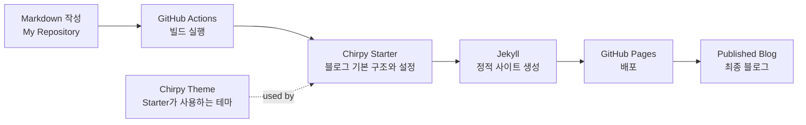

안녕하세요. 이 블로그의 대망의 첫 정식 포스트 주제는 바로 '이 블로그를 어떻게 구축했는가'입니다.

사실 기술 블로그를 직접 만든다는 건 저에게도 꽤 생소한 경험이었습니다. 흔히들 '시대가 변했다'고 말하곤 하죠. 하지만 생각해보면 시대는 항상, 실시간으로 변해왔습니다. 이러한 흐름에 적응하려면 끊임없이 새로운 것을 익히고 배우며, 그 안에서 아이디어를 얻어 나만의 방식으로 조합해 낼 줄 알아야 할 것 같네요.

이제는 AI라는 든든한 조력자를 활용해 훨씬 더 편하고 과감하게 시도해 볼 수 있는 환경이 되었으니까요.

앞으로 이 블로그의 글들은 대부분 AI의 조언을 얻고 진행했지만 직접 확인하고 공식 가이드를 참고해서 작성되었습니다.

뭔가 우회하면 항상 문제가 더 큰 문제가 생기더라고요.

블로그를 구축하는 것 역시 처음 해보는 도전이었기에, 가다 막히거나 잘못된 방향으로 가면 미련 없이 처음부터 리셋하고 다시 진행했습니다.

이 블로그는 2번 지워졌다가 3번째 작성된 것 입니다.  `Best Practice` 그리고 `공식 문서`  +  `최신`이 세  단어는

제가 모든 대화형 AI prompt에 항상 넣는 단어이기도 하지요.


모쪼록 부족한 점이 있다면 언제든 조언 부탁드리며, 저처럼 처음 환경 셋업에 도전하시는 분들께 이 글이 실질적인 도움이 되기를 바랍니다.


## 개요 및 선정 이유 - Why this stack? {#why-this-stack}

수많은 블로그 플랫폼 중에서 이 조합(GitHub Pages + Jekyll + Chirpy)을 선택한 기준

- **최소한의 노력, 뛰어난 가독성:** 큰 커스터마이징 노력 없이도 기본적으로 깔끔하고, 방문자가 글을 읽는 데 불편함이 없는 세팅
- **마크다운(Markdown) 숙달:** 기술 문서를 작성하는 데 필수적인 마크다운 문법에 스스로 더 익숙해질 필요성을 느꼈다.
- **개발자 친화적인 기능 지원:** 개발 블로그의 핵심인 직관적인 '코드 하이라이팅(Code Highlighting)'과 아키텍처를 쉽게 표현할 수 있는 '머메이드(Mermaid) 차트' 지원
- **유지보수의 최소화 (검증된 솔루션):** 본업과 프로젝트에 집중해야 하므로 블로그 자체의 에러를 고치거나 유지보수하는 데 에너지를 쏟을 수 없었다. 따라서 이미 수많은 사람에게 검증되었고, 생태계가 활발하여 알아서 꾸준히 업데이트되는 안정적인 솔루션이 필요했다.


## 주요 기능 점검 - Features Check {#features-check}

- [Jekyll](https://jekyllrb-ko.github.io/) 는 Markdown으로된 문서를 html로 변경하는 것이고 [Chirpy](https://chirpy.cotes.page/)는 theme 의 개념으로 꾸며준다고 이해했다.

- [Github Page](https://docs.github.com/ko/pages/getting-started-with-github-pages/what-is-github-pages) 는 홈페이지를 만드는 여러 과정들을 간소화 해준다 무료 호스팅, 서버설정이 필요 없고 
  git에 push 하면 바로 publish되기 때문에 많은 노력과 비용을 줄여준다.

- [giscus](https://giscus.app) github의 discuss 기능을 활용해서 댓글처럼 운영해주는 Github App 이다 링크로 들어가서 하단에 댓글을 보면
  무엇을 할수 있는지 볼수 있다. github의 discus 기능을 활용하므로  markdown을 기본으로 제공하고 github의 코드링크도 렌더링 해준다.

  

이 블로그 운영 방식의 단점은 일단 git을 다룰줄 알아야하고 markdown을 알아야는데 반대로 이것들만 알면 홈페이지를 꾸밀수 있다는 말이기도 하고

개발자들에게 둘다 익숙한 도구 이기 때문에 오히려 개발자들에게는 접근성이 좋은 편이다.

다른  단점은 정적인 페이지라서 서버와 반응하는 백엔드 기능이 제한된다.

이론상 댓글도 인터랙션이기 때문에 없어야하지만 git의 discuss나 issue를 통해서 해서 가능하긴하다.


뭔가를 새로 시도하기 전에 항상 그것이 어떻게 구현될지 상상해 봐야 한다. 다행히 이 솔루션들은 이미 Preview가 존재하니 직접 확인해 보자.

markdown이 어떻게 html로 렌더링 되는지 두개의 코드를 보면 단번에 이해가 될 것이다.

최종 Preview 는 내가  정보를 전달하기 좋아보이는 kramdown, 적용 가능한 html등을 적용해서, 

내가 보려고 만든 데모인데 새로운걸 발견하면 계속 추가할 예정.

- 공식 : Chirpy preview: [Markdown](https://github.com/cotes2020/jekyll-theme-chirpy/blob/master/_posts/2019-08-08-text-and-typography.md?plain=1)이 이렇게 보이게 된다. [렌더링 결과 보기](https://chirpy.cotes.page/posts/text-and-typography/)

- giscus : https://giscus.app/ 하단의 댓글에 뭘 할수 있는디 보여주는 데모 형식의 댓글이 있다.

- 최종 Preview :  내가 직접 작성한 데모 [Markdown](https://github.com/codefoundry-io/codefoundry-io.github.io/blob/main/_posts/2026-03-08-chirpy-text-and-typography-demo-annotated.md?plain=1)  [렌더링 결과 보기](/posts/chirpy-text-and-typography-demo-annotated)

  

## 사전 준비 사항 - Preconditions {#preconditions}

- 필수: GitHub 계정
- 선택: 기본적인 Git 사용법 (가이드를 따라 해도 가능)

## 셋업 방법 - Setup Guide {#setup-guide}

뭐든지 공식 가이드를 따르는게 좋다 그리고 내가 작성한 가이드도 시간이 지나면 변경될수 있으니 항상 아래 링크를 참조하도록 하자.

\> **출처:** [Jekyll Chirpy 공식 문서](https://chirpy.cotes.page/posts/getting-started)
{: .prompt-info }

### repository 생성

아래 링크로 이동해서 Use this template로 가져오도록 하자.

웹프로그래밍 및 디자인에 전문적인 사람이라면 starter가 아니라[jekyll-theme-chirpy](https://github.com/cotes2020/jekyll-theme-chirpy) 이 repository를 fork 해도 된다.
[chirpy-starter](https://github.com/cotes2020/chirpy-starter)는 대부분의 theme를  [jekyll-theme-chirpy](https://github.com/cotes2020/jekyll-theme-chirpy)를 바라보도록 해놨으니 커스텀으로 어것 저것 손댈거라면 이 방식이 옳다.
하지만 나는 자신이 없으므로 Stater로 하기로 진행.

https://github.com/cotes2020/chirpy-starter


일반적으로 개인이면 개인의 Github ID를 넣으면 되지만 조직의 Owner라면 나처럼 조직명을 넣을수도 있다. 

네이밍 룰은 [여기](https://docs.github.com/ko/pages/getting-started-with-github-pages/creating-a-github-pages-site#creating-a-repository-for-your-site)를 참고 하면 된다.

남들이 봐야하닌 블로그니 Public 으로 설정하는걸 잊으면 안된다.


### Repositry  Setting 

다른 세팅은 취향대로 하지만 우리는 discussion을 이용한 댓글 시스템을 사용할거니 Discussions를 켜주자. 


> 잊지 말고 아래 세팅도 해야한다 Ciirpy 공식 가이드는 github action으로 publish 하도록 가이드 하고 있다
{: .prompt-warning }


### Install giscus

말한대로 Githb Page는 사실상 정적 페이지이다. 댓글이나 이런게 존재할수 없지만 Issue나 Sicdussions등을 이용해서
댓글을 설정할수 있는 여러가지 솔루션이 있다.
나는 그중에 giscus를 이용하기로 했다 아래 사이트로 이동해서 앱을 설치하자.

https://github.com/apps/giscus


내 개인의 아이디는 노출되도 상관없고 알려면 금방 알겠지만...

개인의 아이디와 조직의 오너라면 조직이름이 나올 것이다. 보통은 본인의 ID만 나올 것


### giscus 설정

https://github.com/apps/giscus에 다시들어가면 Install 에서 Configure로 변경된 것을 확인할 수 있다.


{: .w-50 .right }

댓글이 비슷한 제목의 글을 잘못가져오거나  

하는 것을 막기 위한 옵션

<div style="clear: both"></div>


{: .w-50  .right }

댓글에 관한 설정이다 이모티콘으로 반응을 남길수 있는 기능이지만 아무도 해주지 않으면 쓸쓸한 기능일 것 같다.

설정에 따라 밑에 script가 나온다 가장 중요한 것은 `data-repo-id`, `data-category-id` 이 두가지이다.
<div style="clear: both"></div>

repository 의 `_config.yml`{: .filepath}을 수정하자

프로바이더를 giscus로 설정하고 위의 giscus에서 제공한다고 되어 있는데 chirpy에는 그 설정들이 없어서 당황할수도 있다. 

없는 것을 추가하지말고 있는 것만 자신이 선택한 옵션처럼 넣어보자.

```diff
 comments:
   # Global switch for the post-comment system. Keeping it empty means disabled.
-  provider: # [disqus | utterances | giscus]
+  provider: giscus # [disqus | utterances | giscus]
   # The provider options are as follows:
   disqus:
     shortname: # fill with the Disqus shortname. › https://help.disqus.com/en/articles/1717111-what-s-a-shortname
   # utterances settings › https://utteranc.es/
   utterances:
     repo: # <gh-username>/<repo>
     issue_term: # < url | pathname | title | ...>
   # Giscus options › https://giscus.app
   giscus:
-    repo: # <gh-username>/<repo>
-    repo_id:
-    category:
-    category_id:
-    mapping: # optional, default to 'pathname'
-    strict: # optional, default to '0'
-    input_position: # optional, default to 'bottom'
-    lang: # optional, default to the value of `site.lang`
-    reactions_enabled: # optional, default to the value of `1`
+    repo: codefoundry-io/codefoundry-io.github.io
+    repo_id: R_kgDORsudig
+    category: Announcements
+    category_id: DIC_kwDORsudis4C46VY
+    mapping: pathname # optional, default to 'pathname'
+    strict: 1  # optional, default to '0'
+    input_position: top # optional, default to 'bottom'
+    lang: ko # optional, default to the value of `site.lang`
+    reactions_enabled: 1 # optional, default to the value of `1`
```
{: file="_config.yml" }

> Chirpy의 장점이 대부분의 일을 알아서 처리해준 다는 것이다.
>
> 우리가 설정하지 못하는 옵션들은 내부적으로 알아서 처리하고 있다.
{: .prompt-info }

예를 들면 theme의 경우는 사용자가 설정을 해줘도 chirpy에서 덮어씌우기 때문에 넣어도 무용지물이다
이게 마음에 안들면 chirpy origin repository를  fork해서 커스터마이징 해야한다. (어우 난 싫다.)

https://github.com/cotes2020/jekyll-theme-chirpy/blob/9adb7e352b7da2ea1d8d34d0dddcd4bbd7490733/_includes/comments/giscus.html#L2-L29

우리가 정해준거 말고는 다 알아서 설정해주고 있다 고맙다.

```html
<script>
  (function () {
    const themeMapper = Theme.getThemeMapper('light', 'dark_dimmed');
    const initTheme = themeMapper[Theme.visualState];

    let lang = '{{ site.comments.giscus.lang | default: lang }}';
     https://github.com/giscus/giscus/tree/main/locales 
    if (lang.length > 2 && !lang.startsWith('zh')) {
      lang = lang.slice(0, 2);
    }

    let giscusAttributes = {
      src: 'https://giscus.app/client.js',
      'data-repo': '{{ site.comments.giscus.repo}}',
      'data-repo-id': '{{ site.comments.giscus.repo_id }}',
      'data-category': '{{ site.comments.giscus.category }}',
      'data-category-id': '{{ site.comments.giscus.category_id }}',
      'data-mapping': '{{ site.comments.giscus.mapping | default: 'pathname' }}',
      'data-strict' : '{{ site.comments.giscus.strict | default: '0' }}',
      'data-reactions-enabled': '{{ site.comments.giscus.reactions_enabled | default: '1' }}',
      'data-emit-metadata': '0',
      'data-theme': initTheme,
      'data-input-position': '{{ site.comments.giscus.input_position | default: 'bottom' }}',
      'data-lang': lang,
      'data-loading': 'lazy',
      crossorigin: 'anonymous',
      async: ''
    };
```
{: file="_includes/comments/giscus.html" }

저 파일은 starter로 가져왔으면 우리 repository에 보이지도 않는다 결국 원본 theme 에서 가져오는 것이다. 
이 구조도는 다음과 같다.




여기 까지 왔으면 거의 다 된 셈이다. 코드를 반영하고 내 url로 가면 아래와 같은 형태일 것이다

다른 세팅이야 내가 안건드렸으니 괜찮은데 아이콘이 비어있는 것과 고마운 Chirpy 지만 벌레형태의 아이콘이 묘하게 열받는다.


### 기본 적인 블로그 세팅

#### 아바타

아바타는 내 대표이미지고 정사각형의 이미지 사용이 권장된다. 나는 파비콘을 아바타와 동일하게 했는데 다르게 하고 싶으면

다르게 진행해도 무관하다.

나는 챗지피티에서 이 블로그에 취지와 나와 대화하면서 나에게 느낀 성향을 분석해서 [Svg](https://developer.mozilla.org/ko/docs/Web/SVG)를 생성해달라고 했고 PNG로 512x512 이미지로 변경했다.

왜 SVG였냐면 나는 이미지를 여러번 만들기가 귀찮고 svg는 여러 사이즈로 적용해도 깨지지 않기 때문이다.

SVG를 PNG로 바꾸는 방법은 여러 인터넷에서도 가능하지만 

나는 아래와 같이 진행 했다. 투명 배경을 유지는지 안하는지 여러 사이트에서 확인하기 귀찮고

AI가 자꾸 내 질문을 학습해서 터미널에서 가능한 답변만 준다.

> *만들어준 내 아바타도..그렇고 날 뭘로 생각하는거야... 나도 GUI 있는게 편하다고..*

```powershell
winget install ImageMagick.ImageMagick
# 설치하고 터미널을 종료하고 다시 열자.
# 512x512 PNG로 변환 (배경 투명 유지)
magick -background none -size 512x512 원본.svg 결과물_512.png

# 1200x630 JPG로 변환 (배경 흰색)
magick -background white -size 1200x630 원본.svg 결과물_1200.jpg
```
{: file="Windows" }


```shell
sudo apt install imagemagick
convert -background none -size 512x512 logo.svg avatar_512.png
```
{: file="Ubuntu" }

이제 준비한 이미지를 블로그 디렉터리의 `assets/img/`{#filepath} 폴더 안에 넣는다. (파일명 예시: `avatar.png`)

1. 최상단 `_config.yml`{#filepath} 파일을 열고 `avatar:` 항목을 찾아 파일의 절대 경로를 입력한다.

YAML

```
avatar: "/assets/img/avatar.png"
```


#### 파비콘

파비콘이 뭔지도 잘 몰랐는데 위 이미지에서 표기한 벌레(Chirpy야 미안) 이미지로 다양한 OS와 디바이스(iOS, Windows 등)에 완벽하게 대응해야하기 때문에 

[Chirpy 공식 문서 - Customize the Favicon](https://chirpy.cotes.page/posts/customize-the-favicon/)에서 권장하는 전용 툴을 사용해야한다고 한다.

아래와 같이 진행.

1. Chirpy 공식 권장 툴인 [RealFaviconGenerator](https://realfavicongenerator.net/) 웹사이트에 접속한다.
2. 메인 화면의 `Select your Favicon image` 버튼을 눌러 앞서 준비한 512x512 이미지를 업로드한다.
3. 각종 OS별 미리보기가 나오는데, 별다른 설정 변경 없이 스크롤을 맨 아래로 내려 `Generate your Favicons and HTML code` 버튼을 클릭한다.
4. 변환이 완료되면 `Favicon package` 버튼을 눌러 `.zip` 파일을 다운로드한다.
5. 다운로드한 `.zip` 파일의 압축을 푼다.
6. 압축이 풀린 모든 이미지 파일(`favicon.ico`, `apple-touch-icon.png`, `android-chrome-*.png` 등)을 블로그의 `assets/img/favicons/`{#filepath}  폴더 안에 **통째로 덮어씌운다.**

아래와 같이 보이면 된다.


#### 내 정보 설정

이제 프로필 사진과 favicon은 만들었지만 사이트에 모든 링크들이 이상하게 되어있을 것이다.


[공식 설정 가이드](https://chirpy.cotes.page/posts/getting-started/#configuration) 를 참고 하면 우리가 먼저 해야할 성정은 이것이다.

1. `_config.yml`{#filepath}   에서 아래 항목을 채워준다. 

   > timezone 과 lang은 사용가능한 목록의 웹페이지를 `_config.yml`{#filepath}  에 주석으로 명시하고 있다
   >
   > 내가 설명하지 않는 것들은 다음에 기회가 되면 다룰 생각이다 웹 검색에 노출되는 것과 관련된 옵션들로
   >
   > 블로그 글이 좀 늘어나면 설정할 예정
   >
   {: .prompt-tip }

   -  `url` : 내 url github page 주소나 호스팅을 했다면 그 주소를 사용한다.
   -  `timezone` :  `Asia/Seoul`
   -  `lang`  :  `ko-KR`
   -  `title`: 블로그 이름
   -  `tagline`: 짧은 한 줄 소개
   - `description`: 사이트 설명

   ```yaml
   # The language of the webpage › http://www.lingoes.net/en/translator/langcode.htm
   # If it has the same name as one of the files in folder `_data/locales`, the layout language will also be changed,
   # otherwise, the layout language will use the default value of 'en'.
   lang: ko-KR
   
   # Change to your timezone › https://zones.arilyn.cc
   timezone: Asia/Seoul
   
   # jekyll-seo-tag settings › https://github.com/jekyll/jekyll-seo-tag/blob/master/docs/usage.md
   # ↓ --------------------------
   
   title: codefoundry-io # the main title
   
   tagline: AI + Android + CI/CD 1인 구축 기록 # it will display as the subtitle
   
   description: >- # used by seo meta and the atom feed
     AI 도구를 활용한 Android 개발, 테스트 자동화, GitHub Actions CI/CD 구축 과정을 기록하는 기술 블로그입니다.
   
   # Fill in the protocol & hostname for your site.
   # E.g. 'https://username.github.io', note that it does not end with a '/'.
   url: "https://codefoundry-io.github.io"
   
   github:
     username: codefoundry-io # change to your GitHub username
   ```

   

1. `_config.yml`{#filepath}   에서 Social을 항목을 채워준다.

   ```yaml
   social:
     # Change to your full name.
     # It will be displayed as the default author of the posts and the copyright owner in the Footer
     name: chaniri
     links:
       # The first element serves as the copyright owner's link
       - https://github.com/codefoundry-io
   ```

1. `_tabs/about.md`{#filepath} 정보를 누르면 나오는 페이지를 만들어야한다. 

   위 캡쳐에서 정보를 누르면 이동되는 화면이다.
   --- 으로 감싸진 부분은 건드리지말고 밑에 자기 소개를 추가하자.
   나는 이슈로 피드백을 받기로 해서 그냥 이슈 링크를 남겼다.

   ```markdown
   ---
   # the default layout is 'page'
   icon: fas fa-info-circle
   order: 4
   ---
   
   ## codefoundry-io
   
   AI를 활용해 안드로이드 앱을 구현하고,
   GitHub Actions 기반 CI/CD(빌드 체크, 자동화 테스트, 릴리즈)를 1인으로 구축하는 과정을 기록합니다.
   
   ## 피드백
   오타, 개선 제안, 질문은 아래 이슈 작성 화면에서 남겨주세요.
   - [GitHub Issues (피드백 등록)](https://github.com/codefoundry-io/codefoundry-io.github.io/issues/new/choose)
   
   ## 구독
   새 글은 RSS로 구독할 수 있습니다.
   - [RSS 피드 구독](/feed.xml)
   ```

4. `_data/contact.yml`{#filepath} 에 기본 연락 수단 넣기
   아래처럼 보이는 화면이다.

   

   주석처리하면 보이지 않고 사용하고자 하면 주석을 풀고 url을 채워주면 된다. 
   나는 개발에만 사용할거라서 개인적인 SNS 이메일은 모두 제외시키고 github issue를 통해서 연락가능한 부분만 남겼다.

   ```yaml
   #  The contact options.
   
   - type: github
     icon: "fab fa-github"
   
   
   - type: rss
     icon: "fas fa-rss"
   
   - type: feedback
     icon: "fas fa-comments"
     url: "https://github.com/codefoundry-io/codefoundry-io.github.io/issues/new/choose"
     noblank: true
   # Uncomment and complete the url below to enable more contact options
   #
   # - type: mastodon
   #   icon: 'fab fa-mastodon'   # icons powered by <https://fontawesome.com/>
   #   url:  ''                  # Fill with your Mastodon account page, rel="me" will be applied for verification
   #
   # - type: linkedin
   #   icon: 'fab fa-linkedin'   # icons powered by <https://fontawesome.com/>
   #   url:  ''                  # Fill with your Linkedin homepage
   #
   # - type: stack-overflow
   #   icon: 'fab fa-stack-overflow'
   #   url:  ''                  # Fill with your stackoverflow homepage
   #
   ```

5. 이쯤 되면 `_data/contact.yml`{#filepath} 이게 뭔가 궁금해졌을 것이다.
   글을 작성하면 하단에 보이는 글을 공유하는 방법이다.

   
   역시 주석을 풀면 적용된다. 이거 열심히 쓰면 회사 짤려도 갈 구석이 생기나...하는 희망회로로 Linkedin을 추가해놨다.

   ```yaml
   #  Sharing options at the bottom of the post.
   #  Icons from <https://fontawesome.com/>
   
   platforms:
     - type: Twitter
       icon: "fa-brands fa-square-x-twitter"
       link: "https://twitter.com/intent/tweet?text=TITLE&url=URL"
   
   
     - type: Telegram
       icon: "fab fa-telegram"
       link: "https://t.me/share/url?url=URL&text=TITLE"
   
     - type: Linkedin
       icon: "fab fa-linkedin"
       link: "https://www.linkedin.com/feed/?shareActive=true&shareUrl=URL"
   ```

위 설정을 다 하면 누가봐도 그럴싸한 블로그가 되어 있을 것이다.

이제 글을 써야하는데 이것도 쉽지 않다.

## 5. 첫 블로그 포스팅하기.

여기까지 왔으니까 다한 것 같나요?

공짜로 홈페이지가 만들어질 것 같았으면 네이버 블로그를 쓸껄 하는 생각이 들었나요?

네, 저도 그렇습니다. 그런데 끝까지 해봅니다.

글을 쓰는게 얼마나 어렵냐면 Chirpy 공식 가이드 문서는 딱 4개 있다.


그런데 그중에 Writing a New Post가 있다

그만 울고 시작하자 [일단 공식 가이드](https://chirpy.cotes.page/posts/write-a-new-post/) 링크 드리겠습니다.

### 파일 이름 짓기

- **새로운 글은 반드시 최상위의 `_posts`{#filepath}** 이 폴더 안에 생성해야 하며, 파일명은 무조건 아래의 포맷을 지켜야 한다.

> **`YYYY-MM-DD-title.md`**
>
{: .prompt-tip }

- **날짜 포맷 엄수:** 연도 4자리, 월 2자리, 일 2자리를 하이픈(`-`)으로 연결한다. (예: `2026-3-22` X -> `2026-03-22` O)
- **영문 소문자와 하이픈:** `title` 부분은 실제 화면 제목이 아니라 **URL 주소(URI)**로 쓰인다. 한글 대신 영문 소문자와 숫자, 하이픈(`-`) 조합으로 해야한다. 진짜 제목은 파일 안의 Front Matter에 적는다.
- **확장자:** 반드시 `.md` 또는 `.markdown`을 사용한다.

### 이미지 폴더 만들기

같은 폴더에 이미지를 계속 넣다보면 관리도 귀찮아지고 포스트를 만들기도 귀찮을 것이다.

글을 쓸 때마다 `assets/img/posts/`{#filepath} 폴더 아래에 **포스트 파일명과 똑같은 이름의 폴더**를 하나 만든다.

(예: `assets/img/posts/2026-03-22-my-first-post/`{#filepath})

그러면 markdown에 이미지를 어떻게 넣어 너무 귀찮잖아. 경로 변경되면 또 복사까지 하라고?

> 방법 1. markdown editor 대부분이 캡쳐한 이미지를 붙여넣을때 이미지를 상대경로로 자동 복사하는 기능을 제공한다.
> [Paste Image](https://marketplace.visualstudio.com/items?itemName=mushan.vscode-paste-image) [Markdown Image](https://marketplace.visualstudio.com/items?itemName=hancel.markdown-image) [Typora](https://typora.io/) , 심지어 [Obsidian](https://obsidian.md/)도 해당 기능을 제공한다.
>
> 방법 2. 아무렇게나 이미지를 넣고 한번에 폴더 이동후에  포스트 상단 Front Matter에 `media_subpath:` 경로를 지정해 준다.

### 포스트 상단 Front Matter

```yaml
---

title: "여기에 포스트 실제 제목을 입력하세요"
date: 2026-03-22 14:06:00 +0900 # 작성 시간 (한국 시간 기준 +0900 필수)
categories: [대분류, 소분류] # 최대 2개까지만 권장 (예: [DevOps, CI-CD])
tags: [android, local-ai, devops] # 태그는 반드시 소문자로만 작성
description: "홈 화면 리스트와 검색 결과(SEO)에 노출될 핵심 요약 1~2줄을 적는다."

# 포스트 전용 이미지 폴더 경로 (이걸 설정하면 본문에서 파일명만 써도 됨)
# 상단의 markdown editor로 상대 경로를 지정했으면 주석처리해도 됨
# 권장 해상도: 1200 x 630 픽셀 권장 화면비: 1.91 : 1
media_subpath: /assets/img/posts/2026-03-22-현재포스트파일명/

# 블로그 홈과 SNS 공유 시 나타날 대표 이미지
image:
  path: thumbnail.jpg # media_subpath를 썼다면 파일명만 적어도 OK
  alt: "썸네일 대체 텍스트 (접근성 및 SEO용)"

toc: true        # 우측 목차(Table of Contents) 보이기 (기본값: true)
comments: true   # 포스트 하단 Giscus 댓글창 열기 (기본값: true)
math: false      # 수학 수식 (LaTeX) 렌더링 켜기 (무거우므로 쓸 때만 true)
mermaid: false   # 아키텍처 다이어그램 (Mermaid) 렌더링 켜기 (쓸 때만 true)


pin: false       # 홈 화면 맨 위에 공지사항처럼 고정할지 여부 (켤 때만 true)

# 작성자 덮어쓰기 (기본값은 _config.yml의 정보)
# _data/authors.yml 에 등록해둔 다른 ID가 있다면 그 사람 이름으로 발행.
# author: codefoundry # 단일 저자일 때
# authors: [codefoundry, guest_writer] # 공동 저자가 여러 명일 때 배열로 지정
---

여기서부터 마크다운으로 본문을 작성하세요.
```

```markdown
---
title: "여기에 포스트 실제 제목을 입력하세요"
date: 2026-03-22 14:06:00 +0900
categories: [대분류, 소분류]
tags: [android, local-ai, devops]
description: "홈 화면 리스트와 검색 결과 SEO에 노출될 핵심 요약 1~2줄을 적는다."

media_subpath: /assets/img/posts/2026-03-22-현재포스트파일명/

image:
  path: thumbnail.jpg
  alt: "썸네일 대체 텍스트"

toc: true
comments: true
math: false
mermaid: false
pin: false
---

여기서부터 마크다운으로 본문을 작성하세요.
```
{: file="복붙용" }


## 마무리 및 더 읽을거리 - Conclusion & Further Reading {#conclusion}

### 마치며

이 블로그는 사실 3번째 만들어졌다.

처음에는 코드를 직접 다운로드해서 만들었다가 삭제했고, 두번째는 fork해서 만들었다가,  세번째는 정식 가이드 대로만들었다.

처음해보는 거라 더 어려웠지만 어쨌든 만족했다.

결과물을 공유한다. 

#### Proof of concept:

-  [Markdown 소스 코드 보기](https://github.com/codefoundry-io/codefoundry-io.github.io/blob/main/_posts/2026-03-08-chirpy-text-and-typography-demo-annotated.md?plain=1)  ->  [렌더링 결과 보기](/posts/chirpy-text-and-typography-demo-annotated)
- 만들어진 [Blog](https://codefoundry-io.github.io/)
-  repository : [codefoundry-io.github.io](https://github.com/codefoundry-io/codefoundry-io.github.io)


### 읽을거리

항상 뭘 만들면 유지보수를 생각해야 합니다. 나중에 업데이트도 해야하고 
이 정도 수준에서 만족하지 못하는 분들도 계실거라고 링크 남깁니다.

> - [업그레이드 가이드](https://github.com/cotes2020/jekyll-theme-chirpy/wiki/Upgrade-Guide)
> - [Chirpy 홈페이지](https://chirpy.cotes.page/)
{: .prompt-tip }

## 다음글 예고

- Gemini Api 무료 사용 방법 with Cline
- Android Studio AI Agent 가이드
- Gemini Cli 가이드

{: width="220" .right }
