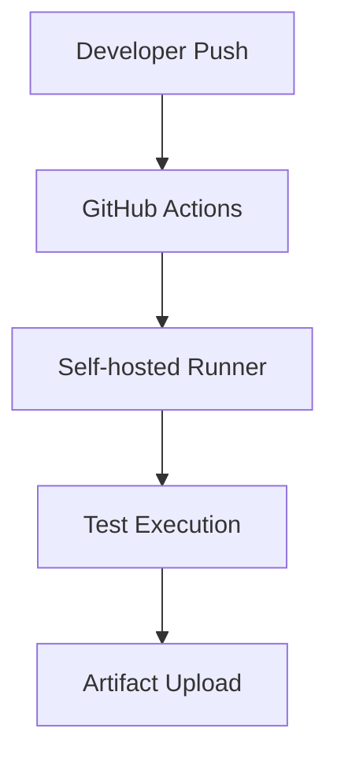

*[AAB]: Android App Bundle
*[APK]: Android Package Kit
*[GHES]: GitHub Enterprise Server
*[GHEC]: GitHub Enterprise Cloud
*[PR]: Pull Request

## 소개 {#intro}

이 문서는 **Chirpy Starter**에서 자주 쓰는 텍스트 및 타이포그래피 기능을  
**렌더링 테스트용 예제 + 실사용 가이드 + AI 프롬프트 참고 샘플** 형태로 정리한 문서입니다.

기존 데모 포스트를 단순히 보여주는 수준에서 끝내지 않고, 아래처럼 **용도 중심**으로 바로 재사용할 수 있도록 구성했습니다.

- 어떤 기능인지
- 언제 쓰는지
- 어떤 문맥에서 잘 어울리는지
- AI에게 어떻게 요청하면 되는지

이 문서에서 바로 확인할 수 있는 항목은 아래와 같습니다.

- Prompt 박스
- filepath 강조
- 코드 블록 파일명 배너
- nolineno
- image shadow
- image left align
- header id
- inline link
- abbreviation
- footnote
- definition list
- inline attribute list
- block attribute list
- `<kbd>`
- `<mark>`
- `<details>`
- math
- mermaid
- checklist
- table

> 이 포스트는 렌더링 테스트와 작성 가이드를 겸하는 샘플입니다.
{: .prompt-info }

> 운영 문서에 그대로 복붙하기보다, 필요한 블록만 골라서 문맥에 맞게 재조합하는 편이 좋습니다.
{: .prompt-tip }

> HTML 혼합이나 일부 스타일은 테마 버전에 따라 렌더링 차이가 있을 수 있습니다.
{: .prompt-warning }

> 운영 서버에 적용하는 명령이나 설정 예시는 반드시 직접 검증 후 사용하세요.
{: .prompt-danger }

## 이 샘플을 어떻게 쓰면 좋은가 {#how-to-use}

### 1. 블로그 샘플 포스트로 사용

Chirpy 기능이 정상 렌더링되는지 한 번에 확인할 때 유용합니다.

### 2. 팀 내부 마크다운 스타일 가이드로 사용

문서 작성자가 어떤 블록을 어떤 상황에서 써야 하는지 설명할 때 기준 문서로 쓸 수 있습니다.

### 3. AI 프롬프트용 예제 저장소로 사용

예를 들어 아래처럼 요청하면 일관된 결과를 얻기 쉽습니다.

> Chirpy 블로그 포스트 형식으로 작성해줘.  
> prompt-info, filepath, code block filename, details, mermaid를 포함하고, 각 섹션마다 실무 용도를 짧게 설명해줘.
{: .prompt-tip }

## Chirpy 기능 {#chirpy-features}

### prompt-tip / prompt-info / prompt-warning / prompt-danger {#prompts}

**용도**  
상태, 주의사항, 팁, 위험 요소를 눈에 띄게 강조할 때 사용합니다.

**추천 상황**

- info: 배경 설명, 보충 설명
- tip: 권장 방법, 실무 팁
- warning: 주의가 필요한 설정, 호환성 이슈
- danger: 운영 영향, 데이터 손실 가능성, 강한 경고

**AI 요청 예시**  
`이 섹션은 warning 박스로 감싸고, 업그레이드 전 체크포인트를 3줄로 요약해줘`

> 이 박스는 info 예제입니다.
{: .prompt-info }

> 이 박스는 tip 예제입니다.
{: .prompt-tip }

> 이 박스는 warning 예제입니다.
{: .prompt-warning }

> 이 박스는 danger 예제입니다.
{: .prompt-danger }

### filepath {#filepath}

**용도**  
파일 경로를 일반 인라인 코드보다 더 문서 친화적으로 보여줄 때 사용합니다.

**추천 상황**

- 설정 파일 위치 안내
- 스크립트 경로 설명
- 독자가 복사하거나 찾아야 하는 경로 강조

**AI 요청 예시**  
`설정 파일 경로는 filepath 스타일로 표기해줘`

설정 파일은 `.github/workflows/android-ci-demo.yml`{: .filepath} 입니다.

실행 스크립트는 `scripts/build-debug.sh`{: .filepath} 입니다.

### code block filename {#code-block-filename}

**용도**  
코드 블록이 어떤 파일에 들어가는 내용인지 바로 보이게 할 때 사용합니다.

**추천 상황**

- 설정 파일 예제
- 샘플 스크립트
- 여러 파일을 순서대로 설명하는 튜토리얼

**AI 요청 예시**  
`코드 블록 위에 파일명 배너가 보이도록 Chirpy file attribute를 붙여줘`

아래 코드는 파일명 배너 예제입니다.

```yaml
name: Android CI Demo

on:
  workflow_dispatch:
  push:
    branches: [main]

jobs:
  build:
    runs-on: ubuntu-latest
    steps:
      - uses: actions/checkout@v4
      - name: Run tests
        run: ./gradlew test
```
{: file=".github/workflows/android-ci-demo.yml" }

### nolineno {#nolineno}

**용도**  
짧은 코드나 단순 명령 예제에서 줄번호를 숨겨 시각적 부담을 줄일 때 사용합니다.

**추천 상황**

- 셸 스크립트 3~10줄 예제
- 복붙 중심 명령 예제
- 줄번호가 의미 없는 설정 샘플

**AI 요청 예시**  
`짧은 bash 예제이므로 줄번호는 숨기고 file 속성도 유지해줘`

아래 코드는 파일명 배너와 함께 줄번호를 숨기는 예제입니다.

```bash
#!/usr/bin/env bash
set -euo pipefail

echo "Start build"
./gradlew assembleDebug
```
{: file="scripts/build-debug.sh" .nolineno }

### image shadow / image left align {#images}

**용도**  
이미지를 더 자연스럽게 배치하거나, 본문 흐름 안에서 설명형 레이아웃을 만들 때 사용합니다.

**추천 상황**

- 대표 이미지 재사용
- UI 캡처 소개
- 이미지 옆에 설명 문단을 붙이고 싶을 때

**AI 요청 예시**  
`대표 이미지는 shadow를 적용하고, 두 번째 이미지는 left 정렬해서 본문이 흐르도록 작성해줘`

대표 이미지 재사용 예제입니다.

{: w="1200" h="630" .shadow }

_대표 이미지 재사용 예시_

왼쪽 정렬 예시입니다.

{: w="420" h="221" .left }

이 문단은 이미지가 왼쪽에 붙었을 때 텍스트가 어떻게 흐르는지 확인하기 위한 예시입니다.  
Chirpy에서 이미지 정렬과 본문 흐름을 함께 점검할 때 사용할 수 있습니다.  
문단이 충분히 길어야 줄바꿈 형태를 눈으로 확인하기 좋습니다.

<div style="clear: both"></div>

## kramdown 기능 {#kramdown-features}

### header id {#header-id}

**용도**  
제목 텍스트는 자유롭게 쓰되, 링크 대상 ID는 안정적으로 고정하고 싶을 때 사용합니다.

**추천 상황**

- 한글 제목을 유지하면서 링크는 영어 slug로 고정
- 다른 포스트나 문서에서 특정 섹션으로 직접 연결
- 제목이 바뀌더라도 anchor를 최대한 유지

**AI 요청 예시**  
`한글 제목을 쓰되 링크용 anchor는 why-this-stack 으로 고정해줘`

아래 제목은 고정 ID를 사용합니다.

### 개요 및 선정 이유 - Why this stack? {#why-this-stack}

- 제목은 한글로 자유롭게 쓰고
- 링크용 ID는 영어 slug로 고정하고
- 다른 포스트에서 직접 섹션 링크를 걸 수 있습니다

예시 링크: `/posts/your-post/#why-this-stack`{: .filepath}

### inline link guide {#inline-link-guide}

**용도**  
Chirpy에서 **고정된 섹션 링크와 문서 내부 점프 링크**를 안정적으로 만들기 위한 작성 규칙입니다.

**핵심 개념**  
Chirpy 테마는 내부적으로 **Kramdown** 마크다운 렌더러를 사용합니다.  
따라서 Kramdown의 공식 문법인 **속성 리스트(Attribute List)** 를 활용해서 **Slug(고정 ID)** 를 지정하고, 그 Slug로 링크를 거는 방식이 가장 안정적입니다.

링크 작업은 크게 아래 두 단계로 나뉩니다.

1. **목적지에 Slug(ID) 달기**
2. **지정한 Slug로 링크 걸기**

#### 1. 목적지에 Slug(ID) 지정하기 {#set-slug}

요소의 끝이나 바로 아랫줄에 중괄호와 샵 표기인 `{#아이디}` 또는 `{: #아이디 }` 를 사용하면 고유한 ID를 부여할 수 있습니다.

##### 제목에 지정할 때 {#header-slug-guide}

한글 제목은 브라우저에서 URL 인코딩이 길어지거나, 경우에 따라 링크가 지저분해 보일 수 있습니다.  
그래서 제목 끝에 **영문 Slug를 수동으로 지정**하는 방식이 실무에서는 더 안정적입니다.

```md
## 셋업 방법 안내 {#setup-guide}
```
{: .nolineno }

실제 예시:

## 셋업 방법 안내 {#setup-guide-demo}

- 표시되는 제목은 한글로 유지
- 링크는 `#setup-guide-demo` 처럼 고정
- 제목 문구가 조금 바뀌어도 anchor 전략을 유지하기 쉬움

##### 일반 문단이나 블록에 지정할 때 {#block-slug-guide}

문단, 인용구, 표, 리스트 같은 **블록 요소** 에 ID를 달고 싶다면, 해당 블록 바로 아래 줄에 `{: #아이디 }` 를 적습니다.

```md
이 문단으로 바로 점프하게 만들고 싶습니다.
{: #jump-here }
```
{: .nolineno }

실제 예시:

이 문단으로 바로 점프하게 만들고 싶습니다.
{: #jump-here }

##### 문장 중간 인라인 요소에 지정할 때 {#inline-slug-guide}

문장 중간의 특정 텍스트에만 Slug를 달고 싶다면, 텍스트를 백틱이나 강조 문법으로 감싼 뒤 바로 뒤에 공백 없이 `{:#아이디}` 를 붙입니다.

```md
이 문장은 `인라인 앵커`{:#inline-anchor} 예시입니다.
```
{: .nolineno }

실제 예시:

이 문장은 `인라인 앵커`{:#inline-anchor} 예시입니다.

#### 2. 지정한 Slug로 링크 걸기 {#link-to-slug}

일반적인 마크다운 링크 문법인 `[링크 텍스트](이동할 경로)` 를 사용하되, 목적지가 어디인지에 따라 경로 작성법이 달라집니다.

##### 같은 포스트 내부에서 이동할 때 {#same-post-link-guide}

같은 페이지 안에서 이동할 때는 **경로 자리에 `#슬러그`만** 적으면 됩니다.

```md
자세한 내용은 [셋업 방법 안내](#setup-guide-demo)를 참고하세요.
```
{: .nolineno }

실제 예시:

자세한 내용은 [셋업 방법 안내](#setup-guide-demo)를 참고하세요.

문단 점프 예시: [이 문단으로 이동](#jump-here)

인라인 앵커 점프 예시: [인라인 앵커로 이동](#inline-anchor)

##### 다른 포스트의 특정 위치로 이동할 때 {#other-post-link-guide}

다른 포스트나 페이지의 특정 위치로 이동할 때는 **대상 포스트 URL 뒤에 `#슬러그`를 덧붙입니다.**

```md
[빌드 로직 섹션 바로가기](/posts/your-post/#build-logic)
```
{: .nolineno }

같은 블로그 내 다른 포스트 예시:

- [다른 글 전체 보기](/posts/your-post/)
- [다른 글의 특정 섹션 보기](/posts/your-post/#build-logic)

##### 외부 문서 링크와 구분할 때 {#external-link-guide}

외부 링크는 일반 URL을 그대로 사용하면 됩니다.  
다만 **경로 표시용 텍스트** 와 **이동용 링크** 는 구분해서 쓰는 편이 읽기 좋습니다.

- 경로 표시용: `.github/workflows/android-ci-demo.yml`{: .filepath}
- 이동용 링크: [workflow 파일 예제 보기](#code-block-filename)

외부 공식 문서 예시: [GitHub Actions 공식 문서](https://docs.github.com/actions)

**권장 작성 팁**

- `여기`, `클릭` 같은 문구보다 **무엇으로 이동하는지 드러나는 링크 텍스트** 가 좋습니다.
- 한글 제목은 자동 생성 anchor에 기대기보다, 영문 Slug를 직접 부여하는 편이 안전합니다.
- 같은 문서 안 반복 참조가 많다면 `setup-guide`, `build-logic`, `runner-checklist` 처럼 **짧고 예측 가능한 Slug** 를 권장합니다.

**AI 요청 예시**  
`Chirpy와 Kramdown 기준으로 같은 페이지 이동 링크 작성법을 설명하고, 제목 Slug 지정 예제 1개, 블록 Slug 예제 1개, 인라인 Slug 예제 1개, 다른 포스트 섹션 링크 예제 1개를 포함해줘`

### abbreviation {#abbreviation}

**용도**  
반복해서 등장하는 약어를 문서 상단에서 정의해 가독성을 높일 때 사용합니다.

**추천 상황**

- 기술 문서에서 동일 약어가 여러 번 등장
- 팀 외부 공유 문서
- 영어 약어가 많은 블로그 포스트

**AI 요청 예시**  
`문서 상단에 AAB, APK, GHES, GHEC, PR 약어 정의를 추가해줘`

AAB 와 APK 는 Android 배포 문서에서 자주 등장합니다.

GHES 와 GHEC 는 GitHub 제품군 비교 글에서 자주 등장합니다.

PR 자동화 정책을 설명할 때도 약어 정의가 있으면 문서가 더 깔끔해집니다.

### footnote {#footnote}

**용도**  
본문 흐름을 끊지 않으면서 보충 설명이나 예외사항을 뒤로 빼고 싶을 때 사용합니다.

**추천 상황**

- 운영상 trade-off 설명
- 비용, 제약, 부가 조건 정리
- 본문보다 우선순위가 낮은 설명

**AI 요청 예시**  
`본문은 짧게 유지하고 운영상 단점은 footnote로 빼줘`

이 방식은 운영 제어가 쉽습니다.[^ops]

비용 구조도 예측하기 편합니다.[^cost]

문서 하단 각주 영역이 실제로 생성되는지 확인해보세요.[^render]

[^ops]: 대신 self-hosted runner 운영 비용과 관리 책임이 늘어납니다.
[^cost]: 초기 투자 비용은 늘 수 있지만 장기적으로는 효율적일 수 있습니다.
[^render]: 이 각주는 렌더링 확인용 예시입니다.

### definition list {#definition-list}

**용도**  
용어 사전처럼 개념과 설명을 짝지어 보여줄 때 적합합니다.

**추천 상황**

- 온보딩 문서
- 개념 설명 섹션
- 도메인 용어 정리

**AI 요청 예시**  
`아래 핵심 용어 3개를 definition list 형식으로 정리해줘`

Self-hosted Runner
: 직접 운영하는 GitHub Actions 실행기

Artifact
: 워크플로 결과물로 업로드하는 파일

Matrix Build
: 여러 조합을 병렬로 실행하는 빌드 전략

### inline attribute list {#inline-attribute-list}

**용도**  
문장 안 특정 토큰 하나만 별도 스타일이나 ID로 제어하고 싶을 때 사용합니다.

**추천 상황**

- 경로만 강조
- 짧은 인라인 anchor 생성
- 특정 토큰을 링크 대상으로 만들기

**AI 요청 예시**  
`문장 안에서 경로 하나는 filepath 클래스로, 코드 하나는 고정 ID를 주는 예제로 보여줘`

이 문장은 `강조 경로`{:.filepath} 처럼 인라인 클래스 적용 예제를 보여줍니다.

이 문장은 `inline-code-demo`{:#inline-code-demo} 처럼 인라인 ID를 줄 수 있습니다.

[인라인 ID 링크 테스트](#inline-code-demo)

### block attribute list {#block-attribute-list}

**용도**  
문단, 인용문, 블록 전체에 ID나 클래스를 붙여 스타일 또는 링크 대상을 제어할 때 사용합니다.

**추천 상황**

- 특정 블록을 바로 링크하고 싶을 때
- prompt 스타일을 블록 전체에 적용할 때
- 커스텀 CSS 대상 블록을 명확히 잡을 때

**AI 요청 예시**  
`이 문단은 custom-block-example ID를 부여하고 링크 테스트도 같이 넣어줘`

> 이 문장은 block IAL + prompt-info 예제입니다.
{: .prompt-info }

이 문단은 일반 블록에 ID를 붙인 예제입니다.
{: #custom-block-example }

[블록 ID 링크 테스트](#custom-block-example)

## HTML 혼합 {#html-mixed}

### kbd {#kbd}

**용도**  
단축키를 문서에서 읽기 쉽게 표현할 때 사용합니다.

**추천 상황**

- 에디터 사용법
- 개발도구 단축키 안내
- 온보딩 문서

**AI 요청 예시**  
`단축키는 kbd 태그로 표기해줘`

저장하려면 <kbd>Ctrl</kbd> + <kbd>S</kbd> 를 누르세요.

명령 팔레트는 <kbd>Ctrl</kbd> + <kbd>Shift</kbd> + <kbd>P</kbd> 입니다.

### mark {#mark}

**용도**  
리뷰 포인트나 핵심 문장을 시각적으로 강조할 때 사용합니다.

**추천 상황**

- 꼭 봐야 하는 한 문장
- 변경 포인트 강조
- 회의 후 요약 포인트 표시

**AI 요청 예시**  
`핵심 결론 한 문장만 mark 태그로 강조해줘`

이 문장은 <mark>하이라이트 예제</mark> 입니다.

### details {#details}

**용도**  
기본 본문은 짧게 유지하면서, 필요할 때만 펼쳐보는 추가 정보를 넣을 때 유용합니다.

**추천 상황**

- 트러블슈팅
- FAQ
- 로그 예시나 세부 조건 숨김 처리

**AI 요청 예시**  
`트러블슈팅 목록은 details 블록 안으로 넣어줘`

<details markdown="1">
<summary>트러블슈팅 더 보기</summary>

- 러너 라벨이 정확한지 확인
- 캐시 키가 너무 자주 바뀌지 않는지 확인
- artifact 업로드 경로가 맞는지 확인
- timeout 발생 시 어느 테스트가 hang 되었는지 summary에 노출되는지 확인

</details>

## 기타 {#others}

### table {#table}

**용도**  
짧은 비교표, 기본 설정값, 체크 기준을 깔끔하게 보여줄 때 사용합니다.

**추천 상황**

- 운영 기준표
- 옵션 비교
- 권장값 표기

**AI 요청 예시**  
`운영 기준을 3열 테이블로 정리해줘`

| 항목 | 권장 | 비고 |
|---|---|---|
| Runner 수 | 4 | 기본 운영 예시 |
| 캐시 | 사용 | 빌드 시간 절감 |
| 로그 보관 | 14일 | 팀 정책에 맞게 조정 |

### checklist {#checklist}

**용도**  
작업 완료 여부나 게시 전 검수 항목을 명확히 보여줄 때 사용합니다.

**추천 상황**

- 포스트 발행 전 체크
- CI 구성 점검
- 문서 리뷰 체크리스트

**AI 요청 예시**  
`배포 전 점검 항목을 checklist 형식으로 5개 만들어줘`

- [x] Prompt 박스 확인
- [x] filepath 확인
- [x] 코드 파일 배너 확인
- [x] nolineno 확인
- [x] 이미지 렌더링 확인
- [x] 각주 확인
- [x] 약어 정의 확인
- [ ] 필요한 블록만 골라서 실제 포스트에 반영

### math {#math}

**용도**  
수식이 포함된 기술 문서나 개념 설명을 작성할 때 사용합니다.

**추천 상황**

- 알고리즘 설명
- 비용 공식
- 모델 관련 수학 표현

**AI 요청 예시**  
`인라인 수식 1개와 블록 수식 1개를 포함해줘`

인라인 수식 예: $E = mc^2$

블록 수식 예:

$$
f(x) = x^2 + 2x + 1
$$

### mermaid {#mermaid}

**용도**  
텍스트 기반으로 간단한 구조도나 흐름도를 함께 보여줄 때 사용합니다.

**추천 상황**

- CI/CD 흐름
- 시스템 구성도
- 검증 절차 설명

**AI 요청 예시**  
`GitHub Actions에서 self-hosted runner로 테스트가 실행되는 흐름을 mermaid로 그려줘`



## AI 프롬프트 템플릿 예시 {#ai-prompt-templates}

아래 문구는 이 문서를 **샘플 템플릿**처럼 재사용할 때 참고할 수 있는 예시입니다.

### 템플릿 1. 튜토리얼 포스트 생성

> Chirpy 블로그 포스트 형식으로 작성해줘.  
> 대상 독자는 CI/CD 입문자이고, prompt-info, filepath, code block filename, details, checklist를 포함해줘.  
> 각 기능에는 한 줄짜리 용도 설명을 붙이고, 문체는 실무 가이드처럼 깔끔하게 써줘.
{: .prompt-tip }

### 템플릿 2. 기술 비교 글 생성

> GHES와 GHEC 비교 글을 작성해줘.  
> abbreviation, table, footnote, mark를 포함하고, 섹션마다 언제 이 구성이 유리한지 설명해줘.  
> 같은 페이지 섹션 링크도 2개 넣어줘.
{: .prompt-tip }

### 템플릿 3. 운영 문서 생성

> self-hosted runner 운영 가이드를 Chirpy 포스트 형식으로 작성해줘.  
> warning과 danger 박스를 포함하고, 파일 경로는 filepath 스타일로 표시해줘.  
> 트러블슈팅은 details 블록으로 접어주고, 마지막에는 체크리스트를 넣어줘.
{: .prompt-tip }

> 위 템플릿들은 Chirpy를 적용한 가이드를 만들어줄테지만 
> 항상 링크에 대한 검증과 제대로된 동작을 확인하시길 바랍니다.
{: .prompt-warning }

### 템플릿 4. 기존 문서 수정
```text
참고 문서의 규칙을 적용해서 원본 Markdown을 재작성해줘.

우선순위:
1. 원본 내용 보존
2. 참고 문서의 표현 규칙 적용
3. Chirpy/Kramdown 호환성 유지

작업 방식:
- 어떤 기법이 필요한지 먼저 판단
- 필요한 기법만 최소한으로 적용
- slug, inline link, filepath, code block file attribute, details 등을 상황에 맞게 사용
- 없는 링크/이미지/사실은 추가하지 않음

출력 형식:
- 최종 Markdown만 출력
- 설명, 해설, 변경 사유는 출력하지 않음

[참고 문서 시작]
여기에 chirpy guide markdown 전문
[참고 문서 끝]

[원본 Markdown 시작]
여기에 사용자 원본 markdown 전문
[원본 Markdown 끝]
```
## 마무리 {#conclusion}
이 포스트는 모든 것을 직접 검증하고 AI 템플릿을 추가하였습니다.
이 포스트를 prompt처럼 사용하고 싶으시면 [프롬프트](#ai-prompt-templates) 부분부터 마지막까지는
지우고 사용하시면 됩니다.
제 모든 포스트는 AI와 함께 작성하지만 항상 Best Practice 그리고 직접 확인하는 것을 철칙으로 합니다.
이 블로그도 정식 AI가 정식 가이드가 아닌 쉬운 방법을 말해줘서 3번째 다시 만들었습니다.

