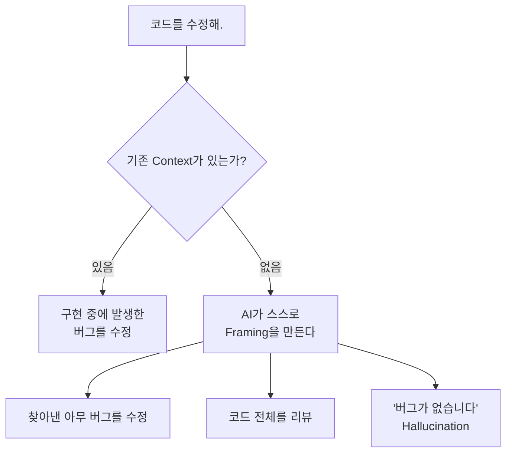
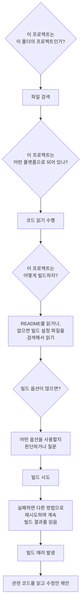
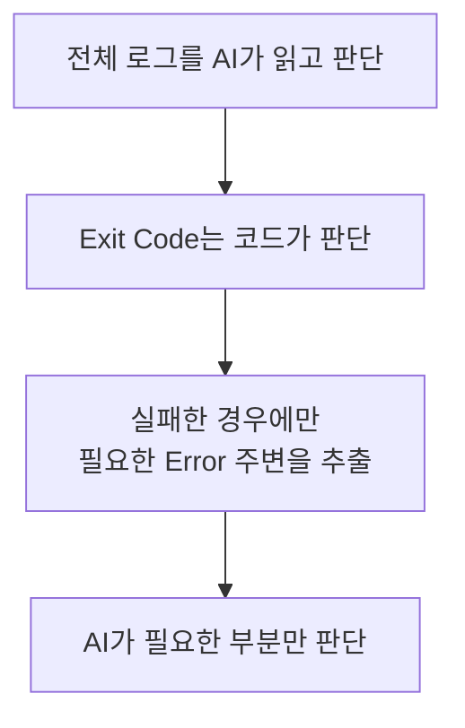
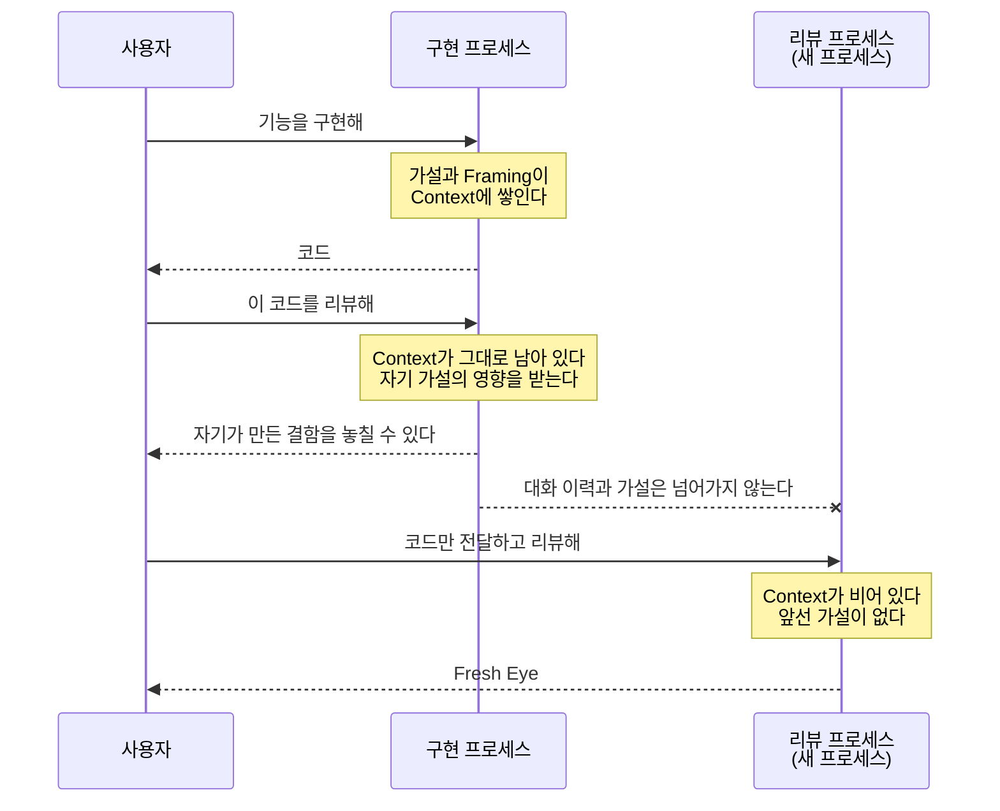

2022년 말 OpenAI사의 ChatGPT 공개를 시작으로, 2023년 정도부터 바야흐로 AI의 시대가 시작되었다.

그때까지만 해도 나는 좋은 검색엔진 정도 수준으로 생각했지만,
Transformer 모델이 번역을 잘하더니 그걸 넘어서 사람의 말을 코드로 번역하듯이 생성하기 시작하는 걸 보면서 나는 이 분야에 흥미를 가지기 시작했고 좀 더 깊이 공부하고, 사용하고, 실험해보았다.

많은 재미있는 일들을 보았고, 정말로 개발자가 AI로 대체되는 걸까, 일부 대체되는 걸까? 이런 고민도 해봤고 나름의 결과도 나오는 것 같다.

그 와중에 했던 실험들, 내가 테스트해본 것들, 얻었던 교훈들, 실패 경험을 나눠서 여러분의 실패 비용을 줄이고 AI를 아주 가성비 있게 그리고 유용하게 사용하는 방법들과 사례를 소개하고자 한다.

그리고 가급적 매 글마다 간단한 실험과 실제 코드를 제공하고자 한다.

먼저 내가 자주 사용하게 될 용어를 공유하고 그게 왜 중요하고 자주 나오는지 소개하고자 한다.

> 몇 개는 실제 전문적이고 인용되는 용어이고, 몇 개는 나만 쓰는 것 같은 내 머릿속의 용어이고, 몇 개는 AI가 나에게 자주 말해서 내가 학습된 용어들이다.
{: .prompt-info }

## 비결정성(Non-determinism) {#non-determinism}

AI의 주요 특징 중 하나는 비결정적인 요소에 있다.

아래와 같이 두 개의 정확히 같은 질문을 새로운 세션에서 열어서 질문했을 때 다른 답이 나오는 것을 볼 수 있다.

{: w="800" h="379" .shadow }
_1차 실행 — "I am Gemma 4, ..." 로 시작한다_

{: w="800" h="379" .shadow }
_2차 실행 — 같은 프롬프트에 다른 응답 "Hello! I am Gemma 4, ..." 로 시작한다_

> 그런데 AI는 어쩔 수 없이 비결정적인 걸까? 설정을 전부 고정하면 같은 답이 나올까?
>
> 궁금하다면 아래 제목을 눌러 펼쳐보자. 직접 해본 실험도 함께 담았다.
{: .prompt-info }

<details markdown="1">
<summary><strong>AI는 꼭 비결정적일까?</strong> — 눌러서 펼치기</summary>

LLM 자체가 무작위 장치인 것은 아니다. 가중치는 이미 고정되어 있고, 아래 설정만 잡으면 원리적으로는 같은 Input에 같은 Output이 나온다.

| 설정키 | 설명 | 값 |
| :--- | :--- | :--- |
| `temperature` | 확률 분포를 얼마나 평탄하게 펼칠지.<br>높을수록 확률이 낮은 토큰까지 뽑힌다 | `0` — 가장 확률 높은 토큰만 고른다 |
| `top_k` | 확률 상위 몇 개를 후보로 둘지 | `1` — 후보를 하나로 줄인다 |
| `top_p` | 누적 확률 상위 몇 %까지를 후보로 둘지 | `temperature` 가 `0`이면 영향이 없다 |
| `seed` | 샘플링에 쓰는 난수의 시작값 | 샘플링을 한다면 매번 같은 값으로 |

애초에 같은 결과만 원한다면 사실 AI를 사용할 필요가 없다. 그리고 위 설정을 전부 고정하더라도 아래 두 가지 문제로 결국 사용자 입장에서는 비결정적이게 된다.

| 영향받는 요소 | 원인 |
| :--- | :--- |
| **Context** | 이전에 어떤 말을 했는지, 그리고 AI가 개인 메모리에<br>무엇을 적어뒀는지에 따라 실제로 모델에 들어가는<br>Input 자체가 달라지기 때문에 계속 다른 결과만 나온다.<br>즉, 첫 질문에만 똑같이 대답하고<br>단어 순서나 마침표 하나에도 영향을 받는다. |
| **수치 오차** | 부동소수점 덧셈은 결합법칙이 성립하지 않는다.<br>커널 구현, 배치 크기, KV 캐시 압축에 따라<br>누적 순서와 정밀도가 달라지고 그 미세한 차이와<br>AI를 서빙하는 서버 상태에 따라 매번 다른 결과가 온다. |

**그래서 직접 확인해봤다**

설정을 모두 고정한 채로, 두 세션에 **완전히 같은 질문**을 먼저 던지고, 그다음 턴에서만 한쪽은 `hello`, 다른 쪽은 `hi` 로 인사한 뒤, 마지막에 **다시 같은 질문**을 했다.

{: w="700" h="1155" .shadow }
_`hello` 세션_

{: w="700" h="1121" .shadow }
_`hi` 세션_

첫 질문 `who you are?` 의 답변은 두 세션이 글자 하나까지 똑같다. 설정을 고정하면 같은 Input에 같은 Output이 나온다는 뜻이다.

그런데 `hello` 와 `hi` 라는, 사람이 보기에는 아무 차이 없는 한 턴이 끼어들자 마지막 질문 `what is gemma4?` 의 답변이 갈렸다.

{: w="800" h="550" .shadow }
_같은 질문의 답변인데 구성이 다르다_

| 위치 | `hello` 세션 | `hi` 세션 |
| :--- | :--- | :--- |
| 답변 첫 문장 | As an **open weights** model | As an `"open weights"` model |
| `Output:` 항목 | it generates **text only**. | it generates **text only**.<br>**It cannot generate images or audio.** |
| 마무리 문단 | **In short, Gemma 4 is a state-of-the-art**<br>**AI model ...** | 없음 |

답변의 길이와 구성 자체가 달라졌다. 사용자에게는 "같은 질문"이지만, 모델이 실제로 받은 Input은 앞선 대화가 통째로 붙은 **다른 Input**이었기 때문이다. 위 표의 **Context** 가 바로 이것이다.

참고 자료:

- [Defeating Nondeterminism in LLM Inference](https://thinkingmachines.ai/blog/defeating-nondeterminism-in-llm-inference/) — Thinking Machines Lab

</details>

OpenAI 역시 생성 모델의 출력이 비결정적일 수 있음을 공식 문서에서 설명하고 있으며, 이런 특성을 다루기 위해 반복 가능한 평가(Evals)를 사용하는 것을 권장한다.

OpenAI 공식 문서: [Evaluation best practices](https://developers.openai.com/api/docs/guides/evaluation-best-practices)

이 개념을 아는 것에서부터 AI에 대한 이해를 시작할 수 있고, 또한 AI가 왜 실패하는지 이해할 수 있다.

AI의 Harness, Prompt Engineering, Few-shot, One-shot 같은 기법들도 모델이 원하는 방향의 결과를 낼 가능성을 높이려는 노력이라고 볼 수 있다.
Google 역시 공식 Prompt Design 문서에서 명확한 지시와 예시를 사용하는 방법을 권장하고 있다.

Google 공식 문서: [Prompt design strategies](https://ai.google.dev/gemini-api/docs/prompting-strategies)

## 결정론적 코드(Deterministic Code) {#deterministic-code}

앞서 사용한 AI의 비결정적인 요소와 대조되는 표현으로 **결정론적(Deterministic)** 이라는 말을 자주 사용할 것이다.

간단하게 말하면 동일한 Input에 동일한 Output이 나온다는 너무 당연한 표현이다.

아래와 같은 Python 코드에 `add(2, 3)`을 하면 무슨 노력을 해도 `5`가 나올 것이다.

```python
def add(a, b):
    return a + b
```
{: .nolineno }

대부분의 소프트웨어 개발에서는 일부러 비결정론적으로 사용하는 Random 함수나 외부 상태 등의 영향을 받는 경우가 아닌 이상, 결정론적인 결과를 요구한다.

즉, 지금 개발자들의 상황을 굳이 정의하자면 **비결정적인 결과를 만들어내는 AI로 결정론적 코드를 생성하려고 노력하고 있는 것**이다.

결국 AI로 개발을 한다는 것은 극단적으로 나누면 둘 중 하나다.

AI로 결정론적인 코드를 생성하거나, AI의 비결정적인 요소 다른 말로 창의성이라고도 할 수 있는 부분을 이용해서
판단, 분석, 추론에 사용하겠다는 것이다.

## 프레이밍(Framing) {#framing}

Framing은 단순히 사용자의 요청사항 그 자체라기보다는 **AI가 사용자의 요청사항을 어떤 문제로 받아들이게 할 것인가에 대한 틀**이라고 이해하면 좋다.

AI는 기본적으로 사용자의 지시를 따르려는 기본적인 성질을 가지고 있다.

물론 System이나 Developer Instruction, Safety Policy 등 더 높은 우선순위의 규칙이 있기 때문에 사용자의 모든 지시를 무조건 따르는 것은 아니다.

그래도 허용되는 요청이라면 사용자의 의도를 최대한 수행하려고 한다.

만약에 사용자가

> 너는 고양이야. 그러니까 말끝에 냥을 붙여서 대답해야 해.
{: .user-prompt }

라고 말하면 대체로 따른다냥.

솔직히 소비자에게

> 너는 되도 않는 짓을 하고 있어. 고양이는 말을 못하고 말끝에 냥도 못 붙여.

라고 매번 정색하며 사용자의 지시를 따르지 않는 AI를 누가 구독할까?

이건 어떻게 보면 AI가 사용자에게 유용해야 하기 때문에 생기는 태생적인 특성이다.

여기서 생기는 문제들이 있다.

내가

> 코드를 수정해.
{: .user-prompt }

라고 막연히 말하면 AI는 어떻게 받아들일까?

이전에 구현 중에 발생한 버그가 있다면 버그를 수정하려 할 것이고, 기존 Context가 없다면 자신이 Framing을 만들어야 한다.



어떻게 할지는 비결정적이다. 즉 정확히 알 수 없다.

코드를 분석하다가 찾아낸 아무 버그를 고치거나, 코드 전체를 리뷰하거나, 경우에 따라서는 "버그가 없습니다"라고 당당하게 Hallucination을 할 수도 있다.

이 Framing을 AI가 어떻게 받아들이게 만드는가는 매우 중요한 요소다.

만약 내가 AI에게 어떤 Test Case를 만들고

> 이 테스트를 무조건 통과시켜.
{: .user-prompt }

라고 말하면 AI의 지상과제는 사용자의 요청을 받아 **테스트를 통과시키는 것**이 된다.

어떻게?

비결정론적으로 가장 쉬운 방법을 찾거나, 자기가 아는 방법을 사용하거나, 자신의 Context나 Memory를 뒤져서 해결할 수도 있다.

최악의 경우에는 그냥 테스트 자체를 통과시키기 위해 가짜 코드를 만들 수도 있다.

> 그래서 단순히 원하는 결과만 이야기할 것이 아니라 **어떤 문제를 해결하는 것인지, 무엇을 해서는 안 되는지까지 같이 Framing하는 것**이 중요하다.
{: .prompt-tip }

## 판단 영역(Decision Space) {#decision-space}

나는 AI에게 **판단 영역을 줄여준다**는 표현을 자주 사용할 것이다.

`Decision Space` 자체는 여러 분야에서 사용되는 표현이지만, 여기서 말하는 **"AI가 스스로 판단해야 하는 영역"**이라는 정의는 내가 설명을 쉽게 하기 위해 사용하는 실무적인 표현이다.

예를 들면 다음과 같다.

AI에게

> 이 프로젝트를 빌드하고 빌드 에러가 발생하면 고쳐.
{: .user-prompt }

라고 하면 AI는 판단해야 할 것이 너무 많아진다.



사용하는 AI가 Memory를 지원하거나 `AGENTS.md`{: .filepath}, `GEMINI.md`{: .filepath}, `CLAUDE.md`{: .filepath} 같은 특정 프로젝트의 가이드를 제공하지 않으면 매번 저 행동을 반복할 수 있다.

| 도구 | 프로젝트 지침 파일 | 설명 | 공식 문서 |
| :--- | :--- | :--- | :--- |
| OpenAI Codex | `AGENTS.md`{: .filepath} | 작업 전 읽어 프로젝트별 지침으로 사용한다 | [agents-md](https://learn.chatgpt.com/docs/agent-configuration/agents-md) |
| Claude Code | `CLAUDE.md`{: .filepath} | 프로젝트별 지침을 Context로 제공할 수 있다 | [memory](https://code.claude.com/docs/en/memory) |
| Gemini CLI | `GEMINI.md`{: .filepath} | 프로젝트 Context로 사용할 수 있다 | [gemini-md](https://geminicli.com/docs/cli/gemini-md/) |

이 질문의 판단 영역을 좁히려면 어떻게 할까?

예를 들어 빌드 방법과 여러 옵션을 미리 정의하고, AI가 전체 빌드 로그를 전부 읽는 대신 Exit Code `0`, `1`만 먼저 읽게 할 수 있다.

실패했을 때만 에러를 특정 Keyword로 `grep`하여 그 주위 라인만 읽게 하면 판단 영역이 좁혀진다.



이 판단 영역은 매우 중요한 요소다.

판단 영역을 좁힐수록 Token과 Context를 줄이는 것은 물론이고, **고역량 모델이 해야 했던 일을 더 낮은 역량의 모델도 수행할 수 있는 수준의 문제로 바꿀 수 있기 때문**이다.

즉 나는 AI를 잘 사용한다는 것이 무조건 더 고성능의 모델을 사용하는 것이라고 생각하지 않는다.

> **AI가 판단하지 않아도 되는 영역을 코드로 제거하고, AI가 판단해야 하는 문제 자체를 쉽게 만드는 것**도 중요한 AI Engineering이라고 생각한다.
{: .prompt-tip }

## 앵커링 효과(Anchoring Effect) {#anchoring-effect}

AI는 이전 대화, 자기가 세운 가설 혹은 Framing, 이전에 발견한 사실에 영향을 받고 그 방향을 지속해가려는 경향을 보일 때가 있다.

나는 이런 현상을 설명할 때 **앵커링 효과(Anchoring Effect)** 라는 표현을 자주 사용할 것이다.

원래 Anchoring Effect는 사람의 인지 편향을 설명하는 용어이므로 사람에게 나타나는 현상과 LLM의 동작을 완전히 같은 것으로 보려는 것은 아니다.

하지만 AI를 사용하다 보면 비슷하게 설명할 수 있는 상황을 자주 경험한다.

예를 들어 코드를 구현한 모델은 자신이 판단하기에 그 코드가 좋은 선택이라고 생각해서 생성한 것이다.

그 구현자에게 바로

> 이 코드를 리뷰해.
{: .user-prompt }

라고 하면 자기 자신이 만든 결함을 놓칠 가능성이 있다.

물론 리뷰 자체를 명확한 전환점으로 주거나, 사용자가 여러 관점을 제공해서 다시 Framing하면 결함을 찾아내기도 한다.

하지만 하나의 Prompt로

> 기능을 구현하는 코드를 짜고 리뷰해.
{: .user-prompt }

라고 하면 Review 단계에서도 자신이 앞서 사용한 가설과 Context의 영향을 받을 수 있다.

> 즉 **Self-review가 불가능하다는 뜻이 아니라, 독립적인 Reviewer와는 조건이 다르다는 것**이다.
{: .prompt-info }

## 컨텍스트 격리(Context Isolation) {#context-isolation}

Context와 관련된 용어다.

앞서 말한 Anchoring Effect 때문에 기존 Context와 격리된, 아무 연관 없는 프로세스에서 Review를 진행할 때 나는 이것을 **Fresh Eye**라고 부르거나 **Context 오염이 없는, 혹은 격리된 프로세스**라고 표현한다.



`Fresh Eye`는 내가 설명을 쉽게 하기 위해 자주 사용하는 표현이고, 기술적으로는 **Context Isolation**이라는 표현이 더 가깝다.

Anthropic도 Claude Code의 Subagent를 설명하면서 각각의 Subagent가 **자신의 Context Window에서 실행된다**고 명시하고 있으며, Context Isolation이 필요한 작업에 Subagent를 사용하는 방법을 공식적으로 설명하고 있다.

Anthropic 공식 문서: [Subagents](https://code.claude.com/docs/en/sub-agents)

OpenAI Codex도 Specialized Agent를 Spawn하고 결과를 수집하는 Subagent Workflow를 지원한다.

OpenAI 공식 문서: [Subagents](https://learn.chatgpt.com/docs/agent-configuration/subagents)

이 Fresh Eye라는 개념의 효과는 좀 놀라운데, 이런 독립된 Context를 이용하는 아이디어 때문에 **Subagent-Driven Development** 같은 실무 개념도 등장하였다.

`obra/superpowers`에는 실제로 `Subagent-Driven Development`라는 이름의 Workflow가 존재한다. 다만 이것은 현재 TDD처럼 정립된 일반적인 소프트웨어 공학 방법론이라기보다는 Agentic Coding에서 사용되는 실무 패턴에 가깝다.

참고: [obra/superpowers — subagent-driven-development SKILL.md](https://github.com/obra/superpowers/blob/main/skills/subagent-driven-development/SKILL.md)

이 Subagent Fresh Eye라는 것은 나에게 많은 시사점을 줬다. 컨텍스트 오염이 없고 격리된 프로세스는, 내가 엄격하게 관리하고 관점을 주입한 프롬프트가 없어도, 내가 관리한 컨텍스트를 주입한 모델보다 리뷰 포인트가 좋았던 것이다. 이 주제도 언젠가 다룰 수 있으면 좋을 것 같다.

이 개념은 Skill의 개발과 테스트에도 매우 중요한 개념인데, **Skill에 대해서는 뒤에서 별도의 글로 자세히 다루려고 한다.**

---

> **다음 글 예고**
>
> 다음 글은 AI 벤더사들이 제공하는 프로그램 그리고 API들에 대해서 유형을 분류하고, 간단한 사용처를 분류하고자 한다.
>
> 의외로 많은 사람들이 Chat, CLI, API, Desktop의 차이를 잘 모르고 있고 제대로 활용하지 않는 것 같아서, 활용할 수 있는 기능 위주로 소개할 예정이다.
{: .prompt-info }

*[TDD]: Test Driven Development
*[LLM]: Large Language Model
