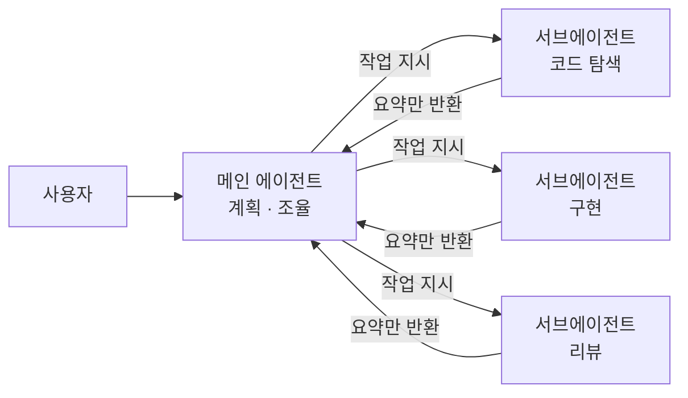
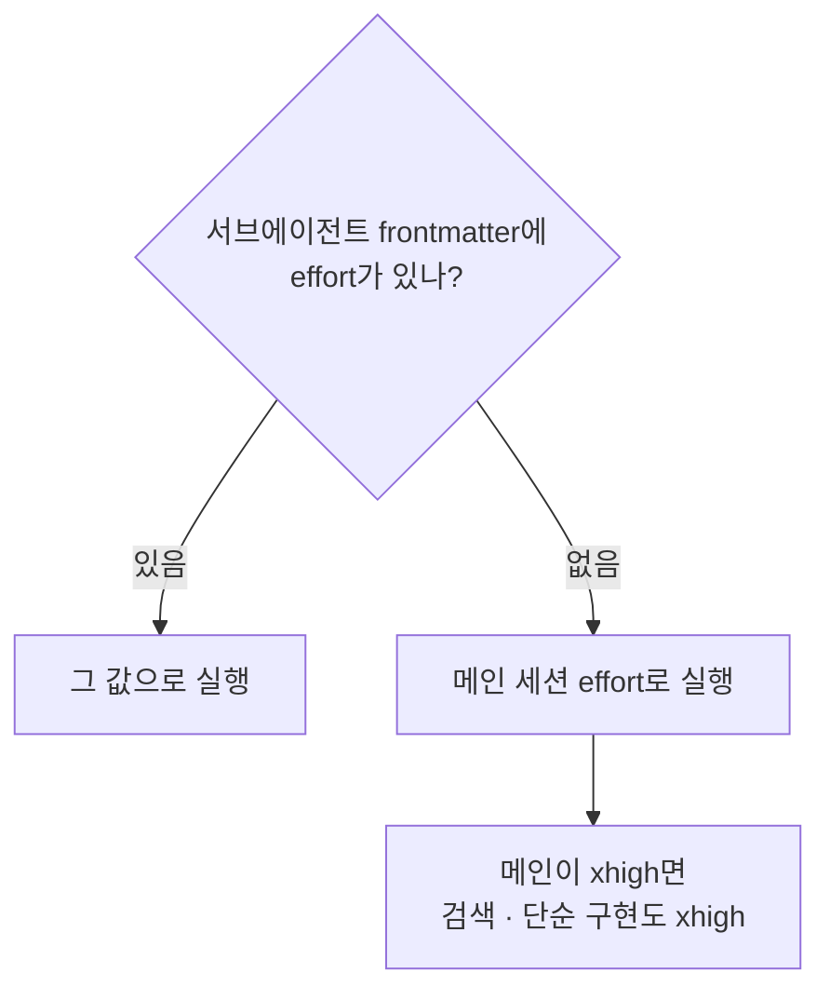
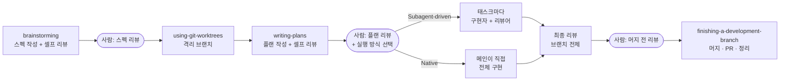
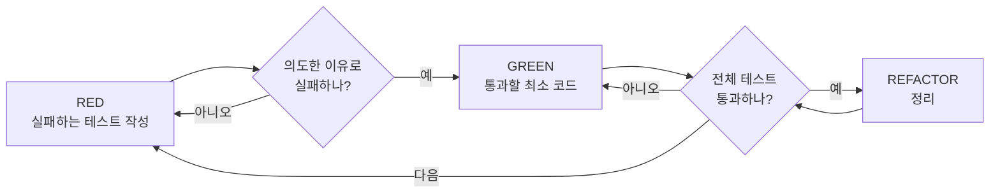
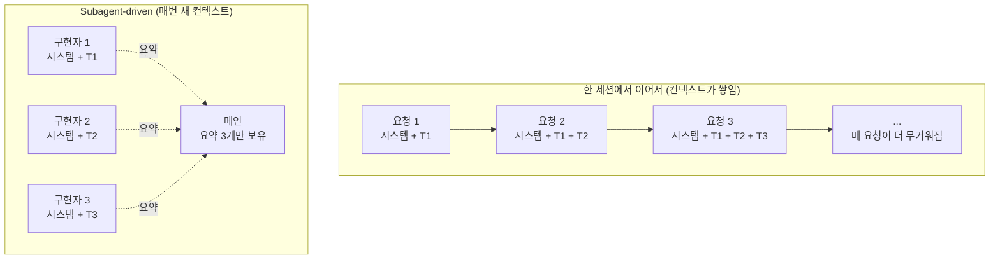

Claude Code를 쓰다 보니 생각보다 느리고 토큰 소모량이 많았다. 그래서 개인적으로 알아봤다.

원인 중 하나는 서브에이전트였다.
Claude Code에서는 메인 에이전트가 일부 작업을 **서브에이전트**에게 나눠 주는데, 서브에이전트는 "얼마나 깊게 생각할지"를 정하는 **effort** 값을 메인에게서 그대로 물려받는다.
그래서 메인을 가장 높은 단계인 `xhigh`로 두고 쓰면, 파일 몇 개 찾아오는 서브에이전트도 `xhigh`로 돈다.
검색에 깊은 생각은 필요 없는데 시간과 비용은 깊은 생각만큼 나간다.

이 글은 그 낭비를 막으려고 서브에이전트 프리셋 6종을 만들어 공개하면서 "이게 왜 좋은지"를 설명한 내용을 정리한 것이다.
effort가 비용과 시간을 얼마나 바꾸는지, 프리셋을 그렇게 나눈 근거, 그리고 Superpowers에 연결하는 방법까지 다룬다.

> Claude Code CLI 기준이며, 2026년 9월 말 공식 문서와 Superpowers v6.4.2(2026-09-25)를 기준으로 작성했습니다.
> 프리셋 6종과 CLAUDE.md 조각은 [글 끝](#presets-download)에서 내려받을 수 있습니다.
{: .prompt-info }

## 메인 에이전트와 서브에이전트 {#main-vs-subagent}

> 서브에이전트는 자기 컨텍스트에서 따로 일하고, 메인에는 결과 요약만 돌려줍니다.
{: .prompt-tip }

Claude Code에서 우리와 대화하는 상대가 **메인 에이전트**다.
메인 에이전트는 일을 직접 하기도 하고, 일부를 **서브에이전트**에게 맡기기도 한다.



서브에이전트를 쓰는 이유는 두 가지다.

- **컨텍스트 분리**: 테스트 로그나 검색 결과처럼 양이 많은 출력은 서브에이전트 안에서 소비되고, 메인에는 요약만 돌아온다. 메인 대화가 지저분해지지 않는다.
- **역할별 설정**: 서브에이전트마다 모델, 도구, effort를 따로 정할 수 있다. 이게 비용에 직결되는데 글의 주제가 바로 이 부분이다.

Claude Code에는 기본 서브에이전트가 세 개 들어 있다.

| 서브에이전트 | 용도 | 모델 |
|:--|:--|:--|
| Explore | 파일 탐색, 코드 검색 (읽기 전용) | 메인 모델 상속 |
| Plan | 플랜 모드에서 코드베이스 조사 (읽기 전용) | 메인 모델 상속 |
| general-purpose | 조사, 여러 단계 작업, 코드 수정 | `CLAUDE_CODE_SUBAGENT_MODEL` 또는 메인 모델 상속 |

생각해보면 이상하다. 모든 읽기 그리고 아웃풋은 모델의 token 단가로 책정되는데
그냥 읽기 · 요약 · grep 같은 단순한 작업도 내가 선택한 메인 에이전트 비용으로 지불해야 하는가?

Claude에서 직접 만드는 서브에이전트는 Markdown 파일 하나로 정의할 수 있고 모델과 effort를 미리 정의하고 사용할 수 있다.
위쪽 frontmatter에 이름, 설명, 모델, effort를 적고, 본문에는 시스템 프롬프트를 적는다. 본문은 비워두고 그때그때 메인 에이전트가 선택하도록 하는 게 범용성이 높아진다.

## effort는 메인에서 상속된다 {#effort-inheritance}

> 서브에이전트 frontmatter에 `effort`가 없으면, 메인 세션의 effort를 그대로 물려받습니다.
{: .prompt-tip }

### effort란

effort는 Claude가 답을 내는 데 **토큰을 얼마나 쓸지(Thinking)** 정하는 값이다.
`low`, `medium`, `high`, `xhigh`, `max` 다섯 단계가 있다.

중요한 점은 effort가 <mark>토큰 단가를 바꾸지 않는다</mark>는 것이다.
단가는 모델별로 고정이고, effort가 높을수록 더 오래 생각한다. 이 Thinking은 output token에 해당하는 비중 높은 비용을 차지한다. 또한 생각할수록 도구를 더 많이 부르고, 출력도 길어진다.
그래서 비용과 시간이 **같이** 늘어난다.

### effort 설정하기

CLI에서 `/model`을 입력하면 모델 선택 화면이 열린다.
모델을 고른 뒤 <kbd>←</kbd> / <kbd>→</kbd> 방향키로 effort를 조절하고 <kbd>Enter</kbd>를 누르면 된다.

```console
> /model
```

<!-- TODO: /model 선택 화면 스크린샷 -->

이렇게 정한 메인 세션의 effort를 서브에이전트가 그대로 물려받는다.
공식 문서의 `effort` 필드 설명은 이렇다.[^effort-field]

> Effort level when this subagent is active. Overrides the session effort level. Default: inherits from session.

정리하면 이렇다.



> Haiku는 예외입니다. Haiku 4.5는 effort를 지원하지 않는 모델이라, 메인의 effort를 물려받아도 아무 효과가 없습니다.
{: .prompt-info }

한 가지 더.
서브에이전트를 부를 때 `model`은 호출할 때마다 바꿀 수 있지만, effort를 바꾸는 방법은 **frontmatter**뿐이다.
그래서 "이 일은 이 모델, 이 effort로"를 고정하려면 서브에이전트 정의 파일, 즉 **프리셋**이 필요하다.

## effort에 따라 비용과 시간이 얼마나 달라질까 {#effort-cost-time}

> 같은 모델이라도 effort에 따라 토큰 사용량이 몇 배씩 달라지고, 시간도 같이 늘어납니다.
{: .prompt-tip }

### 단가

먼저 모델별 단가다. (1M 토큰당 USD. Thinking token은 출력에 해당하는 가격으로 책정)

| 모델 | 입력 | 출력 |
|:--|--:|--:|
| Fable 5.1 | $10 | $50 |
| Opus 5.5 | $4 | $20 |
| Sonnet 5.5 | $2 | $10 |
| Haiku 4.5 | $1 | $5 |

### Opus 5.5의 effort별 토큰과 시간

[Artificial Analysis](https://artificialanalysis.ai/models/claude-opus-5-5-medium)가 같은 평가 세트를 effort별로 돌린 결과다.
출력 비용은 출력 토큰 수에 출력 단가 $20을 곱해 계산했다.

표의 "지수"는 Artificial Analysis의 **Intelligence Index**(v4.3.2) 점수다.
Terminal-Bench 4.0, GDPval-AA, Humanity's Last Exam 등 10개 평가를 에이전트 · 코딩 · 일반 · 과학 추론 네 범주로 묶어 가중 평균한 0~100점 값이다.
"출력 토큰"과 "출력 비용"은 이 10개 평가를 한 벌 다 돌리는 데 든 양이다.
같은 모델을 effort만 바꿔 다섯 번 돌린 결과가 공개돼 있어서, effort가 토큰과 시간을 얼마나 바꾸는지 비교하기 좋다.
다만 종합 점수라서 "이 버그를 고칠 수 있나" 같은 특정 작업의 성공 여부까지 말해 주지는 않는다.

| effort | 지수 | 출력 토큰 | 출력 비용 | xhigh 대비 | 첫 응답까지 |
|:--|--:|--:|--:|--:|--:|
| low | 42 | 20M | $400 | 20% | 13.5초 |
| medium | 51 | 38M | $760 | 38% | 24.2초 |
| high | 54 | 53M | $1,060 | 53% | 35.2초 |
| xhigh | 56 | 100M | $2,000 | 100% | 144.0초 |
| max | 58 | 260M | $5,200 | 260% | 694.0초 |

눈여겨볼 점은 세 가지다.

- **high → xhigh**: 지수는 2점 오르는데 토큰은 약 1.9배다.
- **xhigh → max**: 지수는 2점 오르는데 토큰은 2.6배다.
- **시간**: 출력 속도는 초당 72~92토큰으로 비슷하다. 결국 시간은 토큰 양에 비례한다. 첫 응답까지 걸리는 시간만 봐도 medium은 24초, xhigh는 144초다.

### Sonnet 5.5의 effort별 토큰과 시간

| effort | 지수 | 출력 토큰 | 출력 비용 | 첫 응답까지 |
|:--|--:|--:|--:|--:|
| low | 36 | 23M | $230 | 1.1초 |
| medium | 41 | 29M | $290 | 1.3초 |
| high | 47 | 50M | $500 | 16.2초 |
| xhigh | 52 | 100M | $1,000 | 34.4초 |

여기서 재미있는 비교가 하나 나온다.

- Sonnet 5.5 `xhigh`: 지수 52, 출력 비용 $1,000
- Opus 5.5 `medium`: 지수 51, 출력 비용 $760

<mark>싼 모델로 바꿔도 effort가 xhigh 그대로면, 비싼 모델의 medium보다 더 비쌀 수 있다.</mark>
모델만 고르고 effort를 놓치면 절약이 안 된다. Superpowers 이야기를 할 때 이 부분이 다시 나온다.

### Fable 5.1의 effort별 토큰과 시간

Fable 5.1은 가장 비싼 모델이다. 출력 비용은 출력 단가 $50으로 계산했다.

| effort | 지수 | 출력 토큰 | 출력 비용 | 첫 응답까지 |
|:--|--:|--:|--:|--:|
| low | 47 | 33M | $1,650 | 4.7초 |
| medium | 49 | 44M | $2,200 | 8.1초 |
| high | 51 | 62M | $3,100 | 27.4초 |
| xhigh | 53 | 120M | $6,000 | 108.0초 |
| max | 53 | 190M | $9,500 | 276.4초 |

<!-- TODO: Artificial Analysis의 이전 X 게시물은 Fable 5.1을 58~66점, 13.1M~143.7M 토큰으로 발표했다. 지수 버전이 바뀌면서 달라진 것으로 보이니, 발표 전 모델 페이지의 지수 버전을 확인할 것 -->

이 평가 세트에서는 Fable 5.1 `xhigh`(지수 53, $6,000)가 Opus 5.5 `xhigh`(지수 56, $2,000)보다 점수는 낮고 비용은 3배다.
출력 속도도 초당 48~69토큰으로 Opus 5.5보다 느리다.
**가장 비싼 모델이 모든 일에 가장 좋은 선택은 아니다.**

### 벤치마크 점수도 effort에 정비례하지 않는다

Anthropic이 Opus 5.5 출시 페이지에 공개한 점수-비용 차트의 일부다.

| 벤치마크 | low | medium | high | xhigh | max |
|:--|--:|--:|--:|--:|--:|
| Terminal-Bench 4.0 | 38.5% / $1.29 | 57.6% / $2.94 | 64.2% / $3.88 | 66.4% / $7.35 | 64.8% / $11.24 |
| FrontierCode v1.1 | 47.3% / $0.40 | 54.6% / $0.80 | 54.0% / $1.09 | 51.4% / $2.25 | 54.4% / $6.19 |

<!-- TODO: 수치는 aicatchup이 Anthropic 출시 페이지 차트에서 읽은 값. 발표 전 원 차트에서 한 번 더 확인 -->

FrontierCode에서는 `medium`이 `xhigh`보다 점수가 높고, 비용은 약 1/3이다.
Terminal-Bench에서도 `max`는 `xhigh`보다 점수가 낮은데 비용은 1.5배다.
**effort를 올린다고 늘 좋아지는 게 아니다.** 일의 종류에 맞춰 골라야 한다.

> 위 수치는 공개 평가 세트 기준입니다. 실제 업무에서의 비율은 직접 측정해서 확인하세요.
{: .prompt-warning }

## Superpowers 소개 {#superpowers}

> Superpowers는 "스펙 → 플랜 → 구현 → 리뷰"를 스킬로 강제하는 Claude Code 플러그인입니다. 스킬이 알아서 켜지기 때문에 사용자가 따로 명령할 필요가 없습니다.
{: .prompt-tip }

[Superpowers](https://github.com/obra/superpowers)는 Jesse Vincent(Prime Radiant)가 만든 스킬 모음이다.
README의 표현을 빌리면 "코딩 에이전트를 위한 완결된 소프트웨어 개발 방법론"이고, 그 방법론을 스킬 여러 개와 "스킬을 반드시 쓰게 만드는 초기 지시"로 구현했다.
Claude Code 외에 Codex, Gemini CLI, Cursor, Antigravity 등 16개 하네스를 지원한다.

```console
> /plugin install superpowers@claude-plugins-official
```

### 동작 방식

핵심은 **에이전트가 코드부터 짜지 않게 막는 것**이다.
"이거 만들어 줘"라고 하면 바로 구현에 들어가는 대신 한 걸음 물러나서 무엇을 원하는지 묻고, 스펙을 짧은 단위로 보여주며 확인받고, 승인이 나면 구현 플랜을 쓴다.
플랜이 승인되면 태스크마다 서브에이전트를 띄워 구현하고 리뷰하는 과정을 반복한다.
README는 "에이전트가 플랜에서 벗어나지 않고 두어 시간 자율적으로 일하는 경우가 드물지 않다"고 적고 있다.

이 흐름이 자동으로 켜지는 이유는 `using-superpowers` 스킬 때문이다.
세션 시작 훅으로 주입되는 이 스킬은 "스킬이 적용될 가능성이 1%라도 있으면 반드시 그 스킬을 먼저 부르라"고 지시한다.
그래서 사용자는 스킬 이름을 몰라도 된다. "Let's build X"라고 하면 brainstorming이, "버그가 있어"라고 하면 systematic-debugging이 먼저 켜진다.

### 기본 흐름



| 단계 | 스킬 | 하는 일 |
|:--|:--|:--|
| 1 | `brainstorming` | 코드 쓰기 전에 켜진다. 질문으로 요구를 다듬고, 대안을 살피고,<br>설계를 절 단위로 보여주며 확인받는다. 스펙 문서를 저장한다 |
| 2 | `using-git-worktrees` | 설계 승인 후 켜진다. 새 브랜치에 격리된 작업 공간을 만들고,<br>프로젝트 셋업과 테스트 기준선을 확인한다 |
| 3 | `writing-plans` | 승인된 설계로 플랜을 쓴다.<br>태스크마다 파일 경로, 시그니처, 테스트, 검증 방법을 적는다 |
| 4 | `subagent-driven-development`<br>또는 `executing-plans` | 플랜을 실행한다. 태스크마다 새 서브에이전트를 띄우고 매번 리뷰하거나(꼼꼼함),<br>메인이 직접 다 구현하고 마지막에 한 번 리뷰한다(저렴함) |
| 5 | `test-driven-development` | 구현 중에 켜진다. 실패하는 테스트 → 실패 확인 → 최소 구현 → 통과 확인 → 커밋.<br>테스트보다 먼저 쓴 코드는 지운다 |
| 6 | `requesting-code-review` | 태스크 사이에 켜진다. 플랜과 대조해 심각도별로 이슈를 보고한다.<br>Critical은 진행을 막는다 |
| 7 | `finishing-a-development-branch` | 태스크가 끝나면 켜진다. 테스트를 확인하고<br>머지 · PR · 보관 · 폐기 중 고르게 한 뒤 워크트리를 정리한다 |

이 밖에 디버깅용 `systematic-debugging`(4단계 근본 원인 분석)과 `verification-before-completion`(정말 고쳐졌는지 확인), 리뷰를 받는 쪽의 `receiving-code-review`, 병렬 작업용 `dispatching-parallel-agents`, 그리고 세션이 이상하게 돌았을 때 트랜스크립트를 읽고 원인을 찾아 주는 `diagnosing-superpowers`가 있다.

### 사람이 개입하는 지점

Superpowers는 실행 중에는 사람에게 묻지 않는다. "계속할까요?" 같은 확인은 사용자의 시간을 낭비한다고 보고, 애매한 건 스스로 판단(Ruling)해서 기록하고 넘어간다.
대신 문서가 저장되는 두 지점, 스펙과 플랜에서 사람이 승인해야 다음으로 넘어간다.
스펙과 플랜은 서브에이전트가 아니라 메인이 직접 셀프 리뷰한다.

플랜이 승인되면 실행 방식을 고른다. Superpowers가 그 플랜에 맞는 쪽을 이유와 함께 추천한다.

- **Subagent-driven**: 태스크마다 새 구현자와 리뷰어를 띄운다. 가장 꼼꼼하지만 태스크마다 새 컨텍스트 비용이 든다.
- **Native**: 메인이 모든 태스크를 직접 구현하고, 마지막에 가장 강한 모델로 브랜치 전체를 한 번 리뷰한다. 가장 싸고 빠르다. Superpowers는 중간 티어 세션 모델로도 잘 돈다고 설명한다.

### 플랜 작성 방식

writing-plans는 코드를 다 적지 않는다(v6.4.2부터). 플랜에는 구현자가 혼자 정할 수 없는 **결정**만 기록한다.

| 스텝 종류 | 플랜에 적는 것 |
|:--|:--|
| 테스트 스텝 | 테스트 이름과 단언(assertion), 스펙이 정한 정확한 값 |
| 코드 스텝 | 정확한 시그니처, 파일 위치, 스펙이 정한 값. 본문은 구현자가 쓴다 |
| 검증 스텝 | 실행할 명령과 통과했을 때의 출력 |
| 다른 태스크 참조 | 그 태스크의 Interfaces 블록 (코드를 반복하지 않음) |

코드 본문은 시그니처와 테스트만으로 정해지지 않는 알고리즘이거나, 스펙이 문구를 못박은 경우에만 적는다.
플랜의 독자도 "맥락이 전혀 없는 엔지니어"에서 "인터페이스와 테스트만 알면 관용적인 코드를 쓸 수 있는 엔지니어"로 바뀌었다.

릴리스 노트에 따르면 Opus 5.5 같은 모델이 플랜을 쓰다가 프로젝트 전체를 구현해 버리는 문제가 있었다고 한다.
새 방식에서는 플랜 작성 시간이 1/4, 토큰이 약 1/3로 줄었고, 이렇게 쓴 플랜도 Sonnet 5에서 기존의 전체 코드 플랜과 같은 결과(결함을 심어둔 검증 9/9 통과)를 냈다.

### TDD 작동 방식

구현 단계에서는 `test-driven-development` 스킬이 켜진다. 규칙은 한 줄이다.

> NO PRODUCTION CODE WITHOUT A FAILING TEST FIRST

테스트보다 먼저 쓴 코드는 "참고용"으로도 남기지 않고 지운다. 스킬 원문은 "지운다는 건 지운다는 뜻"이라고 못박는다.



- **RED**: 원하는 동작을 보여주는 테스트를 하나만 쓴다. 실행해서 **실패하는 것을 직접 본다.** 스킬은 "실패하는 걸 안 봤으면 그 테스트가 맞는 걸 검사하는지 모른다"고 말한다.
- **GREEN**: 그 테스트를 통과시킬 최소한의 코드만 쓴다. 미리 일반화하지 않는다.
- **REFACTOR**: 테스트가 초록인 상태를 유지하며 정리하고 커밋한다.
- **초록의 기준은 프로젝트 전체 테스트다.** 태스크가 파일 하나를 지목해도 그 파일만 돌리지 않는다. v6.4.1 릴리스 노트에 따르면 12번 중 11번은 지목된 파일만 돌려서 옆 파일이 깨진 걸 못 봤고, 그래서 "프로젝트 테스트 명령을 돌리고 내가 안 만든 실패까지 이름을 대라"로 바뀌었다.

이 규칙이 프리셋과 연결된다. 플랜에 테스트 단언이 적혀 있고 구현자가 RED부터 시작하면, 싼 모델이 틀려도 테스트가 그 자리에서 잡는다. `tier-cheap`을 구현자로 쓸 수 있는 근거가 바로 이것이다.

## Superpowers의 서브에이전트 운영법 {#superpowers-subagents}

> 태스크마다 새 구현자를 띄우고, 태스크마다 리뷰하고, 마지막에 브랜치 전체를 한 번 더 리뷰합니다.
{: .prompt-tip }

`subagent-driven-development` 스킬의 핵심은 세 가지다.

1. **태스크마다 새 서브에이전트**: 구현자는 이전 태스크의 대화를 물려받지 않는다. 메인이 필요한 맥락만 골라서 넘긴다.
2. **태스크 리뷰**: 구현이 끝나면 리뷰어가 스펙 준수와 코드 품질을 확인한다. 문제가 있으면 구현자가 고치고 다시 리뷰한다.
3. **최종 리뷰**: 모든 태스크가 끝나면 브랜치 전체를 가장 강한 모델로 리뷰한다.

### 컨텍스트가 쌓이면 왜 느려지고 비싸지나

이 방식의 이점은 리뷰만이 아니다. **컨텍스트가 쌓이지 않는다.** 왜 그게 비용과 시간이 되는지부터 보자.

Claude Code는 요청마다 대화 전체를 다시 보낸다. 공식 문서의 설명이다.[^full-conversation]

> Claude Code sends your full conversation with every request, and each time Claude uses tools it sends another request carrying that batch of tool results. (...) a one-line question in a session that has been open all day still draws usage for the whole conversation.

즉 한 세션에서 태스크를 이어서 하면 매 요청이 그때까지의 대화를 전부 싣고 간다.
Anthropic 공식 문서의 그림이 이걸 그대로 보여준다. 턴이 넘어갈수록 이전 턴의 메시지와 응답이 전부 다음 턴의 입력이 된다.

{: w="1600" h="900" .shadow }
_출처: Anthropic Claude Platform 문서 [Context windows](https://platform.claude.com/docs/en/build-with-claude/context-windows). "As the conversation advances through turns, each user message and assistant response accumulates within the context window, and previous turns are preserved completely."_

계산량도 같이 는다. 트랜스포머의 자기어텐션은 입력 토큰끼리 전부 짝을 지어 계산하기 때문에, 입력을 읽는 비용이 입력 길이의 제곱에 비례한다. 원 논문 "Attention Is All You Need"(Vaswani 외, 2017)의 표 1에 층당 복잡도가 $O(n^2 \cdot d)$로 적혀 있다.[^attention] 답을 생성할 때도 토큰 하나를 낼 때마다 지금까지의 컨텍스트 전체를 참조한다. 컨텍스트가 두 배면 읽는 비용은 네 배, 생성 비용은 두 배가 되는 구조다.

{: w="1600" h="693" .shadow }
_출처: Beltagy, Peters, Cohan, "Longformer: The Long-Document Transformer" (2020), Figure 1, [arXiv:2004.05150](https://arxiv.org/abs/2004.05150). 파란 선(Full self-attention)이 일반 트랜스포머로, 입력 길이가 늘수록 시간과 메모리가 제곱으로 늘다가 GPU 메모리가 바닥나 측정이 끊긴다._



이게 비용과 시간이 되는 경로는 세 가지다.

1. **입력 토큰은 매 요청 과금된다.** 캐시에 맞으면 싸지만 공짜는 아니다. Opus 5.5 기준 캐시 읽기는 입력 단가의 5%($0.20/MTok)다. 200k 토큰이 쌓인 세션에서 한 줄 질문을 던지면 그 200k를 매번 다시 읽는 값을 낸다.
2. **캐시가 식으면 전부 다시 처리한다.** 구독은 1시간, API 키는 5분이 지나면 캐시가 사라지고, 다음 요청은 전체 컨텍스트를 정가로 다시 처리한다. 프롬프트 캐싱 문서의 예시로 200k 문서에 50토큰 질문을 하면, 캐시 적중 시 20,050토큰 값, 미적중 시 200,050토큰 값이다.
3. **처리 시간도 입력 길이를 따라간다.** 모델은 답을 내기 전에 입력 전체를 읽어야 한다. 프롬프트 캐싱 문서가 캐싱의 효과로 "긴 문서에서 첫 토큰까지의 시간이 개선된다"고 적는 것 자체가, 입력이 길수록 첫 응답이 늦어진다는 뜻이다.

숫자로 보면 이렇다. 태스크 하나가 대화를 40k 토큰씩 늘린다고 치자.
한 세션에서 태스크 5개를 이어서 하면 다섯 번째 요청은 200k를 싣고 가고, 다섯 요청이 읽는 입력의 합은 40k × (1+2+3+4+5) = 600k다.
Subagent-driven이면 구현자 다섯이 각각 40k씩, 합 200k다. 메인은 요약만 받으니 거의 늘지 않는다.
태스크마다 요청이 여러 번 오간다는 걸 감안하면 실제 차이는 이보다 크다.

Anthropic의 Opus 5.5 소개 글은 Claude Code 사용 패턴이 이미 이 방향이라고 말한다. 요청당 컨텍스트가 2.6배로 늘었고, 입력 대 출력 토큰 비율이 189:1에서 324:1이 됐다. 비용의 대부분이 출력이 아니라 **쌓인 입력을 다시 읽는 데** 들어간다는 뜻이다.

Subagent-driven에서는 구현자마다 새 컨텍스트로 시작하고, 이전 태스크의 대화를 물려받지 않는다. 다섯 번째 태스크도 첫 번째 태스크와 같은 크기로 돈다.
메인은 각 서브에이전트의 요약만 받으니 메인 컨텍스트도 조율에만 쓰인다. Superpowers 스킬 원문도 "서브에이전트는 세션의 컨텍스트나 히스토리를 절대 물려받지 않는다"와 "이것이 메인의 컨텍스트를 조율 작업용으로 보존한다"를 이유로 든다.
태스크가 많을수록 이 방식이 유리하다.

역할별로 모델을 고르는 규칙(Model Selection)도 있다. 원칙은 "그 역할을 해낼 수 있는 가장 약한 모델"이다.

| 역할 | Superpowers의 기준 |
|:--|:--|
| 구현 — 플랜에 코드 본문까지 있거나, 단일 파일 기계적 수정 | 가장 싼 티어 |
| 구현 — 1~2파일, 스펙이 명확한 독립 함수 | 빠르고 싼 모델 |
| 구현 — 플랜이 설명 위주 | 중간 티어 이상 |
| 구현 — 여러 파일 통합, 디버깅 | 표준 모델 |
| 구현 — 설계 판단 필요 | 가장 강한 모델 |
| 태스크 리뷰 | diff 크기와 위험도에 맞게. 최소 중간 티어 |
| 수정 후 재리뷰 | 싼 티어 ~ 중간 티어 |
| 수정 4~5회차 구현 | 막힌 구현자보다 한 티어 위 |
| 최종 리뷰 | 가장 강한 모델 (세션 기본 모델이 아니라) |

그리고 이런 조언이 붙어 있다.[^turn-count]

> Turn count beats token price. (...) the cheapest models routinely take 2-3× the turns on multi-step work — costing more overall.

가장 싼 모델은 여러 단계 작업에서 턴을 2~3배 더 쓰는 경우가 많아, 결국 더 비쌀 수 있다는 뜻이다.
무조건 제일 싼 설정이 답은 아니라는 점에서 앞의 effort 표와 같은 이야기다.

반대로 말하면, 몇 번 틀려도 이상할 게 없을 만큼 짧은 구현이나 빈칸만 채우면 되는 구현은 싼 모델이 몇 번 틀려도 손해가 아니라는 뜻이기도 하다.
Superpowers가 이미 플랜을 짜 놓은 구현이 여기에 가깝다.
v6.4.2 플랜은 코드 본문을 적지 않지만 시그니처, 테스트 단언, 스펙 값이 이미 정해져 있다. 구현자가 새로 판단할 것이 적고, 틀리면 테스트가 바로 잡아낸다.
Superpowers도 같은 기준이다. 스펙이 명확한 1~2파일짜리 독립 함수나 단일 파일의 기계적 수정에는 빠르고 싼 모델을 쓰라고 하고, 플랜이 잘 짜여 있으면 대부분의 구현 태스크가 여기에 해당한다고 말한다.

얼마나 틀려도 되는지 대략 계산해 보자. 같은 평가 세트 한 벌을 돌린 출력 비용 기준이다.

| 모델 | 출력 비용 | 같은 비용으로 Sonnet 5.5 medium을 돌릴 수 있는 횟수 |
|:--|--:|--:|
| Sonnet 5.5 medium | $290 | 1번 |
| Sonnet 5.5 xhigh | $1,000 | 약 3번 |
| Opus 5.5 xhigh | $2,000 | 약 7번 |
| Fable 5.1 xhigh | $6,000 | 약 20번 |

메인이 Opus 5.5 `xhigh`라면, 메인 모델로 한 번 구현할 비용으로 Sonnet `medium`은 **약 7번** 다시 시도할 수 있다.
틀릴 일이 거의 없는 구현이라면 싼 쪽이 남는 장사다.

## Superpowers 가이드대로 하면 어떤 모델이 불릴까 {#what-gets-called}

> Superpowers는 모델 "티어"만 정하고 이름과 effort는 정하지 않습니다. 이름은 메인이 그때그때 고르고, effort는 전부 메인을 따라갑니다.
{: .prompt-tip }

Superpowers의 서브에이전트 템플릿은 모두 `general-purpose`에 `model`을 채워 넣는 형태다.

```text
Subagent (general-purpose):
  description: "Implement Task N: [task name]"
  model: [MODEL — REQUIRED: choose per SKILL.md Model Selection; an omitted
         model silently inherits the session's most expensive one]
```
{: file="skills/subagent-driven-development/implementer-prompt.md" }

여기서 두 가지를 알 수 있다.

- 스킬에는 "싼 티어", "가장 강한 모델" 같은 **티어만** 있고 모델 이름은 없다. 실제 이름은 메인 에이전트가 Claude Code의 모델 별칭(`haiku`, `sonnet`, `opus`, `fable` 등)에서 골라 채운다.
- `general-purpose`에는 effort 설정이 없다. 그래서 **effort는 전부 메인을 따라간다.**

메인을 Opus 5.5 `xhigh`로 두고 Superpowers 가이드대로 돌리면 이렇게 된다.

| 역할 | Superpowers 기준 | 메인이 고를 모델 | 실제 effort |
|:--|:--|:--|:--|
| 스펙 · 플랜 셀프 리뷰 | 서브에이전트 없이 메인이 직접 | Opus 5.5 (메인) | xhigh |
| 단독 코드 리뷰 (requesting-code-review) | 템플릿에 `model` 줄이 없음 | Opus 5.5 (메인 그대로) | xhigh |
| 구현 — 1~2파일 독립 함수, 단일 파일 수정 | 빠르고 싼 모델 | Haiku 4.5 | 적용 안 됨 |
| 구현 — 설명 위주, 여러 파일 통합 | 중간 · 표준 티어 | Sonnet 5.5 | xhigh |
| 구현 — 설계 판단 | 가장 강한 모델 | Opus 5.5 | xhigh |
| 태스크 리뷰 | 최소 중간 티어 | Sonnet 5.5 (위험하면 Opus) | xhigh |
| 수정 후 재리뷰 | 싼 티어 ~ 중간 티어 | Haiku 또는 Sonnet | 적용 안 됨 / xhigh |
| 수정 4~5회차 구현 | 한 티어 위 | Sonnet → Opus | xhigh |
| 최종 리뷰 | 가장 강한 모델 | Opus 5.5 또는 Fable | xhigh |

<!-- TODO: 실제 세션 로그(~/.claude/projects/**/*.jsonl)에서 메인이 고른 model 값을 확인해 표 보정 -->

이 표에서 문제가 세 가지 보인다.

1. **effort가 전부 xhigh다.** Superpowers가 비용을 아끼려고 Sonnet을 골라도 Sonnet `xhigh`가 된다. 앞에서 봤듯이 이건 Opus `medium`보다 비쌀 수 있다.
2. **모델 이름이 실행마다 달라질 수 있다.** "가장 강한 모델"을 메인이 `opus`로 읽을 수도, `fable`로 읽을 수도 있다. Claude Code의 `best` 별칭도 Fable을 쓸 수 있으면 Fable, 아니면 Opus로 풀린다. Fable 5.1의 출력 단가는 $50로 Opus 5.5의 2.5배이고, 앞의 표 기준으로 최종 리뷰 한 번이 $2,000에서 $6,000이 된다.
3. **어느 티어로 갈지가 흔들린다.** v6.4.2 플랜의 태스크는 대부분 시그니처와 테스트만 적혀 있다. 이걸 "스펙이 명확한 독립 함수(싼 티어)"로 볼지 "여러 파일 통합(표준)"으로 볼지는 메인의 판단이라, 같은 플랜도 실행마다 Haiku와 Sonnet을 오갈 수 있다.

<mark>배선이 중요한 이유가 이것이다.</mark> 티어마다 "어떤 모델, 어떤 effort"를 프리셋으로 못박아 두면 세 문제가 한꺼번에 사라진다.

### 예 1. 구현자 (여러 파일 통합 태스크)

- **그대로 쓰면**: Superpowers 기준대로 Sonnet을 골라도, effort는 `xhigh`를 물려받아 Sonnet 5.5 `xhigh`로 실행된다.
- **프리셋**: Sonnet 5.5 `medium`
- **차이**: 출력 토큰 100M → 29M, **약 71% 감소**. 첫 응답까지 34초 → 1.3초.

Superpowers가 비용을 아끼려고 모델을 낮춰도, effort가 따라 내려오지 않으면 효과가 사라진다.

### 예 2. 태스크 리뷰어

- **그대로 쓰면**: 최소 중간 티어 기준으로 Sonnet을 골라도 Sonnet 5.5 `xhigh`로 실행된다.
- **프리셋**: Sonnet 5.5 `high`
- **차이**: 출력 토큰 100M → 50M, **약 50% 감소**. 첫 응답까지 34초 → 16초.

태스크 하나의 diff를 스펙과 대조하는 일이라 `high`로도 충분한 경우가 많다.

### 예 3. 태스크 5개짜리 플랜 한 번 돌리기

Superpowers가 부르는 서브에이전트를 전부 세어 보자.
Subagent-driven 방식에서 태스크가 여러 파일에 걸쳐 구현자가 Sonnet으로 가고, 각 서브에이전트가 비슷한 양의 일을 한다고 단순하게 가정했다.
스펙과 플랜의 셀프 리뷰는 메인이 직접 하므로 표에서 뺐다.

| 역할 | 개수 | 그대로 쓰면 | 비용 | 프리셋 | 비용 |
|:--|--:|:--|--:|:--|--:|
| 구현자 | 5 | Sonnet xhigh | $5,000 | Sonnet medium | $1,450 |
| 태스크 리뷰어 | 5 | Sonnet xhigh | $5,000 | Sonnet high | $2,500 |
| 최종 리뷰어 | 1 | Opus xhigh | $2,000 | Opus xhigh (유지) | $2,000 |
| **합계** | 11 | | **$12,000** | | **$5,950** |

비용이 **약 50%** 줄어든다. 최종 리뷰는 일부러 `xhigh`로 남겨뒀다.
프리셋의 목적은 무조건 낮추는 게 아니라, **아낄 곳에서 아끼고 써야 할 곳에 쓰는 것**이다.

> 금액은 공개 평가 세트 한 벌을 돌린 비용 기준입니다. 실제 금액이 아니라 비율로 보세요.
{: .prompt-warning }

### 예 4. 구성별 비용 예상치

같은 태스크 5개짜리 플랜을 네 가지 구성으로 돌렸을 때 서브에이전트(또는 메인이 직접 한 구현) 비용을 비교한 표다.
단위는 앞과 같이 "평가 세트 한 벌"이고, 메인이 조율에 쓰는 비용은 네 구성 모두 비슷하다고 보고 뺐다.
메인 effort가 `high`인 경우와 `xhigh`인 경우를 나눴다. 상속 때문에 이 둘의 차이가 크다.

| 구성 | 구현 5개 | 태스크 리뷰 5개 | 최종 리뷰 | 메인 high | 메인 xhigh |
|:--|:--|:--|:--|--:|--:|
| A. Superpowers 없이<br>메인이 직접 구현, 리뷰 없음 | Opus (메인 effort) | 없음 | 없음 | $5,300 | $10,000 |
| B. Superpowers 그대로<br>(Subagent-driven) | Sonnet (메인 effort 상속) | Sonnet (상속) | Opus (상속) | $6,060 | $12,000 |
| C. 프리셋만 두고 배선 없음 | B와 같음 | B와 같음 | B와 같음 | ≈ $6,060 | ≈ $12,000 |
| D. 프리셋 + 배선 | `tier-cheap` | `tier-standard` | `tier-max` | **$5,950** | **$5,950** |

- **A**: 리뷰가 없어서 싸 보이지만, 구현이 전부 메인 모델(Opus)로 돈다. 메인이 xhigh면 D의 1.7배다.
- **B**: Superpowers가 모델은 Sonnet으로 낮췄지만 effort가 메인을 따라간다. 메인이 xhigh면 구현자와 리뷰어 열 개가 전부 Sonnet xhigh($1,000)로 돌아 D의 2배가 된다.
- **C**: 프리셋 파일이 있어도 Superpowers 템플릿은 `general-purpose`를 이름으로 부르고 `model`을 직접 넘긴다. 배선이 없으면 프리셋은 그냥 지나친다. 메인이 가끔 description을 보고 프리셋을 고를 수는 있어서 "≈"로 적었다.
- **D**: 메인 effort와 상관없이 같은 비용이다. 메인이 high일 때는 B와 비용이 거의 같지만, 그 안에서 구현 비용을 줄이고 최종 리뷰를 xhigh로 올렸다. 메인이 xhigh일 때는 절반이다.

정리하면, 프리셋과 배선의 효과는 <mark>메인 effort가 높을수록 커진다.</mark> 메인이 high면 "같은 돈으로 최종 리뷰를 더 강하게", 메인이 xhigh면 "비용 절반"이다.

> A~D 모두 서브에이전트 하나가 비슷한 양의 일을 한다는 단순 가정입니다. 실제로는 Superpowers가 경고한 대로 싼 모델이 턴을 더 쓸 수 있고, 리뷰에서 문제가 나오면 수정 · 재리뷰 비용이 추가됩니다.
{: .prompt-warning }

## 메인 에이전트는 무엇으로 할까 {#choosing-main}

> 장기 운영은 두 갈래입니다. 목표가 뚜렷하면 `/goal`, 변칙적이고 문제에 대응하며 가야 하면 Fable. 페어 코딩하듯 하려면 Opus입니다.
{: .prompt-tip }

서브에이전트 프리셋을 정하기 전에 메인부터 정해야 한다.
메인은 사람과 대화하고, 플랜을 쓰고, 서브에이전트를 부르고 결과를 합친다.
세 기준으로 나눠서 공개된 자료만 놓고 봤다.

### 1. 터미널에서 여러 단계 작업을 얼마나 잘하나

Terminal-Bench는 두 분야가 있다. **4.0**은 명령줄 안에서 여러 단계로 이어지는 소프트웨어 작업, **Science 0.1**은 터미널에서 하는 과학 연구 작업이다.
Anthropic 출시 페이지의 수치와, 같은 하네스로 독립 측정한 Artificial Analysis 수치를 나란히 놓았다.

| 모델 | TB 4.0 (Anthropic) | TB-Science 0.1 (Anthropic) | TB 4.0 (Artificial Analysis) |
|:--|--:|--:|--:|
| Sonnet 5.5 | 70.6% (effort 미표기) | — | 63.6% (max) |
| Opus 5.5 | 66.4% (xhigh) | 58.7% | 59.6% (xhigh · max 동일) |
| Fable 5.1 | 55.8% | 52.6% | 미측정 |

두 출처 모두 순위는 같다. Sonnet 5.5 > Opus 5.5 > Fable 5.1.
가장 비싼 Fable 5.1이 터미널 작업에서는 가장 낮다.
Anthropic 수치는 표준 오차가 ±2.6pt(Opus 5.5)라 Sonnet과 Opus의 차이는 오차 범위 근처다.

### 2. 긴 작업을 끊기지 않고 이어가나

작업 연속성은 두 가지로 나눠 봐야 한다. **오래 일관되게 판단하는가**(벤치마크가 재는 것)와 **사람 없이 혼자 계속 가는가**(체감으로 느끼는 것)다. 결론부터 말하면 앞의 것은 Opus 5.5가, 뒤의 것은 Fable 5.1이 앞선다. 그리고 메인 자리에서 중요한 건 뒤의 것이다.

<details markdown="1">
<summary>벤치마크 근거 더 보기 — Vending-Bench 2 · AA-Briefcase · 실측 · METR</summary>

**Vending-Bench 2** (Andon Labs): 1년치 자판기 사업을 운영하며 "얼마나 오래 일관되게 판단하는가"를 잰다. 최종 잔고가 점수다.

| 모델 | 순위 | 최종 잔고 | 출처 |
|:--|--:|--:|:--|
| Opus 5 | 3위 | $11,182 | Andon Labs 공식 |
| Opus 4.7 | 4위 | $10,937 | Andon Labs 공식 |
| Opus 5.5 | 7위 | $9,235 | Andon Labs 공식 |
| Sonnet 5 | 16위 | $6,378 | 제3자 집계 |
| Fable 5 | 21위 | $5,680 | 제3자 집계 |
| Fable 5.1 | 24위 | $5,422 | 제3자 집계 |

**Opus 5.5는 전작 Opus 5보다 낮다.** 새 모델이 장기 일관성에서는 물러선 셈이다.
다만 Fable 5.1은 그보다 더 낮다. Fable 계열은 이 벤치마크에서 원래 약하다.

**AA-Briefcase v1.1** (Artificial Analysis): 긴 호흡의 지식 노동을 Elo로 잰다.

| 모델 | Elo |
|:--|--:|
| Opus 5.5 (max) | 1822 |
| Sonnet 5.5 | 1811 (Opus와 동률이지만 토큰을 훨씬 많이 씀) |
| Fable 5.1 | 약 1679 (Opus 5.5보다 143 낮음) |

**직접 돌려본 사례** (The New Stack): 같은 작업 15회씩 비교했다.

- 동시성 버그 수정에서 Fable 5.1은 5/5 성공, Opus 5.5는 3/5. Opus는 **두 번 토큰 한도에 걸려 결과를 못 냈다.**
- 전체 소요 시간은 Fable 1시간 29분, Opus 2시간 29분. Opus가 67% 느렸고, 추가 토큰은 대부분 생각(thinking)에 들어갔다.
- 반대로 Fable은 불안정한 테스트를 통과시키려고 다섯 번 모두 지연 코드를 지워 버렸다. 빠르지만 편법을 쓴다.

**METR** 사전 평가는 Opus 5.5를 "Fable 5.1보다 점진적으로 나아진 수준"이라고 적었고, 시간 지평(time horizon) 수치는 아직 발표하지 않았다.

</details>

정리하면, 벤치마크에서는 Opus 5.5가 Fable 5.1보다 앞서지만 전작보다는 뒤로 갔고, 실제 어려운 작업에서는 Opus 5.5가 생각을 너무 오래 하다 한도에 걸리는 약점이 있다.

**혼자 계속 가는가.** Claude Code에서 써 보면 Opus 5.5는 자꾸 멈춰서 묻고, Fable 5.1은 말없이 계속 일한다. 이건 착각이 아니다. Anthropic의 Opus 5.5 프롬프트 가이드가 "무인 에이전트 실행" 절에서 이 현상을 그대로 인정한다.[^unattended]

> On long tasks with several parts, Claude Opus 5.5 keeps the user updated as it works, and some of those updates end the turn with text rather than a tool call. An unattended agent loop that treats such a turn as the end of the task stops running there.

가이드는 Opus 5.5가 일이 남았는데도 턴을 끝내는 네 가지 방식을 꼽는다. 한 일을 길게 요약하고 "다음은 이걸 하겠다"로 끝내기, "원하시면 계속하겠다"고 묻기, 막지도 않는 결정 목록을 사용자에게 넘기기, 마일스톤이 끝났으니 보고할 때라고 판단하기.
Fable 5.1 쪽은 반대로 "Fable 5보다 긴 무인 작업에 더 편안하다"(Shopify)는 평가가 있고, 제3자 벤치마크에서도 턴이 적고 컸다.

Vending-Bench나 AA-Briefcase 같은 벤치마크는 하네스가 자동으로 다음 턴을 이어 주기 때문에 이 멈춤이 점수에 안 잡힌다. 그래서 벤치마크로는 Opus 5.5가 앞서 보이지만, 메인 자리에 앉혀 놓고 자리를 비우면 Opus 5.5는 멈춰 있고 Fable 5.1은 일하고 있다. <mark>장기 수행에 맞는 모델은 Fable 5.1이다.</mark>

Opus 5.5의 멈춤은 프롬프트로 줄일 수는 있다. 같은 가이드가 시스템 프롬프트에 넣을 지시문을 제공한다. 요지는 "도구 호출이 없는 메시지는 턴을 끝내니, 상태 보고와 결정 제안은 다음 도구 호출과 같은 메시지에 넣고 사용자 답이 필요 없는 일은 계속하라. 멈춰도 되는 건 사용자 없이는 아무것도 못 움직일 때뿐이다"이다. CLAUDE.md에 넣어 두면 된다. Superpowers도 스킬 안에 "태스크 사이에 사용자에게 확인하지 말고 끝까지 실행하라"는 지시가 있다. 다만 이건 모델의 성향을 지시문으로 누르는 것이라, 지시문이 없는 상황(다른 스킬, 다른 레포)에서는 다시 멈춘다. 지시문 없이도 계속 가는 건 Fable뿐이다.

### 3. 서브에이전트를 얼마나 잘 다루나

"서브에이전트를 조율하는 능력"에 가장 가까운 공개 벤치마크는 **MCP Atlas**(Scale AI)다.
여러 MCP 서버에 흩어진 도구를 찾아서, 맞는 인자로 부르고, 실패하면 복구하고, 결과를 합쳐 답을 내는 여러 단계 도구 조율을 잰다. 서브에이전트를 부르는 것도 결국 Agent라는 도구를 조율하는 일이라, 이 능력과 가장 가깝다.

| 모델 | MCP Atlas | 출처 |
|:--|--:|:--|
| Fable 5.1 | 87.2% (1위) | Scale AI, 2026-09-23 |
| Opus 5 | 85.8% | Anthropic 하네스 (Scale 재측정도 85.8%) |
| Fable 5 | 83.3% | Anthropic 하네스 |
| Opus 4.8 | 82.2% | 제3자 집계 |
| Opus 5.5, Sonnet 5.5 | 미측정 | 9월 말 기준 공개 점수 없음 |

**Fable 5.1이 1위다.** Opus 5.5와 Sonnet 5.5는 아직 점수가 없어서, 이 항목만큼은 "Fable이 앞선다"가 현재 자료로는 맞다. Opus 5(85.8%)가 Fable 5.1에 근소하게 뒤진 것을 보면 Opus 5.5가 따라잡을 가능성은 있지만, 나오기 전까지는 모른다.
하네스가 다른 출처끼리는 직접 비교가 안 된다는 점도 같이 봐야 한다.

<details markdown="1">
<summary>학계 벤치마크 더 보기 — OrchestraBench · OrchBench</summary>

학계에도 오케스트레이션 전용 벤치마크가 있다. OrchestraBench(위임 실패 유형과 복구, 분해 품질)와 OrchBench(오케스트레이션 플랜을 시뮬레이터로 채점)인데, 둘 다 Claude 5.x 점수는 없다. OrchestraBench의 Sonnet 4.6 · Opus 4.8 · Haiku 4.5 결과에서는 세 모델 모두 "모호한 위임"과 "컨텍스트 오염"을 거의 복구하지 못했다. 모델 급을 올려도 조율 실패는 남는다는 뜻이라, 배선처럼 사람이 규칙을 못박는 이유가 된다.

</details>

Anthropic 공식 문서는 오케스트레이터와 워커에 어떤 모델을 쓰라고 권하지 않는다. 예시 코드는 조율자에 `claude-opus-5-5`, 워커에 `claude-haiku-4-5`를 쓰지만 예시일 뿐이라고 적혀 있다.

Claude Code 안에서 실제로 돌려본 자료는 [claude-code-orchestration-benchmark](https://github.com/Dealwatch/claude-code-orchestration-benchmark)다.
2026년 9월에 Claude Code에서 메인을 Fable 5.1과 Opus 5.5로 바꿔가며 같은 오케스트레이터 설정으로 실제 버그 티켓을 고치게 했다.

| 항목 | 결과 |
|:--|:--|
| 티켓 해결 | 두 모델 모두 전부 해결, 회귀 없음 |
| 비용 | Fable 5.1 메인이 Opus 5.5 메인의 1.9~3.0배 |
| 턴 수 | Fable이 더 적고 큰 턴, 때로 더 빠름 |
| 블라인드 코드 리뷰 | Opus 5.5 쪽이 약간 높은 점수 |
| 워커 위임 | **두 모델 모두 열 번 중 한 번도 워커를 부르지 않음** |

마지막 줄이 중요하다. 두 오케스트레이터 모두 위임이 손해라고 판단해 직접 일했다.
그래서 이 실험은 "조율을 얼마나 잘하나"보다 "메인 자리에 앉았을 때 얼마나 드나"를 보여준다.
저자도 셀당 한 번씩 돌린 케이스 스터디라고 적었다.

Anthropic 고객 평가는 양쪽 다 있다. Opus 5.5 페이지에는 "서브에이전트 위임이 훨씬 효과적"이라는 평가와 "한 세션이 12개 세션을 지휘해 40개 스택 PR을 리베이스했다"는 사례가, Fable 5.1 페이지에는 "연구 · 장기 작업엔 Fable을 오케스트레이터로 쓰겠다"는 평가와 38시간 무인 실행 사례가 있다. 마케팅 문구라서 근거로는 약하다.

### 판단

| 기준 | Sonnet 5.5 | Opus 5.5 | Fable 5.1 |
|:--|:--|:--|:--|
| 터미널 작업 | 1위 | 2위 | 3위 |
| 오래 일관되게 판단 (벤치마크) | Briefcase 동률 | Briefcase 1위, Vending 7위 | 둘 다 최하 |
| 혼자 계속 감 (실전) | 자료 없음 | 턴을 텍스트로 끝내고 멈춤,<br>어려운 문제에서 토큰 한도 | 지시문 없이도 계속 감, 턴 적고 빠름.<br>대신 편법 주의 |
| 도구 · 서브에이전트 조율 (MCP Atlas) | 미측정 | 미측정 (Opus 5는 85.8%) | 1위 87.2% |
| 조율 실전 (Claude Code) | 자료 없음 | 리뷰 점수 약간 우세 | 턴이 적고 빠름 |
| 메인 자리 비용 | 가장 쌈 | 중간 | Opus의 1.9~3.0배 |

메인 자리에서 중요한 순서는 "혼자 계속 가는가 → 서브에이전트를 잘 부르는가 → 터미널 작업을 잘하는가"다.
앞의 둘은 Fable 5.1이 앞서고, 마지막은 Sonnet · Opus가 앞선다.

그런데 "혼자 계속 가는가"는 모델만의 문제가 아니다. Claude Code에는 `/goal`이 있다.
완료 조건을 한 줄로 적어 두면, 턴이 끝날 때마다 작은 모델(기본 Haiku)이 조건이 충족됐는지 판정하고, 아니면 사람 대신 다음 턴을 시작한다.

```console
> /goal test/auth의 테스트가 전부 통과하고 lint가 깨끗하다
```

Opus 5.5가 "여기까지 했습니다, 계속할까요?"로 턴을 끝내도, 평가기가 "아직 아님"이라고 답하면 그대로 다음 턴이 돈다. 즉 **목표를 한 줄로 적을 수 있는 작업이면 Opus의 멈추는 버릇은 `/goal`이 지워 준다.** 평가 비용은 Haiku라 미미하고, 서브에이전트가 돌고 있으면 평가를 미뤘다가 끝나면 이어간다.

그래서 장기 운영은 두 갈래로 나뉜다.

- **목표가 뚜렷한 장기 작업은 `/goal` + Opus 5.5 `high`.** "모든 테스트 통과", "설계 문서의 수용 기준 전부 충족", "이슈 큐 비우기"처럼 끝을 검증할 수 있는 일이다. Superpowers로 플랜을 실행하는 것도 여기에 든다. 플랜이 곧 완료 조건이다.
- **변칙적이고 문제에 대응하며 가야 하는 장기 작업은 Fable 5.1 `high`.** 끝을 한 줄로 못 적는 탐색적인 일, 가다가 판단을 바꿔야 하는 일이다. 평가기가 판정할 조건이 없으니 모델 스스로 계속 가야 하고, 그걸 지시문 없이 하는 건 Fable뿐이다. 도구 조율 1위이고 턴이 적어 빠르다. 비용은 Opus의 2~3배이고, 편법 코드는 `tier-max` 최종 리뷰에서 거른다.
- **페어 코딩하듯 같이 볼 때는 Opus 5.5 `high`.** 터미널 작업과 판단 일관성이 좋고 비용은 절반 이하다. 자꾸 멈춰서 묻는 건 옆에 사람이 있으면 단점이 아니라 확인 기회다. 개인적으로는 장기 작업만 아니면 Opus가 페어 코딩하듯 쓰기에 가장 좋다고 본다. 한 단계 하고 보여주고, 방향을 확인하고, 다음 단계로 가는 리듬이 사람과 맞는다. 어려운 문제에서 토큰 한도에 걸리면 그 문제만 Fable로 넘긴다.
- **플랜이 이미 있고 Native로 돌린다면 Sonnet 5.5 `high`.** 터미널 작업 1위, Briefcase는 Opus와 동률이다. Superpowers도 Native 실행은 중간 티어 세션 모델로 잘 돈다고 적었다.

> 이 글의 비용 예시는 메인을 Opus 5.5 `high`로 두고 계산했습니다. 메인을 Fable로 바꿔도 서브에이전트 프리셋과 배선은 그대로 쓸 수 있고, 서브에이전트 비용은 같습니다. 메인 자리 비용만 2~3배가 됩니다.
{: .prompt-info }

## 서브에이전트 프리셋 6종 {#presets}

> Superpowers 티어 4종 + 일상 작업 2종입니다. description에 용도만 적고 본문은 비웁니다.
{: .prompt-tip }

### 설계 원칙

- **Superpowers가 쓰는 말과 1:1로 맞춘다.** 스킬은 cheap / standard / most capable 같은 티어로만 말한다. 프리셋 이름을 티어로 지으면 배선 표가 그대로 이름이 되고, 모델이 바뀌어도 `model` 줄만 갈아끼우면 된다.
- **Superpowers에 없는 일은 용도로 이름을 짓는다.** 검색과 요약, 코드 탐색은 Superpowers 역할이 아니다. 메인이 description만 보고 고를 수 있게 용도를 이름으로 둔다.
- **본문(시스템 프롬프트)은 비운다.** 본문을 적으면 서브에이전트가 그 역할로 제한된다. 공식 문서 기준으로 본문은 필수가 아니다. 다만 빈 본문은 Claude Code v2.1.281 이상에서 지원한다.
- **모델은 별칭으로 적는다.** `opus`, `sonnet`, `haiku`는 그 시점의 최신 모델로 풀리니 새 모델이 나와도 프리셋을 안 고쳐도 된다. 공식 문서에 따르면 메인이 같은 계열이면 메인과 같은 모델로 풀려서, 메인이 `opus[1m]`이면 서브에이전트도 1M 컨텍스트를 받는다.

### A. Superpowers 티어 4종

비용과 첫 응답 시간은 앞의 Artificial Analysis 표에서 가져왔다. (같은 평가 세트 한 벌 기준 출력 비용)

| 프리셋 | 모델 · effort | Superpowers에서 부르는 말 | 지수 | 출력 비용 | 첫 응답 |
|:--|:--|:--|--:|--:|--:|
| `tier-cheap` | Sonnet 5.5 medium | cheap / fast model | 41 | $290 | 1.3초 |
| `tier-standard` | Sonnet 5.5 high | standard / mid-tier | 47 | $500 | 16초 |
| `tier-capable` | Opus 5.5 high | one tier above (에스컬레이션) | 54 | $1,060 | 35초 |
| `tier-max` | Opus 5.5 xhigh | most capable | 56 | $2,000 | 144초 |

**`tier-cheap`** — Anthropic 출시 페이지 기준으로 Sonnet 5.5는 medium에서 Terminal-Bench 4.0의 Sonnet 5 최고 점수를 넘기면서 비용은 1/10 이하였다. 시그니처와 테스트가 정해진 구현은 틀려도 테스트가 잡아 주니 여기까지로 충분하다.

```markdown
---
name: tier-cheap
description: 시그니처와 테스트가 이미 정해진 구현, 단일 파일 수정, 작은 diff 재리뷰. Superpowers의 cheap / fast model 티어
model: sonnet
effort: medium
---
```
{: file=".claude/agents/tier-cheap.md" }

**`tier-standard`** — FrontierCode에서 Sonnet 5.5는 high에서 46.2%로 GPT-6 Sol의 최고 점수와 같다. 여러 파일을 오가며 통합하거나 디버깅할 때, 그리고 태스크 하나의 diff를 스펙과 대조하는 리뷰에 쓴다. Superpowers가 "리뷰어의 하한은 중간 티어"라고 한 자리다.

```markdown
---
name: tier-standard
description: 여러 파일에 걸친 통합 구현, 디버깅, 태스크 단위 코드 리뷰. Superpowers의 standard / mid-tier 티어
model: sonnet
effort: high
---
```
{: file=".claude/agents/tier-standard.md" }

**`tier-capable`** — Terminal-Bench 4.0에서 Opus 5.5 high는 64.2%($3.88), xhigh는 66.4%($7.35)다. 점수의 97%를 절반 비용으로 얻는다. Superpowers가 "막힌 구현자보다 한 티어 위"라고 한 에스컬레이션 자리와, 모델을 지정하지 않는 단독 코드 리뷰 템플릿에 쓴다.

```markdown
---
name: tier-capable
description: 두 번 이상 막힌 구현의 에스컬레이션, 일반 코드 리뷰. Superpowers의 one tier above 티어
model: opus
effort: high
---
```
{: file=".claude/agents/tier-capable.md" }

**`tier-max`** — Terminal-Bench 4.0의 최고점(66.4%)이 xhigh에서 나온다. max는 점수가 오히려 떨어지고(64.8%) 비용은 1.5배라 넣지 않았다. 설계 판단이 필요한 구현, 동시성이나 보안처럼 위험한 diff의 리뷰, 브랜치 전체를 보는 최종 리뷰처럼 한 번 틀리면 되돌리기 비싼 일에만 쓴다.

설계 · 아키텍처 판단을 직접 재는 벤치마크는 없다. 가장 가까운 추론 중심 평가에서는 Opus 5.5가 Fable 5.1을 넘었다. Humanity's Last Exam 61.4% vs 59.1%, SciCode 66.9% vs 63.1%, GDPval-AA 1846 vs 1735, 종합 지수 58 vs 53이다. 반대로 CritPt, AA-LCR(긴 문맥 추론), GDP.pdf에서는 Opus 5.5가 뒤처지고, 실제 동시성 버그 수정에서는 Fable이 5/5, Opus가 3/5였다. 그래서 `tier-max`는 Opus 5.5로 두되, **긴 문맥을 한 번에 읽고 판단해야 하는 설계나 동시성처럼 Opus가 약한 문제는 `model: fable`로 따로 부른다.** 아래 "왜 Fable은 없나"에서 다시 다룬다.

```markdown
---
name: tier-max
description: 설계 판단이 필요한 구현, 동시성 · 보안 · 데이터 손실처럼 위험한 변경의 리뷰, 머지 전 브랜치 전체 최종 리뷰. Superpowers의 most capable 티어
model: opus
effort: xhigh
---
```
{: file=".claude/agents/tier-max.md" }

### B. 일상 작업 2종

| 프리셋 | 모델 · effort | 맡는 일 | 근거 |
|:--|:--|:--|:--|
| `search` | Haiku 4.5 | 웹 검색 결과 정리,<br>문서 · 로그 한 건 요약처럼 한 번에 끝나는 일 | 단가가 Sonnet의 절반,<br>첫 응답 0.7초, 생각 토큰 없음 |
| `explore` | Sonnet 5.5 low | 여러 파일을 뒤지는 코드 조사,<br>호출 관계 추적 | 여러 턴 작업에서 Haiku(reasoning)보다<br>싸고($230 vs $390) 지수 2배 |

**`search`** — 한 번 읽고 한 번 답하는 일은 생각 토큰이 필요 없다. Haiku 4.5는 effort를 지원하지 않지만 이런 일에는 조절할 것도 없다. 공식 문서도 단순한 서브에이전트 작업에는 `model: haiku`를 권한다.

```markdown
---
name: search
description: 웹 검색 결과 정리, 문서나 로그 한 건 요약처럼 한 번 읽고 한 번 답하면 끝나는 조사. 여러 파일을 뒤져야 하면 explore를 쓴다
model: haiku
---
```
{: file=".claude/agents/search.md" }

**`explore`** — 파일을 여러 개 열어 보며 답을 찾는 조사는 턴이 쌓인다. Artificial Analysis 측정에서 Haiku 4.5(reasoning)는 지수 17에 출력 토큰 78M($390), Sonnet 5.5 low는 지수 36에 23M($230)이다. Superpowers가 경고한 "싼 모델이 턴을 2~3배 쓴다"가 그대로 나타난다. 이름을 `Explore`로 두면 기본 Explore 서브에이전트를 덮어쓸 수도 있지만, 기본 동작을 바꾸는 일이라 별도 이름으로 시작하는 편이 안전하다.

```markdown
---
name: explore
description: 여러 파일을 뒤지는 코드 조사, 호출 관계와 데이터 흐름 추적, 변경 영향 범위 파악
model: sonnet
effort: low
---
```
{: file=".claude/agents/explore.md" }

<!-- TODO: Haiku 4.5 수치(78M 토큰)는 Artificial Analysis의 다른 지수 버전일 수 있음. 발표 전 확인 -->

### 별칭 대신 전체 ID로 고정해야 할 때

두 경우에는 `model: claude-opus-5-5`처럼 전체 ID로 바꾼다.

- **제공자가 Anthropic API가 아닐 때.** 별칭은 제공자마다 다르게 풀린다. `opus`가 Microsoft Foundry에서는 Opus 4.6, `sonnet`이 Amazon Bedrock에서는 Sonnet 4.5다. 위의 제3자 벤치마크도 이 함정을 보고 전체 ID로 바꿨다.
- **모델 × effort 조합을 고정하고 싶을 때.** 새 버전이 나오면 같은 effort라도 토큰 사용량과 기본값이 달라지고, 지원하지 않는 effort는 경고 없이 한 단계 아래로 떨어진다. `xhigh`가 Opus 4.6에서는 `high`로 실행된다. 이 글의 벤치마크 근거는 Sonnet 5.5와 Opus 5.5 기준이라, 그 근거를 그대로 지키려면 고정해야 한다.

### 왜 Fable은 없나

출력 단가가 Opus의 2.5배인데 Terminal-Bench는 Opus보다 낮다. xhigh 기준 지수 53에 $6,000이라 `tier-max`(지수 56, $2,000)에 밀린다.
위의 메인 비교에서 봤듯이 Fable이 강한 건 "빠르고 턴이 적다"는 점과, 긴 문맥 추론(AA-LCR) · 동시성 같은 특정 문제다. 앞의 것은 서브에이전트가 아니라 메인 자리에서 의미가 있다.

뒤의 것 때문에 프리셋 6종에는 없지만 Fable을 부를 자리는 남겨 둔다.
`tier-max`로도 답이 안 나오는 설계 문제, 동시성 버그, 한 번에 읽어야 하는 긴 문맥 분석은 호출할 때 `model: fable`을 직접 넘기면 된다.
Superpowers가 "막힌 구현자보다 한 티어 위"라고 한 에스컬레이션의 마지막 단이 이 자리다.
정해진 프리셋으로 만들지 않은 이유는, 자동 위임이 Fable로 새는 것을 막기 위해서다. 사람이 판단해서 부르는 게 맞다.

### 프리셋을 두는 위치

| 위치 | 범위 | 우선순위 |
|:--|:--|--:|
| managed settings | 조직 전체 | 1 |
| `--agents` CLI 플래그 | 현재 세션 | 2 |
| `.claude/agents/` | 현재 프로젝트 (git으로 팀 공유) | 3 |
| `~/.claude/agents/` | 내 모든 프로젝트 | 4 |
| 플러그인의 `agents/` | 플러그인을 켠 곳 | 5 |

같은 이름이 여러 곳에 있으면 우선순위가 높은 쪽이 쓰인다.

## CLAUDE.md에 추가하기 {#claude-md}

> description만으로는 "부를 수 있다"이지 "부른다"가 아닙니다. 실제로 쓰이게 하려면 CLAUDE.md 라우팅이나 이름 지목이 필요합니다.
{: .prompt-tip }

description만 적은 프리셋을 CLAUDE.md에 언급하지 않아도 호출될까? 문서상으로는 된다.[^auto-delegation]

> Claude automatically delegates tasks based on the task description in your request, the `description` field in subagent configurations, and current context.

그런데 실제로 써 보면 프리셋을 만들어 두기만 해서는 잘 안 불린다. 이건 description을 잘못 써서가 아니다. 근거가 셋 있다.

1. **문서도 "보통은"이라고만 한다.** 이름을 지목해도 "Claude typically delegates"라고 적혀 있다. 보장이 아니다.
2. **기본 서브에이전트가 경쟁한다.** 읽기 전용 탐색은 기본 Explore가, 여러 단계 작업은 general-purpose가 먼저 후보에 오른다. 내가 만든 `explore`가 있어도 메인은 익숙한 Explore를 고를 수 있다.
3. **실측에서도 안 불렸다.** 앞의 [claude-code-orchestration-benchmark](https://github.com/Dealwatch/claude-code-orchestration-benchmark)는 워커 서브에이전트를 셋 정의해 두고 열 번을 돌렸는데, **열 번 모두 정의한 워커를 한 번도 부르지 않았다.** 파일럿에서 한 번 위임했을 때도 정의한 워커가 아니라 기본 서브에이전트를 불렀다.

그래서 프리셋이 실제로 쓰이게 하려면 세 가지 중 하나가 더 필요하다.

| 방법 | 어떻게 | 언제 |
|:--|:--|:--|
| CLAUDE.md 라우팅 | "이런 일은 이 프리셋"을 적는다 | 매 세션 자동으로 적용하고 싶을 때 (이 글의 방식) |
| 이름 지목 | 프롬프트에 "tier-max로 리뷰해"<br>또는 `@agent-tier-max` | 한 번만 확실히 부르고 싶을 때.<br>`@` 지목은 선택을 메인에게 맡기지 않는다 |
| `--agent` | `claude --agent tier-standard` | 세션 전체를 그 프리셋 설정으로 돌릴 때 |

description은 그래도 잘 써야 한다. 문서가 권하는 건 "언제 쓰는지"를 적고 "use proactively" 같은 문구를 넣는 것이다. 이 글의 프리셋은 용도를 한 줄로 적고 Superpowers 티어 이름을 붙여서, 배선 표의 단어와 description의 단어가 같게 했다. 메인이 표를 읽고 프리셋을 찾을 때 헷갈리지 않게 하기 위해서다.

CLAUDE.md 조각은 두 판이다. Superpowers를 안 쓰면 **기본판**, 쓰면 다음 절의 **배선판**을 넣는다.

### 기본판 — Superpowers 없이 쓸 때

여섯 프리셋 모두를 상황으로 라우팅한다. 기본 Explore 대신 `explore`를 쓰라는 것도 여기서 정한다.

```markdown
## 서브에이전트 라우팅

- 웹 검색 정리, 문서 · 로그 한 건 요약: search
- 여러 파일을 뒤지는 코드 조사, 영향 범위 파악: explore (기본 Explore 대신 쓴다)
- 시그니처와 테스트가 정해진 구현, 단일 파일 수정, 작은 diff 재리뷰: tier-cheap
- 여러 파일에 걸친 구현, 디버깅, 태스크 단위 코드 리뷰: tier-standard
- 두 번 이상 막힌 구현의 에스컬레이션, 일반 코드 리뷰: tier-capable
- 설계 판단이 필요한 구현, 동시성 · 보안 등 위험한 변경의 리뷰, 머지 전 최종 리뷰: tier-max
- 위 프리셋을 부를 때 model 값은 넘기지 않는다. 프리셋의 모델과 effort를 그대로 쓴다.
```
{: file="CLAUDE.md" }

<details markdown="1">
<summary>English version (basic)</summary>

```markdown
## Subagent routing

- Web search digests, one-shot summaries of a single doc or log: search
- Multi-file code investigation, impact analysis: explore (use instead of the built-in Explore)
- Implementation with signatures and tests already fixed, single-file fixes, scoped re-review of a small diff: tier-cheap
- Multi-file implementation, debugging, task-level code review: tier-standard
- Escalation after two or more failed attempts, general code review: tier-capable
- Design-judgment implementation, review of risky changes (concurrency, security), final review before merge: tier-max
- When dispatching these presets, do NOT pass a model value. Use the preset's model and effort as is.
```
{: file="CLAUDE.md" }

</details>

### 배선판 — Superpowers를 쓸 때

Superpowers 템플릿은 `general-purpose`를 이름으로 부르고 `model`을 직접 넘긴다. 이걸 `tier-*`로 바꿔 부르라는 지시가 필요하다. 다음 절에서 다룬다.

CLAUDE.md는 매 세션 컨텍스트에 올라간다. 공식 문서도 200줄 이하를 권장하니, 라우팅처럼 짧은 규칙만 두고 긴 절차는 스킬로 뺀다.

## Superpowers를 쓴다면: 배선 만들기 {#wiring}

> Superpowers의 모델 티어를 `tier-*` 프리셋에 1:1로 연결해야 모델과 effort가 함께 고정됩니다.
{: .prompt-tip }

앞에서 본 세 문제를 막는 게 배선이다. 먼저 서브에이전트의 모델이 정해지는 순서를 알아야 한다.

1. 호출할 때 넘긴 `model` 값
2. 프리셋 frontmatter의 `model`
3. `CLAUDE_CODE_SUBAGENT_MODEL` 환경변수
4. 메인 모델

Superpowers는 호출할 때 `model`을 넘기도록 되어 있고, 이 값은 프리셋의 `model`보다 우선한다.
그래서 배선 규칙은 두 가지다.

- Superpowers가 `general-purpose`를 부르라고 할 때, **해당 티어의 `tier-*` 프리셋을 대신 쓴다.**
- 프리셋을 쓸 때는 **`model` 값을 넘기지 않는다.** 프리셋에 적힌 모델과 effort가 그대로 쓰이게 하기 위해서다.

Superpowers 스킬 원문의 표현을 왼쪽에, 프리셋을 오른쪽에 두면 배선 표는 이렇게 된다.

```markdown
## Superpowers 배선

Superpowers 스킬이 `Subagent (general-purpose)` 템플릿으로 서브에이전트를 부르라고 하면,
general-purpose 대신 아래 프리셋을 subagent_type으로 쓰고 model 값은 넘기지 않는다.
템플릿의 `model:` 줄은 이 표로 대신한다.

| Superpowers 원문 | 상황 | 프리셋 |
|---|---|---|
| cheapest tier / fast, cheap model | 플랜에 코드 본문이 있는 구현, 1~2파일 독립 함수, 단일 파일 수정, 작은 diff 재리뷰 | tier-cheap |
| standard model / mid-tier floor | 설명 위주 플랜 구현, 여러 파일 통합, 디버깅, 태스크 리뷰 | tier-standard |
| a model at least one tier above | 수정 4~5회차에 막힌 구현자 교체 (cheap→standard, standard→capable) | tier-capable |
| (model 줄 없음) code-reviewer.md | requesting-code-review 단독 호출 | tier-capable |
| most capable available model | 설계 판단 구현, 동시성 · 보안 등 위험한 diff 리뷰, 최종 브랜치 리뷰 | tier-max |
| orchestrator subagent (mid-tier) | claude-code-tools.md의 오케스트레이터 위임을 쓸 때 | tier-standard |
```
{: file="CLAUDE.md" }

기본판의 `search` · `explore` 두 줄은 그대로 두고, 구현 · 리뷰 네 줄 대신 이 표를 넣는다.
영어 프로젝트라면 아래 판을 쓴다. Superpowers 원문 열은 스킬의 표현 그대로라 두 판이 같다.

<details markdown="1">
<summary>English version (Superpowers wiring)</summary>

```markdown
## Subagent routing

- Web search digests, one-shot summaries of a single doc or log: search
- Multi-file code investigation, impact analysis: explore (use instead of the built-in Explore)
- Implementation and review follow the Superpowers wiring table below

## Superpowers wiring

When a Superpowers skill tells you to dispatch a `Subagent (general-purpose)` template,
use the preset below as subagent_type instead of general-purpose and do NOT pass a model value.
This table replaces the template's `model:` line.

| Superpowers wording | Situation | Preset |
|---|---|---|
| cheapest tier / fast, cheap model | plan carries the code body; 1-2 file isolated function; single-file fix; scoped re-review of a small diff | tier-cheap |
| standard model / mid-tier floor | prose-only plan; multi-file integration; debugging; task review | tier-standard |
| a model at least one tier above | replace a stuck implementer at fix rounds 4-5 (cheap->standard, standard->capable) | tier-capable |
| (no model line) code-reviewer.md | standalone requesting-code-review dispatch | tier-capable |
| most capable available model | design-judgment implementation; risky diffs (concurrency, security); final whole-branch review | tier-max |
| orchestrator subagent (mid-tier) | when using the claude-code-tools.md orchestrator delegation | tier-standard |
```
{: file="CLAUDE.md" }

</details>

이렇게 두면 "가장 강한 모델"이 매번 Opus 5.5 `xhigh`로 고정되고, 티어마다 모델과 effort가 실행에 상관없이 같게 유지된다.
어느 태스크를 어느 티어로 보낼지 흔들리는 문제는 플랜 리뷰 때 사람이 태스크별로 확인해서 줄인다.

> `CLAUDE_CODE_SUBAGENT_MODEL_FORCE`가 켜져 있으면 프리셋과 호출 값을 모두 무시하고, 모든 서브에이전트가 `CLAUDE_CODE_SUBAGENT_MODEL`의 모델로 실행됩니다. 배선이 안 먹는 것 같으면 이 환경변수부터 확인하세요.
{: .prompt-warning }

Superpowers 쪽에도 Claude Code 전용으로 비용을 줄이는 방법이 하나 있다.
태스크를 조율하는 메인 자리가 가장 비싸니, 사용자가 원하면 **중간 티어 모델의 오케스트레이터 서브에이전트 하나**에게 플랜 전체 실행을 맡기는 방식이다.
메인은 결과와 오케스트레이터가 내린 판단 목록만 받는다. 릴리스 노트 기준으로 비용과 시간이 약 절반으로 줄었다고 한다.
배선 표의 마지막 줄이 이 자리다.

## 플래닝 이후 리뷰하면 좋은 포인트 {#review-after-planning}

> 구현을 시작하기 전, 플랜이 스펙을 빠짐없이 덮는지 사람이 한 번 확인합니다.
{: .prompt-tip }

Superpowers는 플랜을 쓴 뒤 스스로 점검하고, 저장된 플랜을 사람이 승인해야 실행한다.
이때 사람이 보면 좋은 포인트를 v6.4.2의 자체 점검 항목 기준으로 정리했다.

- **스펙 커버리지**: 스펙의 요구사항마다 그걸 구현하는 태스크가 있는가?
- **Review Focus 섹션**: 스펙이 암시하지만 테스트가 안 다루는 입력이나 실패 상황이 적혀 있는가? 비어 있다면 "확인했는데 없음"인지 확인한다.
- **타입 · 이름 일관성**: 앞 태스크에서 정의한 함수 이름과 시그니처를 뒤 태스크가 그대로 쓰는가?
- **스텝이 결정을 담았는가**: 테스트 스텝에 테스트 이름과 단언이, 코드 스텝에 시그니처 · 파일 · 스펙 값이 있는가? 코드 본문이 적혀 있다면 시그니처와 테스트만으로 정해지지 않는 알고리즘인가?
- **분량**: 플랜이 스펙보다 몇 배 길다면 결정이 아니라 코드를 옮겨 적은 것이다.
- **빈 결정이 없는가**: "TBD", "엣지 케이스 처리", "적절한 검증 추가"처럼 아무것도 정하지 않은 줄은 구현자에게 추측을 떠넘긴다.
- **태스크 난이도 → 프리셋**: 각 태스크가 몇 개 파일을 건드리는지 보고 어느 프리셋으로 갈지 예상해 본다. 설계 판단이 필요한 태스크가 `tier-cheap`으로 가면 안 된다.
- **실행 방식**: Superpowers가 이 플랜에 어느 방식을 추천하는지와 그 이유를 확인한다. Native를 고르면 구현 전체가 메인에서 돌기 때문에, 메인의 모델과 effort가 곧 구현 비용이 된다.

## 머지 전에 리뷰하면 좋은 포인트 {#review-before-merge}

> 최종 리뷰어의 판정을 그대로 믿지 말고, 판정의 근거와 "판단하지 않은 것"을 사람이 확인합니다.
{: .prompt-tip }

Superpowers의 최종 리뷰어는 브랜치 전체를 보고 Critical / Important / Minor로 이슈를 나누고, "머지해도 되나?"에 Yes / No / With fixes로 답한다.
사람이 머지 전에 볼 포인트는 이렇다.

- **Critical 0건**: 버그, 보안, 데이터 손실 위험이 남아 있지 않은가?
- **플랜과의 차이**: 플랜과 다르게 구현된 부분이 있다면, 의도한 개선인지 문제인지 확인한다.
- **"Declined to judge" 목록**: 리뷰어는 "스펙 밖이라 판단하지 않은 것"을 따로 적고, 실행 중인 세션이 하나씩 결정한다. 여기에 진짜 문제가 숨어 있는 경우가 많으니 그 결정이 맞는지 확인한다.
- **실행 중 내린 판단(Ruling) 목록**: Superpowers는 실행 중에 사람에게 묻지 않고 스스로 판단한 내용을 기록한다. 각 판단이 틀렸을 때의 비용까지 적혀 있으니 하나씩 읽어 본다.
- **테스트가 실제 동작을 검증하는가**: 목(mock)만 확인하는 테스트는 아닌가?
- **운영 준비**: 스키마가 바뀌었다면 마이그레이션, 하위 호환성은 고려됐는가?
- **최종 리뷰어의 모델**: 최종 리뷰가 정말 `tier-max`로 돌았는지 확인한다. `~/.claude/projects/**/*.jsonl` 트랜스크립트에 서브에이전트마다 실제로 응답한 모델이 기록된다. 배선이 잘못되면 여기서 조용히 바뀐다.

## 한 걸음 더: triad-dispatch {#triad-dispatch}

> 같은 모델 계열의 리뷰어는 구현자와 같은 사각지대를 공유합니다. 다른 계열에게 한 번 더 물어보세요.
{: .prompt-tip }

Superpowers의 리뷰어도 결국 Claude다. 구현자가 합리화해 버린 버그를 같은 계열의 리뷰어가 똑같이 넘어갈 수 있다.

[triad-dispatch](https://github.com/codefoundry-io/triad-dispatch)는 이 문제를 위해 만든 Claude Code 플러그인이다.
Codex, Gemini, Antigravity 같은 다른 모델 계열의 CLI에 질문을 한 번씩 보내고, 독립적인 판정을 받아 온다.

- 스킬: `triad-codex-dispatch`, `triad-gemini-dispatch`, `triad-antigravity-dispatch`, `triad-cross-family-review`
- Superpowers와 독립적으로 동작하지만 같이 쓰기 좋다. 특히 `triad-cross-family-review`는 subagent-driven-development의 마지막 관문으로 쓰기 좋다.

<!-- TODO: 설치 명령과 사용 예시 추가 -->

## 정리 {#summary}

> 서브에이전트는 effort를 상속받기 때문에, 모델 × effort 프리셋으로 고정하고 Superpowers에 배선해야 합니다.
{: .prompt-tip }

- 서브에이전트는 **effort를 메인에서 상속**받는다. 메인이 xhigh면 모든 서브에이전트가 xhigh다.
- effort는 단가가 아니라 **토큰 양**을 바꾼다. 같은 모델에서도 비용과 시간이 몇 배씩 달라진다.
- 서브에이전트의 effort를 고정하는 방법은 **프리셋 frontmatter**뿐이다.
- 메인은 일의 모양으로 고른다. 목표가 뚜렷하면 **`/goal` + Opus 5.5 high**, 변칙적이고 문제에 대응하며 오래 가야 하면 **Fable 5.1 high**, 페어 코딩하듯 같이 보면 **Opus 5.5 high**, Native 실행은 Sonnet 5.5도 된다.
- 프리셋은 **Superpowers 티어 4종(`tier-*`) + 일상 작업 2종(`search`, `explore`)**. description에 용도만 적고 본문은 비운다. 만들어 두기만 하면 잘 안 불리니 CLAUDE.md 라우팅이나 `@agent-` 지목으로 연결한다.
- Superpowers는 모델 티어만 정하고 effort는 정하지 않는다. **배선**으로 티어와 프리셋을 연결해야 절약이 완성된다.
- 아낄 곳에서 아끼고, <mark>최종 리뷰처럼 써야 할 곳에는 제대로 쓴다.</mark>

## 내려받기 {#presets-download}

프리셋 6종과 CLAUDE.md 조각 네 가지(기본판 · 배선판 × 한국어 · 영어)를 묶은 zip이다. `.claude/agents/`를 프로젝트에 복사하고, 조각을 CLAUDE.md에 붙여 넣으면 된다.

[claude-subagent-presets.zip 내려받기](/assets/img/posts/2026-09-30-claude-subagent-superpowers/claude-subagent-presets.zip)

<details markdown="1">
<summary>발표자 노트 — 10분 배분</summary>

| 절 | 분 | 한 줄 |
|:--|--:|:--|
| 도입 | 0.5 | 느리고 비쌌다. 원인은 서브에이전트의 effort 상속 |
| 메인/서브 개념 + 상속 | 2 | `/model`로 정한 effort를 서브가 그대로 물려받는다 |
| effort별 비용 · 시간 | 1.5 | xhigh → max는 지수 2점에 토큰 2.6배 |
| Superpowers 소개 + 운영법 | 2 | 스펙 → 플랜 → 태스크별 구현 · 리뷰. 컨텍스트가 안 쌓인다 |
| 가이드대로 하면 + 비용 예시 | 1.5 | 모델은 낮춰도 effort는 xhigh. 배선하면 절반 |
| 메인 선택 | 1 | `/goal` + Opus, 변칙적이면 Fable, 페어 코딩은 Opus |
| 프리셋 6종 + 배선 | 1 | tier 4종 + search · explore. 만들기만 하면 안 불린다 |
| 리뷰 포인트 + triad | 0.5 | Declined to judge 목록, 다른 계열 교차 리뷰 |

</details>

## 참고 자료 {#references}

- Claude Code 공식 문서
  - [Subagents](https://code.claude.com/docs/en/sub-agents)
  - [Model configuration (effort, 모델 별칭)](https://code.claude.com/docs/en/model-config)
  - [Manage costs effectively (요청마다 대화 전체 전송)](https://code.claude.com/docs/en/costs)
  - [Keep Claude working toward a goal (/goal)](https://code.claude.com/docs/en/goal)
- Claude Platform 공식 문서
  - [Effort](https://platform.claude.com/docs/en/build-with-claude/effort)
  - [Pricing](https://platform.claude.com/docs/en/about-claude/pricing)
  - [Models overview (모델 ID)](https://platform.claude.com/docs/en/about-claude/models/overview)
  - [Prompting Claude Opus 5.5 — 무인 에이전트 실행 절](https://platform.claude.com/docs/en/build-with-claude/prompt-engineering/prompting-claude-opus-5-5)
  - [Prompt caching (캐시 단가, 미적중 시 전체 재처리)](https://platform.claude.com/docs/en/build-with-claude/prompt-caching)
- Anthropic 출시 페이지
  - [Introducing Claude Opus 5.5](https://www.anthropic.com/claude-opus-5-5)
  - [Introducing Claude Sonnet 5.5](https://www.anthropic.com/claude-sonnet-5-5)
  - [Introducing Claude Fable 5.1 and Claude Mythos 5.1](https://www.anthropic.com/claude-fable-and-mythos-5-1)
  - [Claude Opus 제품 페이지](https://www.anthropic.com/claude/opus)
  - [Opus 5.5 — 긴 코딩 세션 (요청당 컨텍스트 2.6배, 입력:출력 324:1)](https://claude.com/blog/claude-opus-5-5-built-for-coding-sessions-that-use-more-context)
- Artificial Analysis 측정값
  - Opus 5.5: [low](https://artificialanalysis.ai/models/claude-opus-5-5-low) · [medium](https://artificialanalysis.ai/models/claude-opus-5-5-medium) · [high](https://artificialanalysis.ai/models/claude-opus-5-5-high) · [xhigh](https://artificialanalysis.ai/models/claude-opus-5-5-xhigh) · [max](https://artificialanalysis.ai/models/claude-opus-5-5)
  - Fable 5.1: [low](https://artificialanalysis.ai/models/claude-fable-5-1-low) · [medium](https://artificialanalysis.ai/models/claude-fable-5-1-medium) · [high](https://artificialanalysis.ai/models/claude-fable-5-1-high) · [xhigh](https://artificialanalysis.ai/models/claude-fable-5-1-xhigh) · [max](https://artificialanalysis.ai/models/claude-fable-5-1)
  - Haiku 4.5: [reasoning](https://artificialanalysis.ai/models/claude-4-5-haiku-reasoning) · [non-reasoning](https://artificialanalysis.ai/models/claude-4-5-haiku)
  - Sonnet 5.5: [low](https://artificialanalysis.ai/models/claude-sonnet-5-5-low) · [medium](https://artificialanalysis.ai/models/claude-sonnet-5-5-medium) · [high](https://artificialanalysis.ai/models/claude-sonnet-5-5-high) · [xhigh](https://artificialanalysis.ai/models/claude-sonnet-5-5-xhigh)
- [Artificial Analysis Intelligence Index 산정 방식](https://artificialanalysis.ai/methodology/intelligence-benchmarking)
- [Anthropic 출시 차트 수치 정리 — AI Catchup](https://aicatchup.com/news/claude-opus-5-5)
- 작업 연속성 · 오케스트레이션
  - [Vending-Bench 2 — Andon Labs](https://andonlabs.com/evals/vending-bench-2) · [제3자 집계 (BenchLM)](https://benchlm.ai/benchmarks/vendingbench2)
  - [Artificial Analysis: Opus 5.5 분석 (AA-Briefcase)](https://artificialanalysis.ai/articles/claude-opus-5-5) · [Sonnet 5.5 분석](https://artificialanalysis.ai/articles/claude-sonnet-5-5)
  - [Artificial Analysis: Terminal-Bench 4.0 리더보드](https://artificialanalysis.ai/evaluations/terminalbench-4-0)
  - [Claude Opus 5.5 vs. Fable 5.1 — The New Stack](https://thenewstack.io/claude-opus-5-5-vs-fable-5-1/)
  - [METR: Claude Opus 5.5 사전 평가 요약](https://metr.org/blog/2026-09-22-claude-opus-5-5/)
  - [MCP Atlas — Scale AI 리더보드](https://labs.scale.com/leaderboard/mcp_atlas) · [출처별 점수 정리 (CodingFleet)](https://codingfleet.com/blog/mcp-atlas-leaderboard-2026/)
  - [OrchestraBench (arXiv 2608.05263)](https://arxiv.org/html/2608.05263v1) · [OrchBench (arXiv 2607.25656)](https://arxiv.org/html/2607.25656v1)
  - [claude-code-orchestration-benchmark — Fable 5.1 vs Opus 5.5 오케스트레이터 비교](https://github.com/Dealwatch/claude-code-orchestration-benchmark)
  - [Claude Platform: Multiagent orchestration](https://platform.claude.com/docs/en/managed-agents/multiagent-orchestration)
- Superpowers (v6.4.2)
  - [obra/superpowers](https://github.com/obra/superpowers)
  - [RELEASE-NOTES.md (v6.4.2, v6.4.1)](https://github.com/obra/superpowers/blob/main/RELEASE-NOTES.md)
  - [subagent-driven-development/SKILL.md](https://github.com/obra/superpowers/blob/main/skills/subagent-driven-development/SKILL.md)
  - [subagent-driven-development/implementer-prompt.md](https://github.com/obra/superpowers/blob/main/skills/subagent-driven-development/implementer-prompt.md)
  - [writing-plans/SKILL.md](https://github.com/obra/superpowers/blob/main/skills/writing-plans/SKILL.md)
  - [brainstorming/SKILL.md](https://github.com/obra/superpowers/blob/main/skills/brainstorming/SKILL.md)
  - [requesting-code-review/SKILL.md](https://github.com/obra/superpowers/blob/main/skills/requesting-code-review/SKILL.md)
  - [test-driven-development/SKILL.md](https://github.com/obra/superpowers/blob/main/skills/test-driven-development/SKILL.md)
  - [using-superpowers/references/claude-code-tools.md](https://github.com/obra/superpowers/blob/main/skills/using-superpowers/references/claude-code-tools.md)
- [codefoundry-io/triad-dispatch](https://github.com/codefoundry-io/triad-dispatch)

[^effort-field]: Claude Code 공식 문서 [Subagents](https://code.claude.com/docs/en/sub-agents), Configuration 표의 `effort` 항목.
[^full-conversation]: Claude Code 공식 문서 [Manage costs effectively](https://code.claude.com/docs/en/costs), "Why usage climbs in a long session" 절.
[^turn-count]: Superpowers v6.4.2 [subagent-driven-development/SKILL.md](https://github.com/obra/superpowers/blob/main/skills/subagent-driven-development/SKILL.md), "Model Selection" 절.
[^unattended]: Claude Platform 문서 [Prompting Claude Opus 5.5](https://platform.claude.com/docs/en/build-with-claude/prompt-engineering/prompting-claude-opus-5-5), "Unattended agentic runs" 절.
[^auto-delegation]: Claude Code 공식 문서 [Subagents](https://code.claude.com/docs/en/sub-agents), "Understand automatic delegation" 절.
[^attention]: Vaswani et al., "Attention Is All You Need" (2017), Table 1: Self-Attention complexity per layer $O(n^2 \cdot d)$. [arXiv:1706.03762](https://arxiv.org/abs/1706.03762)
