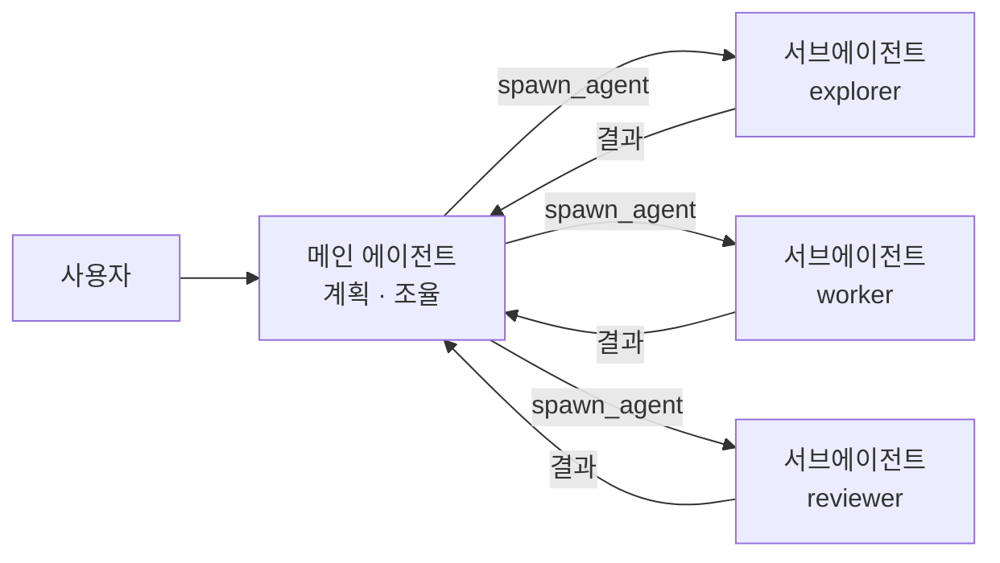
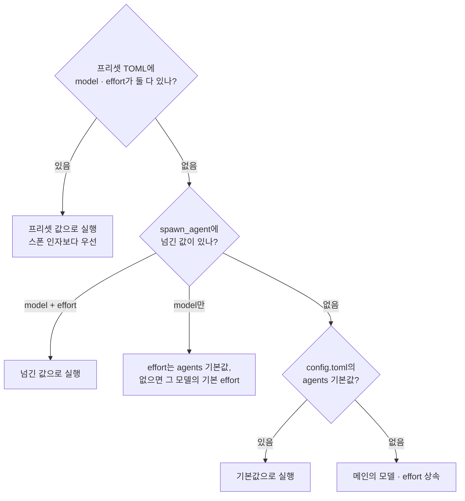
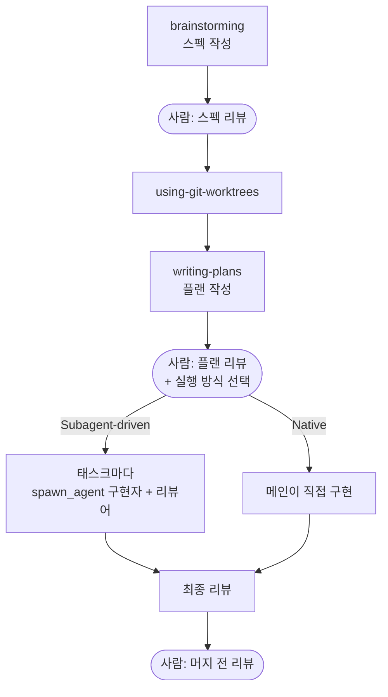
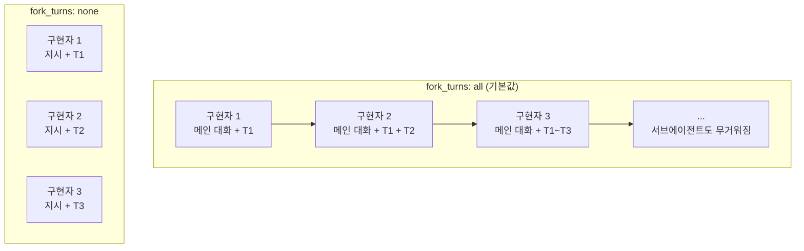

OpenAI가 지구를 날려버렸다. 가격 경쟁에 들어가서 살벌하다. 소설을 좋아해서 이것저것 읽다 보니, Codex가 나왔을 때 "왜 굳이 악마의 성경 코덱스?"라고 생각했는데..

**코덱스 기가스(Codex Gigas)**는 13세기 초(1204~1230년) 보헤미아(지금의 체코)에서 쓰인 필사본이다. 처음 알려진 소유자는 포들라지체의 베네딕토회 수도원이다. 높이 92cm, 무게 약 75kg으로 알려진 중세 필사본 중 가장 크다.
290장 앞면에 악마 한 마리가 한 쪽을 통째로 차지하고 있어서 **"악마의 성경"**이라고 불린다.

전설은 이렇다. 벽에 산 채로 갇히는 벌을 받게 된 수도사가 하룻밤 만에 세상의 모든 지식을 담은 책을 쓰겠다고 약속했고, 자정 무렵 절망한 나머지 영혼을 대가로 루시퍼에게 도움을 청했다.
실제로는 필체 분석상 한 사람이 20~30년에 걸쳐 쓴 것으로 본다. 1648년 30년 전쟁이 끝날 때 스웨덴 군이 전리품으로 가져갔고, 지금은 스톡홀름의 스웨덴 국립도서관에 있다.[^codex-gigas]

<details markdown="1">
<summary>악마 그림 보기 (징그러울 수 있음)</summary>

{: w="240" h="380" }
_코덱스 기가스 290r의 악마. 퍼블릭 도메인, Wikimedia Commons_

</details>

그래 Codex라는 이름은 그럴 수 있다. 그런데 얼마 전에 모델을 Sol, Terra, Luna로 태양계를 들고 나오더니,
Astra가 생겨서 우주를 만들더니 어중간해진 Sol의 위치를 Terra를 날려버리고 살렸다.
가격이든 성능이든 애매한 Sol 라인이었는데 본인들도 그렇게 생각했는지 지구(Terra)를 날려버리고 Sol(태양)을 선택. (애매한 건 Sol인데 왜 지구를 날려.. 악마...)

이제 OpenAI는 지구를 없애버린 채 라인업을 Astra, Sol, Luna로 줄인 것으로 생각된다.

그래서 오늘은 악마숭배자 같은 OpenAI의 악마에게 당하신 Terra를 R.I.P. 하는 이미지를 만들어봤다. 사연은 [여담](#where-is-terra)에 적었다.

이 글은 Codex에서 서브에이전트가 어떤 모델과 effort로, 어떤 문맥을 들고 도는지 조사한 내용이다.

결론부터 말하면 편한 점과 함정이 섞여 있었다.

일단 Codex는 **서브에이전트를 띄울 때 모델과 함께 reasoning effort도 지정할 수 있다.** 따라서 별도의 프리셋 파일을 만들 필요 없이 AGENTS.md에서 용도에 따라 배정만 해 주면 된다.

다만 따로 지정해 주지 않으면 서브에이전트는 메인 에이전트의 모델과 effort를 그대로 상속받는다. 메인을 `xhigh`로 두면 파일 몇 개 검색하는 서브에이전트도 `xhigh`로 돈다.

더 열받는 건 문맥이다. Codex 서브에이전트는 기본이 메인의 대화 전체를 복사해서 시작한다. 서브에이전트를 띄우는 도구의 [`fork_turns` 인자 기본값이 `all`](https://github.com/openai/codex/blob/main/codex-rs/core/src/tools/handlers/multi_agents_spec.rs)이라, 지정하지 않으면 컨텍스트 전체가 복사되고 그만큼 사용량이 늘어난다.[^context-cost] 새 문맥으로 띄우려면 직접 지정해 줘야 한다. (아...)

> **이 글의 숫자는 2026년 10월 2일 시점 작성입니다.** GPT-6.1 Sol은 GPT-6 Sol이 나온 지 7일 만인 9월 29일에 나와 같은 날 CLI 0.159.1에서 Codex 기본 모델이 됐고, GPT-5.5는 10월 14일 Codex에서 빠지며, GPT-5.6 계열은 "출시(롤아웃) 기간 동안" 남아 있다고만 되어 있습니다. 모델 이름과 단가, 벤치마크 점수는 몇 주 안에 바뀔 수 있습니다. 숫자 하나하나보다 **비율과 구조**를 봐 주세요.
{: .prompt-warning }

> Codex CLI 0.159.2 기준이며, 2026-10-02 공식 문서와 Superpowers v6.4.2(2026-09-25)를 기준으로 작성했습니다.
> AGENTS.md 조각과 TOML 프리셋 7종은 [글 끝](#presets-download)에서 내려받을 수 있습니다.
{: .prompt-info }

> Claude Code를 쓴다면 [Claude Code 편](/posts/claude-subagent-superpowers/)을 보세요. 같은 주제를 Claude Code 기준으로 정리했습니다.
{: .prompt-tip }

## 메인 에이전트와 서브에이전트 {#main-vs-subagent}

> Codex도 메인에이전트가 서브에이전트에게 일을 맡기고 결과를 받습니다. 다만 기본값으로는 서브에이전트가 메인의 대화를 전부 물려받습니다.
{: .prompt-tip }

Codex에서 우리와 대화하는 상대가 **메인 에이전트**다. 메인은 일을 직접 하기도 하고, 일부를 **서브에이전트**에게 맡기고 결과만 받기도 한다.
Codex에서는 메인이 `spawn_agent`라는 도구로 서브에이전트를 띄운다. 현재 버전에서는 따로 켜지 않아도 기본으로 켜져 있다.[^subagents-doc]



Codex에 기본으로 들어 있는 서브에이전트는 세 가지다.

| 서브에이전트 | 용도 | 모델 · effort |
|:--|:--|:--|
| default | 범용 | 메인 상속 |
| worker | 구현과 수정 | 메인 상속 |
| explorer | 읽기 위주의 코드베이스 탐색 | 메인 상속 |

서브에이전트를 쓰면 좋은 점은 이렇다.

- **컨텍스트 오염 방지**: 검색 결과, 로그, 코드 탐색 결과를 메인이 직접 읽으면 전부 메인 컨텍스트에 쌓인다. 웹 페이지 같은 외부 텍스트에 숨은 지시(프롬프트 인젝션)가 메인에 바로 들어오는 것도 막을 수 있다. 서브에이전트에게 읽히고 요약만 받는 게 깔끔하고 안전하다.
- **메인 컨텍스트 절약**: 결과만 요약해서 받으면 메인 컨텍스트를 아끼면서 오래 작업할 수 있다.
- **독립적인 컨텍스트**: 메인의 맥락을 모르는 눈이 필요한 리뷰 같은 일에 좋다. 단, Codex에서는 이게 **기본값이 아니다.** 아래에서 다룬다.
- **비용 절약**: 서브에이전트마다 모델과 effort를 따로 정할 수 있다. 메인의 모델을 바꾸면 캐시가 다시 쓰이지 않을 수 있지만, 서브에이전트에 맡기면 메인의 캐시는 그대로 두고 일마다 싼 조합을 쓸 수 있다.[^prompt-caching]

그런데 기본 서브에이전트 셋은 모델과 effort를 정해 두지 않는다. 소스를 보면 `explorer`의 설정 파일은 아예 빈 파일이다.[^spawn-src]
그래서 아무것도 정하지 않으면 메인을 높은 effort로 둔 만큼 탐색하는 서브에이전트도 같은 effort로 돈다.

서브에이전트를 미리 정의해 둘 수도 있다. **TOML 파일 하나**가 서브에이전트 하나이고, `name`, `description`과 함께 시스템 프롬프트에 해당하는 `developer_instructions`가 **필수**라 비워 둘 수 없다.[^subagents-doc]
그래서 나는 굳이 프리셋을 만들기보다 AGENTS.md에 지정하는 쪽으로 진행했다. 이유는 [방법 1](#agents-md)에 적었다.

그리고 중요한 기본값이 하나 있다. **서브에이전트가 메인의 대화 전체를 복사해서 시작한다.**
`spawn_agent`의 `fork_turns` 인자 기본값이 `all`이라서, 아무것도 지정하지 않으면 메인의 대화 전체를 복사해서 시작한다.[^spawn-src] 이 동작은 Codex 공식 문서에는 적혀 있지 않고 도구 설명과 소스에만 있다. Superpowers의 Codex 문서도 이걸 짚는다.[^codex-tools]

> give children a clean context with `spawn_agent {fork_turns: "none"}`; the default `"all"` copies your entire transcript into the child.

위에서 장점으로 꼽은 "독립적인 컨텍스트"가 Codex에서는 기본값이 아니라는 뜻이다. 리뷰어처럼 메인의 맥락을 모르는 게 장점인 일에서는 `fork_turns: "none"`을 꼭 넘겨야 한다.

> `fork_turns`는 GPT-6 계열과 GPT-5.6 Sol · Terra가 쓰는 V2 도구의 인자입니다. GPT-5.6 Luna는 이전 V1 도구를 쓰고, V1은 `fork_context`라는 다른 인자에 기본값이 "깨끗한 시작"입니다. 모델에 따라 기본 동작이 반대라는 점을 기억해 두세요. 구모델을 써야 하는 환경이라면 `fork_turns` 대신 `fork_context`를 씁니다.
{: .prompt-info }

## effort를 스폰할 때 정할 수 있다 {#effort-at-spawn}

> Codex의 `spawn_agent`는 호출할 때마다 `model`과 `reasoning_effort`를 따로 받습니다. 둘 다 생략하면 메인을 상속하고, `model`만 넘기면 effort는 그 모델의 기본값이 됩니다(`config.toml`의 `[agents]` 기본값이 없을 때).
{: .prompt-tip }

### reasoning effort란

effort는 모델이 답하기 전에 **생각(Thinking)에 토큰을 얼마나 쓸지** 정하는 값이다.

중요한 점은 effort가 <mark>토큰 단가를 바꾸지 않는다</mark>는 것이다.
단가는 모델마다 고정이지만, effort가 높을수록 생각을 많이 한다. 이 생각에 쓴 토큰(reasoning token)은 화면에 보이지 않아도 **출력 토큰으로 과금**되고, 출력 단가는 입력의 5배다(GPT-6.1 Sol 기준 $2 → $10).[^reasoning-doc] 생각할수록 도구를 더 부르고 답도 길어지기 쉽다.
그래서 effort를 올리면 비용과 시간이 **같이** 늘어난다. 얼마나 늘어나는지는 [뒤에서](#effort-cost-time) 숫자로 본다.

생각한 토큰은 컨텍스트에도 남는다. OpenAI 문서에 따르면 GPT-5.6 이후 모델은 이전 턴의 reasoning을 다음 요청에 기본으로 다시 넣는다.[^reasoning-doc] effort가 높을수록 컨텍스트도 더 빨리 쌓인다는 뜻이다. 컨텍스트가 쌓이면 왜 비싸지는지는 [Superpowers 절](#context-cost)에서 다룬다.

Codex 문서에 적힌 단계는 `low`, `medium`, `high`, `xhigh`, `max`, `ultra` 여섯 개다.[^config-ref] 모델마다 지원하는 단계가 다르다.

| 모델 | 지원 단계 |
|:--|:--|
| GPT-6.1 Sol | low ~ max, ultra |
| GPT-6 Astra | low ~ max, ultra |
| GPT-6 Luna | low ~ max (ultra 없음) |

- **`ultra`는 다른 단계와 성격이 다르다.** 문서는 "Ultra uses subagents to handle separate parts of a complex task in parallel"이라고 설명한다.[^models-doc] 소스를 보면 `ultra`를 고르면 Codex가 서브에이전트를 적극적으로 띄우는 모드로 바뀌고, 모델에 실제로 보내는 effort는 `xhigh`다(GPT-6.1 Sol · Astra 기준).[^ultra-src] 즉 더 오래 생각하는 게 아니라 `xhigh`로 생각하면서 서브에이전트에게 일을 적극적으로 나누는 모드다. 딱히 큰 장점은 없다. 더 똑똑해지는 게 아니라 서브에이전트를 적극 쓰는 모드라고 보면 된다.

### effort 설정하기

CLI에서 `/model`을 입력하고 모델을 고르면 된다. `max`와 `ultra`는 **More reasoning…**을 골라야 보인다.[^models-doc]

```console
> /model
```

설정 파일에 고정하려면 `~/.codex/config.toml`에 적는다.

```toml
model = "gpt-6.1-sol"
model_reasoning_effort = "high"
```
{: file="~/.codex/config.toml" }

### 스폰할 때 effort 지정하기

여기가 Codex 서브에이전트의 핵심이다. `spawn_agent`의 인자는 이렇다.[^spawn-src]

| 인자 | 필수 | 설명 |
|:--|:--:|:--|
| `task_name` | ✅ | 작업 이름 |
| `message` | ✅ | 서브에이전트에게 줄 지시 |
| `agent_type` | | 미리 정의한 서브에이전트 이름.<br>직접 만든 프리셋이 하나 이상 있을 때만 나타난다<br>(그때 기본 `explorer` · `worker`도 고를 수 있다) |
| `fork_turns` | | 메인 대화를 몇 턴 물려줄지. `none`, `all`, 또는 숫자. 기본값 `all` |
| `model` | | 모델 지정 |
| `reasoning_effort` | | effort 지정 |

`reasoning_effort`의 설명은 이렇다.

> Reasoning effort override for the new agent. Omit to inherit the parent effort.

**호출할 때마다 모델과 effort를 둘 다 정할 수 있다.**

실제 화면은 이렇다. 메인에게 웹 검색을 서브에이전트로 맡긴 예다.

{: w="1854" h="726" .shadow }
_스폰할 때는 `• Started /root/<작업 이름>`만 찍히고 모델과 effort는 안 보인다. `/subagents`로 목록을 열어 서브에이전트를 고른다._

{: w="1811" h="984" .shadow }
_서브에이전트를 고르면 그 서브에이전트의 작업 기록이 열리고, 아래 상태 줄에 실제로 돈 모델과 effort(`GPT-6.1-Sol medium`)가 찍힌다._

> 캡처 속 서브에이전트는 공식 발표를 여러 출처에서 대조하는 웹 조사라서 GPT-6.1 Sol로 돌았습니다. 다만 저는 부르주아라서 `low` 대신 `medium`을 씁니다. 이 글이 권하는 웹 조사 조합은 [GPT-6.1 Sol `low`](#presets)입니다.
> 두 번째 캡처처럼 `/subagents`에서 서브에이전트를 고르면, 모델과 effort뿐 아니라 그 서브에이전트가 무엇을 했는지도 볼 수 있습니다. 어떤 검색어로 웹을 찾았는지, 메인에게 어떤 결과를 돌려줬는지까지 출력이 그대로 남아 있습니다.
{: .prompt-info }

그런데 공식 문서에 함정이 하나 적혀 있다.[^subagents-doc]

> If an explicit spawn request or an `[agents]` default selects a model without an explicit or configured reasoning effort, the subagent uses that model's default reasoning effort.

**모델만 넘기면 effort는 메인 값이 아니라 그 모델의 기본값이 된다**(`[agents]`에 기본 effort를 두지 않았을 때). Superpowers의 Codex 문서도 같은 경고를 한다.[^codex-tools]

> Setting `model` alone is a trap: the child's effort silently resets to that model's default, not to yours.

메인이 "이 리뷰는 6.1 Sol로"라고 모델만 넘기면, 메인이 `high`여도 리뷰어는 메인 값이 아니라 그 모델의 기본 effort로 돈다.

서브에이전트의 모델과 effort가 정해지는 순서는 이렇다.[^subagents-doc]



모델과 effort는 이 순서를 각각 따로 거친다. 프리셋에 `model`만 적혀 있으면 effort는 그 모델의 기본값이 아니라 앞에서 정해진 값(스폰 인자 → `[agents]` → 메인 순)을 그대로 쓴다.[^subagents-doc]

정리하면 이렇다.

| 항목 | Codex |
|:--|:--|
| 호출할 때 모델 · effort 지정 | **가능** (`model`, `reasoning_effort`) |
| 모델만 지정하면 effort는 | **그 모델의 기본값** (메인 값이 아님,<br>`[agents]` 기본 effort가 없을 때) |
| 프리셋 값과 호출 값이 다르면 | **프리셋 값이 이김** |
| 기본 컨텍스트 | **메인 대화 전체 복사** (`fork_turns: all`)<br>새 컨텍스트는 `none`을 직접 지정 |
| 전체 기본값 | `[agents]`의 `default_subagent_model`<br>+ `default_subagent_reasoning_effort` |
| 프리셋 형식 | TOML, `developer_instructions` 필수 |

## effort에 따라 비용과 시간이 얼마나 달라질까 {#effort-cost-time}

> Codex도 effort에 따라 토큰 사용량이 몇 배씩 달라집니다. 주목할 점은 모델의 가격 차이는 100배까지 납니다.
{: .prompt-tip }

### 단가

API 단가다. (1M 토큰당 USD, 272K 이하 컨텍스트 기준)[^pricing]

| 모델 | 입력 | 캐시 입력 | 출력 | CLI `/model` 화면 설명 |
|:--|--:|--:|--:|:--|
| GPT-6 Astra | $10 | $1.00 | $50 | Frontier intelligence for the most demanding work |
| GPT-6.1 Sol (기본) | $2 | $0.10 | $10 | Latest workhorse model for coding and everyday work |
| GPT-6 Luna | **$0.10** | **$0.01** | **$0.50** | Fast and affordable model for easier tasks |

<mark>GPT-6 Luna는 GPT-6 Astra의 정확히 1/100이다.</mark> 입력, 캐시 입력, 출력 세 항목 모두 100배 차이다.
기본 모델인 GPT-6.1 Sol과 비교해도 입력과 출력은 1/20이다(캐시 입력은 1/10).

구독으로 쓰는 사람에게 이 차이는 5시간 메시지 한도로 나타난다. Codex 가격 페이지의 Plus 기준 추정치이며
비지니스 요금을 쓰는 사람은 제발 Luna를 적극 활용하세요.[^codex-pricing]

| 모델 | 5시간당 로컬 메시지 (Plus) |
|:--|--:|
| GPT-6 Astra | 5 ~ 45 |
| GPT-6.1 Sol | 15 ~ 160 |
| GPT-6 Luna | 350 ~ 3,000 |

<details markdown="1">
<summary>더 보기 — 이전 세대 모델 단가 (GPT-6 Sol, GPT-5.6 계열)</summary>

| 모델 | 입력 | 캐시 입력 | 출력 | 비고 |
|:--|--:|--:|--:|:--|
| GPT-6 Sol | $2 | $0.20 | $10 | 이전 기본 모델 |
| GPT-5.6 Sol | $4 | $0.40 | $20 | 할인가, "적어도 2026-11-21까지" |
| GPT-5.6 Terra | $2 | $0.20 | $12 | |
| GPT-5.6 Luna | $0.20 | $0.02 | $1.20 | |

272K를 넘는 프롬프트는 입력이 2배(GPT-6 계열은 캐시도 2배), 출력이 1.5배다. Fast 모드는 2배, Batch · Flex는 0.5배다.

</details>

<details markdown="1" id="where-is-terra">
<summary>여담 — Terra는 어디 갔나</summary>

모델 이름은 라틴어 천체 이름이다(OpenAI가 유래를 밝힌 건 아니다). Luna(달), Terra(지구), Sol(태양), Astra(별들).
GPT-5.6에는 Luna · Terra · Sol이 있었는데, GPT-6 세대에는 Luna · Sol · Astra만 있고 **GPT-6 Terra는 없다.**

- GPT-5.6 Terra는 아직 Codex 선택 목록에 있고, 지원 중단 공지도 없다. Codex 모델 문서는 "GPT-5.6 Sol, GPT-5.6 Terra, and GPT-5.6 Luna remain available during the rollout"이라고만 적었다.[^models-doc]
- 다만 추천 모델 목록에서는 빠졌다. 7월 31일 변경 기록은 "gpt-5.4는 gpt-5.6-terra로 바꾸라"고 했는데, 지금 모델 문서는 "gpt-5.4는 gpt-6-sol로 바꾸라"고 한다.[^changelog]
- **왜 Terra를 만들지 않았는지 OpenAI는 설명하지 않았다.** 커뮤니티에 같은 질문이 올라왔지만 OpenAI 쪽 답은 없다.[^terra-thread]

그래서 표지에서는 Terra가 천사가 되어 떠나는 것으로 그렸다. 공식 사유가 나오면 고치겠다.

</details>

### GPT-6.1 Sol의 effort별 토큰과 시간

[Artificial Analysis](https://artificialanalysis.ai/models/gpt-6-1-sol)가 같은 평가 세트를 effort별로 돌린 결과다. **Intelligence Index v4.3.2**(10개 평가의 가중 평균)라서 모델끼리 같은 자로 비교할 수 있다.[^aa]
"출력 비용"은 출력 토큰 수에 출력 단가를 곱한 값이다. "첫 응답까지"는 생각 시간을 포함한 첫 응답 토큰까지의 시간이다. 수치는 2026-10-02에 확인했다.

| effort | 지수 | 출력 토큰 | 출력 비용 | xhigh 대비 | 1점 더 올리는 비용 | 첫 응답까지 |
|:--|--:|--:|--:|--:|--:|--:|
| low | 42 | 9.0M | $90 | 25% | — | 2.6초 |
| medium | 48 | 15M | $150 | 42% | $10 | 5.3초 |
| high | 50 | 25M | $250 | 69% | $50 | 57.3초 |
| xhigh | 51 | 36M | $360 | 100% | $110 | 107.8초 |
| max | 52 | 67M | $670 | 186% | $310 | 281.9초 |

- **low → medium**: 6점이 $60로 오른다. 1점당 $10로 가장 싸다. 메인이든 서브에이전트든 low로 두는 건 아까운 선택이다.
- **medium → high**: 첫 응답까지 5초에서 57초로 10배 넘게 늘어난다. 점수는 2점 오른다.
- **xhigh → max**: 1점에 $310. medium 구간의 31배다.

### GPT-6 Astra의 effort별 토큰과 시간

| effort | 지수 | 출력 토큰 | 출력 비용 | 1점 더 올리는 비용 | 첫 응답까지 |
|:--|--:|--:|--:|--:|--:|
| low | 46 | 10M | $500 | — | 3.0초 |
| medium | 50 | 19M | $950 | $113 | 6.1초 |
| high | 51 | 26M | $1,300 | $350 | 58.4초 |
| xhigh | 52 | 38M | $1,900 | $600 | 142.3초 |
| max | 53 | 60M | $3,000 | $1,100 | 320.3초 |

Astra는 모든 effort에서 6.1 Sol보다 1~4점 높다. 대신 같은 effort에서 출력 비용이 약 4.5~6배다.
여기서 역전이 나온다.

- GPT-6.1 Sol `xhigh`: 지수 51, $360
- GPT-6 Astra `low`: 지수 46, $500

<mark>비싼 모델을 낮은 effort로 쓰는 것보다 싼 모델을 높은 effort로 쓰는 게 점수도 높고 싸다.</mark>

### GPT-6 Luna의 effort별 토큰과 시간

| effort | 지수 | 출력 토큰 | 출력 비용 | 1점 더 올리는 비용 | 첫 응답까지 |
|:--|--:|--:|--:|--:|--:|
| low | 22 | 8.2M | $4.1 | — | 2.4초 |
| medium | 30 | 29M | $14.3 | $1.3 | (측정값 없음) |
| high | 33 | 47M | $23.4 | $3.0 | 12.4초 |
| xhigh | 35 | 69M | $34.3 | $5.4 | 22.9초 |
| max | 38 | 144M | $72.2 | $12.6 | 128.8초 |

Luna 값은 Artificial Analysis가 10월 2일 이후 갱신한 값(10월 3일 확인)이다.[^aa]

Luna는 다른 모델과 성격이 다르다. 요금이 올라가도 금액이 귀엽다. 비싸고 느려져도 귀여운 가격이고 성능이 꾸준히 올라가는 게 용서가 가능할 것 같다.

- **토큰은 가장 많이 쓴다.** max에서 144M으로 6.1 Sol max(67M)의 두 배다. 그런데도 단가가 1/20이라 출력 비용은 $72로 6.1 Sol의 `low`($90)보다 싸다.
- **가장 빠르다.** 초당 130토큰대로, 6.1 Sol(50~60토큰대)의 두 배가 넘는다.
- **effort를 올리는 값이 거의 공짜다.** low에서 max까지 16점을 올리는 데 $68가 든다. 6.1 Sol에서 xhigh → max 1점 올리는 값($310)보다 싸다.
- **점수의 천장은 낮다.** max에서도 38점으로, 6.1 Sol low(42)보다 낮다.

그래서 Luna는 **effort를 높여서 쓰는 모델**이다. 공식 문서도 서브에이전트에 Luna를 쓸 때 "start with high for GPT-6 Luna"라고 권한다.[^subagents-doc]
스폰할 때 effort를 지정할 수 있다는 Codex의 특징이 Luna에서 특히 중요한 이유다.

### 벤치마크 점수도 effort에 정비례하지 않는다

OpenAI 출시 페이지의 DeepSWE v1.1 차트다. 실제 저장소에서 긴 호흡으로 하는 소프트웨어 과제를 재는 벤치마크다. 값은 차트의 데이터 라벨에서 옮겼고, 비용은 과제 하나당 달러다.[^sol61-page][^sol-luna-page]

| effort | GPT-6.1 Sol | GPT-6 Astra | GPT-6 Sol | GPT-6 Luna |
|:--|--:|--:|--:|--:|
| low | 64.4% / $0.17 | 67.0% / $1.60 | 37.2% / $0.16 | 2.4% / $0.006 |
| medium | 73.0% / $0.42 | 72.8% / $3.08 | 56.6% / $0.38 | 44.5% / $0.052 |
| high | **75.2% / $0.65** | 73.2% / $3.92 | 65.3% / $0.64 | 59.3% / $0.084 |
| xhigh | 71.9% / $0.79 | **74.1% / $4.43** | 66.6% / $1.00 | 61.3% / $0.11 |
| max | 71.9% / $1.57 | 73.2% / $7.50 | **68.8% / $2.74** | **66.6% / $0.22** |

<!-- TODO: OpenAI GPT-6.1 Sol 출시 페이지의 DeepSWE v1.1 effort별 차트 캡처 (차트는 이미지 파일이 아니라 SVG라서 화면 캡처 필요).
     https://openai.com/index/introducing-gpt-6-1-sol/ -->
<!-- {: .shadow }
_출처: OpenAI, [Introducing GPT-6.1 Sol](https://openai.com/index/introducing-gpt-6-1-sol/) (2026-09-29), DeepSWE v1.1 차트._ -->

- **GPT-6.1 Sol은 `high`가 최고점이다.** xhigh와 max는 오히려 71.9%로 내려가고, 비용은 각각 1.2배와 2.4배다.
- **GPT-6.1 Sol `high`(75.2%, $0.65)는 Astra의 어떤 effort보다도 점수가 높다.** Astra 최고점(xhigh 74.1%)의 1/7 비용이다.
- **Luna는 effort를 따라 가파르게 오른다.** low에서는 2.4%로 사실상 못 푼다. medium 44.5%, high 59.3%, max 66.6%다. <mark>Luna를 low로 쓰면 싼 게 아니라 실패 비용을 높여서 사실상 돈을 버리는 것과 같다.</mark>

Artificial Analysis의 코딩 에이전트 지수에서도 같은 경향이 나왔다. 2026-09-29 분석 글은 "GPT-6.1 Sol (xhigh) scores 1 point above GPT-6 Astra for less than 15% of the Cost per Task"라고 적고, 6.1 Sol은 xhigh가 max보다 3점 높았다고 밝혔다.[^aa-article]

> Astra 출시 페이지의 표 점수는 effort를 따로 적지 않으면 최고점입니다. 각주에 "Evaluation scores are the maximum at any effort"라고 적혀 있습니다. 표의 점수를 기본 effort에서 기대하면 안 됩니다.
{: .prompt-info }

> 위 수치는 공개 평가 세트 기준입니다. 실제 업무에서의 비율은 직접 측정해서 확인하세요.
{: .prompt-warning }

### 같은 돈으로 몇 번 실패할 수 있나 {#retry-budget}

개인적으로 가장 크게 보는 건 이 부분이다.
Luna가 Astra의 1/100이라는 건, 같은 돈으로 Luna를 몇 번 다시 돌릴 수 있는지로 바꿔 보면 실감 난다.

DeepSWE v1.1의 과제당 비용 기준이다.[^sol61-page][^sol-luna-page]

| 기준 모델 (과제당 비용) | Luna high ($0.084, 59.3%)로 | Luna max ($0.22, 66.6%)로 |
|:--|--:|--:|
| GPT-6.1 Sol high ($0.65, 75.2%) | **약 8번** | 약 3번 |
| GPT-6 Astra xhigh ($4.43, 74.1%) | **약 53번** | 약 20번 |
| GPT-6 Astra max ($7.50, 73.2%) | **약 89번** | 약 34번 |

Artificial Analysis 지수 한 벌을 돌린 출력 비용으로 보면 횟수가 더 많다(약 1.4배).

| 기준 | 같은 비용으로 Luna high($23.4)를 돌릴 수 있는 횟수 |
|:--|--:|
| GPT-6.1 Sol high ($250) | 약 11번 |
| GPT-6 Astra xhigh ($1,900) | 약 81번 |
| GPT-6 Astra max ($3,000) | **약 128번** |

<mark>비싼 모델 한 번 값으로 Luna high를 두 자릿수에서 세 자릿수 번 돌릴 수 있다.</mark>
DeepSWE에서 Luna high는 과제의 약 60%를 푼다. Astra xhigh 한 번 값이면 Luna high를 50번 넘게 돌릴 수 있다.

물론 이 계산은 그대로 믿으면 안 된다.

- **고점이 명확하게 낮다.** 얘한테 설계를 맡기면 안 된다. 다만 어지간한 코딩은 가능하다.
- **재시도는 독립이 아니다.** 어려운 과제는 몇 번을 돌려도 같은 이유로 실패한다. 싼 모델의 천장(Luna max 66.6%) 위에 있는 과제는 횟수로 못 넘는다.
- **실패를 알아보는 장치가 있어야 한다.** 재시도가 의미 있으려면 "틀렸다"를 공짜로, 정확하게 판정해야 한다. 테스트가 그 역할이다. Superpowers의 TDD가 Luna를 구현자로 쓸 수 있게 해 주는 이유다.
- **Luna는 effort를 내리면 무너진다.** low에서는 2.4%다. 실패 예산은 high 이상에서만 성립한다.
- **턴 수도 비용이다.** Superpowers는 "Turn count beats token price", 즉 싼 모델이 여러 단계 작업에서 턴을 2~3배 쓴다고 경고한다.[^sdd-skill] Luna는 이미 토큰을 가장 많이 쓰는 모델이다. 다만 단가 차이가 100배라 턴이 3배가 돼도 아직 크게 남는다.
- **공식 재시도 데이터는 없다.** Luna와 Sol · Astra의 pass@k(k번 안에 한 번 성공할 확률)는 OpenAI도 Artificial Analysis도 공개하지 않았다. 재시도해서 성공하는 건 테스트 케이스를 쌓으며 개발 가능한 코딩 영역에서나 통한다. 코딩 영역에서도 설계와 방향이 실패하면 안 된다. 안 되는 건 안 되는 거다.

그래서 이 차이를 이렇게 쓴다. **테스트가 정해진 구현은 Luna high에게 몇 번이고 맡기고, 판단이 필요한 자리만 Sol로 올린다.** 아래 [용도별 7종](#presets)이 이 원칙이다.

> 이 절의 배수는 2026-10-02의 단가와 벤치마크로 계산했습니다. Luna의 단가가 지금처럼 Astra의 1/100이 아니게 되면 배수도 바뀝니다. 계산 방법(과제당 비용 ÷ 과제당 비용)만 가져가서 그때의 숫자로 다시 해 보세요.
{: .prompt-warning }

테스트로 실패를 걸러 내며 여러 번 시도하는 방식은 요즘 AI를 통한 개발의 큰 흐름이기도 하다. 이 글에서는 아래 [Superpowers의 TDD](#tdd)가 그 장치 역할을 한다.

## Superpowers 소개 {#superpowers}

> Superpowers는 "스펙 → 플랜 → 구현 → 리뷰"를 스킬로 강제하는 플러그인입니다. Codex도 지원합니다.
{: .prompt-tip }

[Superpowers](https://github.com/obra/superpowers)는 Jesse Vincent(Prime Radiant)가 만든 스킬 모음이다. 코딩 에이전트에게 "스펙 → 플랜 → 구현 → 리뷰"라는 개발 절차를 스킬로 강제한다. Codex를 포함해 여러 코딩 에이전트를 지원한다.

Codex에서는 공식 Codex 플러그인 마켓플레이스로 설치한다.[^sp-readme]

```console
> /plugins
```

`superpowers`를 검색해서 **Install Plugin**을 고른다.

### 동작 방식

핵심은 **에이전트가 코드부터 짜지 않게 막는 것**이다. "이거 만들어 줘"라고 하면 바로 구현에 들어가는 대신 질문으로 요구를 다듬고, 스펙과 플랜을 사람에게 승인받은 뒤 태스크마다 서브에이전트로 구현과 리뷰를 돌린다.
이 흐름은 `using-superpowers` 스킬이 켠다. "스킬이 적용될 가능성이 1%라도 있으면 먼저 그 스킬을 부르라"고 지시하기 때문에, 사용자가 스킬 이름을 몰라도 된다.
Codex에서는 Superpowers가 `skills/using-superpowers/references/codex-tools.md`로 Codex 전용 주의사항을 알려 준다. 서브에이전트는 `spawn_agent`로 띄우고, 새 컨텍스트(`fork_turns: "none"`)와 모델 · effort 지정을 요구한다.[^codex-tools]

### 기본 흐름



### 사람이 개입하는 지점

스펙과 플랜, 머지 전 세 곳이다. 실행 중에는 되돌릴 수 없는 작업, 보안 관련 작업, 머지 · 푸시 · 게시 같은 바깥 부작용, 어느 길로 가도 추측뿐인 플랜이 아니면 사람에게 묻지 않고 스스로 판단해 Ruling으로 기록한다.

### 플랜 작성 방식

v6.4.2의 플랜은 코드 본문 대신 시그니처, 테스트 단언, 스펙 값 같은 **결정**만 적는다. 구현자에게 남는 판단이 적어서 싼 모델이 구현자로 들어가기 좋다.

### TDD 작동 방식 {#tdd}

> NO PRODUCTION CODE WITHOUT A FAILING TEST FIRST

실패하는 테스트를 먼저 보고, 통과할 최소 코드를 쓰고, 전체 테스트로 확인한다. Codex에서 이 규칙이 특히 중요한 이유는 [앞 절](#retry-budget)이다. **테스트가 있어야 Luna의 실패 예산을 쓸 수 있다.**

## Superpowers의 서브에이전트 운영법 {#superpowers-subagents}

> Codex에서 Superpowers는 서브에이전트마다 모델과 effort를 직접 적고, 대화를 물려주지 말라고 지시합니다.
{: .prompt-tip }

Superpowers의 Codex 문서에는 서브에이전트 지시가 여럿 있는데, 비용과 직결되는 건 둘이다.[^codex-tools]

1. **새 컨텍스트로 띄워라.** `fork_turns: "none"`을 넘긴다. 기본값 `all`은 메인의 대화 전체를 복사한다.
2. **모델과 effort를 둘 다 적어라.**

> Every `spawn_agent` you issue … sets `model` AND `reasoning_effort` explicitly… Setting `model` alone is a trap: the child's effort silently resets to that model's default.

그리고 `config.toml`의 `[agents]`에 `default_subagent_model`과 `default_subagent_reasoning_effort = "medium"`을 기본값으로 두라고 권한다. 값을 빼먹은 서브에이전트가 메인 값을 물려받지 않게 하는 설정이다. 이 글은 이걸 AGENTS.md 한 줄로 대신한다([방법 1](#agents-md)).

### 컨텍스트가 쌓이면 왜 느려지고 비싸지나 {#context-cost}

모델은 요청마다 그때까지 쌓인 대화를 입력으로 다시 읽는다. 아래 그림은 Anthropic 문서의 그림이지만 구조는 같다. 턴이 넘어갈수록 이전 턴의 메시지와 응답이 전부 다음 턴의 입력이 된다. Codex 가격 문서도 "extended sessions that require the agent to hold more context will use significantly more per message"라고 적었다.[^context-cost]

{: w="1600" h="900" .shadow }
_출처: Anthropic Claude Platform 문서 [Context windows](https://platform.claude.com/docs/en/build-with-claude/context-windows). "As the conversation advances through turns, each user message and assistant response accumulates within the context window, and previous turns are preserved completely." 특정 회사의 구조가 아니라 대화형 LLM의 공통 구조라 그대로 가져왔다._

계산량도 같이 는다. 트랜스포머의 자기어텐션은 입력 토큰끼리 전부 짝을 지어 계산하기 때문에, 입력을 읽는 비용이 입력 길이의 제곱에 비례한다. 원 논문 "Attention Is All You Need"(Vaswani 외, 2017)의 표 1에 층당 복잡도가 $O(n^2 \cdot d)$로 적혀 있다.[^attention] 답을 생성할 때도 토큰 하나를 낼 때마다 지금까지의 컨텍스트 전체를 참조한다. 컨텍스트가 두 배면 읽는 비용은 네 배, 생성 비용은 두 배가 되는 구조다.

{: w="1600" h="693" .shadow }
_출처: Beltagy, Peters, Cohan, "Longformer: The Long-Document Transformer" (2020), Figure 1, [arXiv:2004.05150](https://arxiv.org/abs/2004.05150). 파란 선(Full self-attention)이 일반 트랜스포머로, 입력 길이가 늘수록 시간과 메모리가 제곱으로 늘다가 GPU 메모리가 바닥나 측정이 끊긴다._

이게 비용과 시간이 되는 경로는 세 가지다.[^prompt-caching]

1. **입력 토큰은 매 요청 과금된다.** 캐시에 적중하면 싸지만 공짜는 아니다. 캐시 입력은 입력 단가의 10%, GPT-6.1 Sol은 5%다. 200k 토큰이 쌓인 세션에서 한 줄 질문을 던지면 그 200k를 다시 읽는 값을 낸다.
2. **캐시는 시간이 지나면 사라진다.** GPT-5.6 이후 모델의 캐시는 마지막으로 쓰거나 다시 쓴 뒤 최소 30분 유지된다. 그 뒤 요청은 전체 컨텍스트를 정가로 다시 처리한다. GPT-6.1 Sol로 200k 토큰을 다시 읽으면 캐시 적중 시 $0.02, 미적중 시 $0.40로 20배 차이다.
3. **처리 시간도 입력 길이를 따라간다.** 모델은 답을 내기 전에 입력 전체를 읽어야 한다. 캐싱 문서가 캐싱의 효과로 "Reduce the time spent processing input before the response starts"라고 적은 것 자체가, 입력이 길수록 첫 응답이 늦어진다는 뜻이다.

숫자로 보면 이렇다. 태스크 하나가 대화를 40k 토큰씩 늘린다고 치자.
한 세션에서 태스크 5개를 이어서 하면 다섯 번째 요청은 200k를 싣고 가고, 다섯 요청이 읽는 입력의 합은 40k × (1+2+3+4+5) = 600k다.
태스크마다 새 서브에이전트를 띄우면 구현자 다섯이 각각 40k씩, 합 200k다. 메인은 요약만 받으니 거의 늘지 않는다.
태스크마다 요청이 여러 번 오간다는 걸 감안하면 실제 차이는 이보다 크다. Superpowers 스킬 원문도 같은 이유를 든다.[^sdd-skill]

> They should never inherit your session's context or history — you construct exactly what they need. This also preserves your own context for coordination work.

그런데 Codex에서는 여기에 `fork_turns` 기본값이 얹힌다. 태스크 5개짜리 플랜을 돌리면서 매번 대화 전체를 물려주면, 다섯 번째 구현자는 앞 네 태스크의 대화를 모두 싣고 시작한다. 새 서브에이전트를 띄워도 위의 600k 쪽으로 돌아가는 셈이다.



`fork_turns: "none"`이면 서브에이전트는 메인이 `message`에 적은 지시만 받고 시작한다. "서브에이전트는 매번 새 컨텍스트"라는 장점을 Codex에서 얻으려면 이걸 명시해야 한다.

캐시에 대해서도 한 가지 짚는다. OpenAI 프롬프트 캐싱 문서는 캐시가 재사용되려면 앞부분 전체가 같아야 한다고 하고, 모델이 다르면 "different weights and caching behavior"를 쓸 수 있으며 effort를 바꾸면 앞부분이 바뀔 수 있다고 적었다(GPT-6 모델은 `configuration_update`로 앞부분을 지키면서 effort를 바꾸는 방법도 안내한다. Codex가 이걸 쓰는지는 확인하지 못했다).[^prompt-caching] Codex 저장소에도 "세션 중에 effort를 바꾸면 캐시 미스가 크게 난다"는 사용자 보고가 열려 있다(공식 문서는 아니다).[^issue-35416]
그래서 메인의 모델이나 effort를 작업마다 바꾸기보다, 메인은 그대로 두고 일을 서브에이전트에 맡기는 게 낫다.

> Codex V2의 기본 동시 실행 수는 메인을 포함해 4개, 즉 서브에이전트 3개입니다(소스 기준). `[agents]`의 `max_concurrent_threads_per_session`으로 바꿀 수 있고, 이 값은 메인을 뺀 서브에이전트 수로 셉니다(기본과 같게 하려면 3).
{: .prompt-info }

역할별로 모델을 고르는 규칙(Model Selection)도 있다. 원칙은 "그 역할을 해낼 수 있는 가장 약한 모델"이다.[^sdd-skill]

| 역할 | Superpowers의 기준 |
|:--|:--|
| 구현 — 플랜에 코드 본문까지 있거나, 단일 파일 기계적 수정 | 가장 싼 티어 |
| 구현 — 1~2파일, 스펙이 명확한 독립 함수 | 빠르고 싼 모델 |
| 구현 — 플랜이 설명 위주 | 중간 티어 이상 |
| 구현 — 여러 파일 통합, 디버깅 | 표준 모델 |
| 구현 — 설계 판단 필요 | 가장 강한 모델 |
| 태스크 리뷰 | diff 크기와 위험도에 맞게. 최소 중간 티어 |
| 수정 후 재리뷰 | 싼 티어 ~ 중간 티어 |
| 수정 4~5회차 구현 | 막힌 구현자보다 한 티어 위 |
| 최종 리뷰 | 가장 강한 모델 (세션 기본 모델이 아니라) |

그리고 이런 조언이 붙어 있다.

> Turn count beats token price. (...) the cheapest models routinely take 2-3× the turns on multi-step work — costing more overall.

가장 싼 모델은 여러 단계 작업에서 턴을 2~3배 더 쓰는 경우가 많아, 결국 더 비쌀 수 있다는 뜻이다. 무조건 제일 싼 설정이 답은 아니다. Codex에서는 이 계산이 [실패 예산](#retry-budget)과 만난다.

## Superpowers 가이드대로 하면 어떤 모델이 불릴까 {#what-gets-called}

> Codex에서는 effort가 상속으로 고정되지 않고, 메인이 스폰할 때마다 고릅니다. 그래서 실행마다 흔들릴 수 있습니다.
{: .prompt-tip }

Superpowers 스킬에는 "싼 티어", "가장 강한 모델" 같은 티어만 있고 모델 이름과 effort는 없다. Codex에서는 메인이 매번 두 값을 골라 `spawn_agent`에 넣는다.

| 역할 | Superpowers 기준 | 메인이 고를 법한 값 | 흔들리는 지점 |
|:--|:--|:--|:--|
| 구현 — 1~2파일 독립 함수 | 빠르고 싼 모델 | gpt-6-luna, effort는 그때그때 | Luna를 low로 고르면 DeepSWE 2.4% |
| 구현 — 여러 파일 통합 | 표준 티어 | gpt-6.1-sol | `model`만 넘기면 그 모델의 기본 effort |
| 태스크 리뷰 | 최소 중간 티어 | gpt-6.1-sol | 같음 |
| 최종 리뷰 | 가장 강한 모델 | gpt-6.1-sol 또는 gpt-6-astra | Astra면 입력 · 출력 단가 5배 |

문제는 세 가지다.

1. **effort가 실행마다 달라질 수 있다.** 지시대로 effort를 적더라도 어느 값을 적을지는 메인의 판단이다.
2. **모델만 넘기면 effort가 바뀐다.** 메인 값이 아니라 그 모델의 기본값이 된다(`[agents]` 기본 effort가 없을 때).
3. **`fork_turns`를 빠뜨리면 대화 전체가 복사된다.**

AGENTS.md 배선 표에 모델 · effort · `fork_turns`를 적어 두면 세 문제가 모두 줄어든다. 메인이 표를 어기는 것까지 막으려면 TOML 프리셋으로 값을 고정한다([방법 2](#toml-presets)).

### 예 1. 구현자 (테스트가 정해진 태스크)

- **그대로 쓰면**: 메인이 GPT-6.1 Sol `xhigh`이고 서브에이전트에 아무것도 넘기지 않으면 6.1 Sol `xhigh`를 상속한다. 출력 비용 $360.
- **배선**: GPT-6 Luna `high`. 출력 비용 $23.4.
- **차이**: **약 93% 감소**. DeepSWE 기준으로 Luna high는 59.3%라 6.1 Sol xhigh(71.9%)보다 낮지만, DeepSWE 과제당 비용으로 약 9번(AA 출력 비용으로는 약 15번) 시도할 수 있다. 테스트가 정해진 태스크라면 틀려도 테스트가 바로 잡는다.

### 예 2. 태스크 5개짜리 플랜 한 번 돌리기

Subagent-driven 방식에서 각 서브에이전트가 비슷한 양의 일을 한다고 단순하게 가정했다. 단위는 Artificial Analysis 지수 한 벌의 출력 비용이다. `fork_turns: all`로 늘어나는 입력 비용은 넣지 않았다.

| 역할 | 개수 | 그대로 쓰면 (메인 6.1 Sol xhigh 상속) | 비용 | 배선 | 비용 |
|:--|--:|:--|--:|:--|--:|
| 구현자 | 5 | 6.1 Sol xhigh | $1,800 | Luna high | $117 |
| 태스크 리뷰어 | 5 | 6.1 Sol xhigh | $1,800 | 6.1 Sol medium | $750 |
| 최종 리뷰어 | 1 | 6.1 Sol xhigh | $360 | 6.1 Sol xhigh (유지) | $360 |
| **합계** | 11 | | **$3,960** | | **$1,227** |

비용이 **약 69%** 줄어든다. 최종 리뷰는 일부러 `xhigh`로 남겼다.
메인을 Astra `xhigh`로 두고 모두 상속하면 11 × $1,900 = $20,900이다. 배선 구성은 그 **6%**다.

### 예 3. 구성별 비용 예상치

| 구성 | 구현 5개 | 태스크 리뷰 5개 | 최종 리뷰 | 메인 6.1 Sol high | 메인 6.1 Sol xhigh |
|:--|:--|:--|:--|--:|--:|
| A. Superpowers 없이<br>메인이 직접 구현, 리뷰 없음 | 메인 | 없음 | 없음 | $1,250 | $1,800 |
| B. 아무것도 넘기지 않음 (상속) | 메인 상속 | 메인 상속 | 메인 상속 | $2,750 | $3,960 |
| C. 모델만 넘김 (함정) | 모델 기본 effort | 모델 기본 effort | 모델 기본 effort | 실행마다 다름 | 실행마다 다름 |
| D. AGENTS.md 배선 | Luna high | 6.1 Sol medium | 6.1 Sol xhigh | **$1,227** | **$1,227** |

- **D가 A보다도 싸다.** 리뷰를 6번(태스크 리뷰 5 + 최종 리뷰 1) 더 하는데도 그렇다. 구현을 Luna가 맡기 때문이다.
- **C는 비용을 계산할 수 없다.** effort가 메인 값이 아니라 모델마다의 기본값으로 정해진다.

> A~D 모두 서브에이전트 하나가 비슷한 양의 일을 한다는 단순 가정입니다. 실제로는 싼 모델이 턴을 더 쓰고, 리뷰에서 문제가 나오면 수정 · 재리뷰 비용이 더해지고, `fork_turns: all`이면 입력 비용이 늘어납니다.
{: .prompt-warning }

## 메인 에이전트는 무엇으로 할까 {#choosing-main}

> 메인은 GPT-6.1 Sol `high`가 기본입니다. 6.1 Sol로 안 풀리는 문제만 Astra로 올립니다.
{: .prompt-tip }

### 먼저, OpenAI는 모델을 어떻게 두나

- **GPT-6.1 Sol**: Codex 기본 모델이다. 변경 기록에는 "Added GPT-6.1 Sol as the default model in the bundled catalog"(CLI 0.159.1, 2026-09-29)라고 되어 있다.[^changelog] 모델 문서는 "For complex coding and agentic workflows, use GPT-6.1 Sol"이라고 쓴다.[^models-doc]
- **GPT-6 Astra**: 모델 문서는 "Keep Astra for your most demanding work"라고 쓴다.[^models-doc] 가장 강한 모델이고 입력 · 출력 단가는 6.1 Sol의 5배다(캐시 입력은 10배).
- **GPT-6 Luna**: "Use Luna for focused, repeatable tasks." 메인이 아니라 서브에이전트 자리다.

### 1. 코딩 에이전트 작업을 얼마나 잘하나

앞의 DeepSWE 표가 가장 직접적인 근거다. **GPT-6.1 Sol `high`(75.2%)가 Astra의 모든 effort보다 높다.**

Terminal-Bench 4.0은 Astra의 effort별 값만 공개됐다.[^astra-page]

| Terminal-Bench 4.0 | low | medium | high | xhigh | max |
|:--|--:|--:|--:|--:|--:|
| GPT-6 Astra | 49.7% / $4.95 | 53.9% / $6.15 | **57.9% / $7.21** | 57.6% / $7.48 | 56.7% / $10.35 |

Astra도 `high`가 최고점이고 그 위로는 비용만 오른다. GPT-6.1 Sol의 Terminal-Bench 4.0 점수는 찾지 못했다.

반대로 Astra가 크게 앞서는 영역도 있다. 터미널에서 하는 과학 연구 작업인 Terminal-Bench Science 0.1에서는 Astra max 68.1%($23.80), 6.1 Sol max 57.0%($5.47)다(6.1 Sol 출시 페이지 기준. Astra 출시 페이지는 같은 벤치마크의 Astra max를 64.6%로 적었다).[^sol61-page]

### 2. 긴 작업과 서브에이전트 조율

장기 작업 벤치마크나 MCP Atlas로 비교하고 싶었지만, 세 모델을 같은 출처에서 잰 공개 자료를 찾지 못했다. 이 항목은 **판단 보류**다.
참고로 Astra 출시 페이지에는 재시도 관련 수치가 하나 있다. SRE-Bench에서 Astra는 한 번에 88.0%, 네 번 안에 99.2%를 풀었고, GPT-5.6 Sol은 각각 55.9%와 68.7%였다.[^astra-page] Luna와의 비교는 아니다.

### 판단

| 기준 | GPT-6 Luna | GPT-6.1 Sol | GPT-6 Astra |
|:--|:--|:--|:--|
| 공식 위치 | 반복 가능한 좁은 작업 | 코딩 · 에이전트 작업의 기본 | 가장 어려운 작업 |
| DeepSWE 최고점 | 66.6% (max, $0.22) | **75.2% (high, $0.65)** | 74.1% (xhigh, $4.43) |
| AA 지수 (xhigh) | 35 / $34.3 | 51 / $360 | 52 / $1,900 |
| 과학 연구 (TB Science) | — | 57.0% | **68.1%** |
| 단가 (입력 / 출력) | $0.10 / $0.50 | $2 / $10 | $10 / $50 |

그래서 메인은 이렇게 고른다.

- **기본은 GPT-6.1 Sol `high`.** DeepSWE 최고점이 high에서 나온다. low보다 AA 지수로 8점, DeepSWE로 약 11%p 높다. `config.toml`에 `model_reasoning_effort = "high"`로 적어 둔다.
- **6.1 Sol로 막히는 문제만 GPT-6 Astra.** 특히 과학 · 연구성 작업은 Astra가 확실히 앞선다. 공식 서브에이전트 가이드는 "start with high for GPT-6 Luna or low for GPT-6 Astra"라고 권한다.[^subagents-doc]
- **Luna는 메인에 두지 않는다.** 점수의 천장(38)이 낮다. 대신 서브에이전트로 많이 쓴다.

## 용도별 모델 · effort 7종 {#presets}

> Superpowers 티어 4종 + 일상 작업 3종입니다. 각각 모델과 effort를 한 쌍으로 정합니다.
{: .prompt-tip }

### 설계 원칙

- **이름은 티어와 용도로 붙인다.** Superpowers 티어 이름(`tier-*`)과 용도 이름(`search`, `web-research`, `explore`)이다. 배선 표와 프리셋이 같은 단어로 읽힌다.
- **모델과 effort는 항상 같이 정한다.** 모델만 정하면 effort는 메인 값이 아니라 그 모델의 기본값이 된다(`[agents]` 기본 effort가 없을 때).
- **모델은 전체 이름(slug)으로 적는다.** Codex에는 모델 별칭이 없다. 새 모델이 나오면 직접 바꿔야 한다. 이 글의 수치가 스냅샷이라는 점과 같은 이야기다.
- **적는 곳은 두 가지다.** 기본은 AGENTS.md 표에 적고 메인이 스폰할 때마다 넘기게 하는 [방법 1](#agents-md)이다. 값을 강제로 고정하고 싶으면 같은 7종을 TOML 파일로 두는 [방법 2](#toml-presets)를 쓴다.

### 근거가 된 벤치마크 {#coding-benchmarks}

앞 절의 DeepSWE v1.1 표와 Artificial Analysis 표가 근거다. 하나를 더하면, FrontierCode 1.1(코드 변경이 사람 손 없이 머지될 수 있는지)에서 Luna max는 42.4%($0.11), GPT-6 Sol max는 49.3%($2.14)였다.[^sol-luna-page] 6 Sol보다 7점 낮은 점수를 1/20 비용에 낸다.

### A. Superpowers 티어 4종

| 이름 | 모델 · effort | Superpowers에서 부르는 말 | AA 지수 | 출력 비용 | DeepSWE |
|:--|:--|:--|--:|--:|--:|
| `tier-cheap` | GPT-6 Luna high | cheap / fast model | 33 | $23.4 | 59.3% / $0.084 |
| `tier-standard` | GPT-6.1 Sol medium | standard / mid-tier | 48 | $150 | 73.0% / $0.42 |
| `tier-capable` | GPT-6.1 Sol high | one tier above (에스컬레이션) | 50 | $250 | 75.2% / $0.65 |
| `tier-max` | GPT-6.1 Sol xhigh | most capable | 51 | $360 | 71.9% / $0.79 |

**`tier-cheap`** — 공식 서브에이전트 가이드가 Luna를 "fast, narrowly scoped agents handling clear, repeatable, or high-volume work"에 쓰라고 하고, effort는 "start with high"라고 한다.[^subagents-doc] 시그니처와 테스트가 정해진 구현은 틀려도 테스트가 잡고, 같은 돈으로 6.1 Sol high를 한 번 돌릴 동안 8번 시도할 수 있다.

**`tier-standard`** — GPT-6.1 Sol은 low → medium 구간이 1점당 $10로 가장 싸고, DeepSWE에서 medium(73.0%)이 Astra medium(72.8%)과 같은 수준이다. 첫 응답도 5.3초로 high(57초)보다 훨씬 빠르다. 여러 파일 통합, 디버깅, 태스크 단위 리뷰에 쓴다.

**`tier-capable`** — DeepSWE의 6.1 Sol 최고점(75.2%)이 high에서 나온다. 막힌 구현자를 한 단계 올려 교체하는 자리와 일반 코드 리뷰에 쓴다.

**`tier-max`** — Artificial Analysis의 코딩 에이전트 지수에서 6.1 Sol은 xhigh가 최고점이고(max보다 3점 높음), Astra보다 1점 높으면서 비용은 15% 미만이었다.[^aa-article] DeepSWE에서는 high가 더 높아서 고민했지만, 최종 리뷰처럼 여러 파일과 설계를 넓게 보는 자리에는 에이전트 지수 쪽을 근거로 xhigh를 골랐다. max는 넣지 않았다. DeepSWE와 코딩 에이전트 지수 모두 max가 xhigh보다 낮거나 같은데, 비용은 DeepSWE에서 약 2배, 코딩 에이전트 지수에서 약 1.5배다. (종합 지수인 Intelligence Index만 max가 1점 높다.)

### B. 일상 작업 3종

| 이름 | 모델 · effort | 맡는 일 | 근거 |
|:--|:--|:--|:--|
| `search` | GPT-6 Luna low | grep처럼 찾아서 위치와 원문을 돌려주는 일,<br>한 번 읽고 답하면 끝나는 확인 (요약 없음) | 출력 비용 $4.1, 첫 응답 2.4초 |
| `web-research` | GPT-6.1 Sol low | 웹 검색과 결과 요약,<br>여러 웹 페이지를 읽고 대조하는 조사 | Luna xhigh보다 지수 7점 높고 첫 응답 약 9배 빠름 |
| `explore` | GPT-6 Luna high | 여러 파일을 뒤지는 코드 조사 | 공식 가이드의 "fast scans", 읽기 위주 병렬 작업 |

**`search`** — 파일 · 로그 · 문서에서 grep처럼 찾아서 위치(파일 경로, 줄 번호, URL)와 원문을 돌려주는 일이다. 무엇이 중요한지 고르는 판단이 없으니 지수 22로도 충분하다. 요약이 필요한 일, 특히 웹 검색은 `web-research`로 보낸다. **코드 수정은 절대 맡기지 않는다.** DeepSWE low 2.4%가 그 이유다.

**`web-research`** — 웹 검색은 결과를 그대로 넘기면 페이지가 길고 잡음이 많아서 요약이 필요하다. 거기에 어느 출처가 1차 자료인지, 수치가 어느 effort에서 나온 건지 가려야 하는 일이다. 그래서 Luna가 아니라 6.1 Sol을 쓴다. 6.1 Sol low(지수 42, $90, 첫 응답 2.6초)는 Luna xhigh(지수 35, $34.3, 22.9초)보다 비싸지만 점수가 높고 빠르다.

**`explore`** — 공식 가이드는 "use parallel agents for read-heavy tasks such as exploration"이라고 하고, 가벼운 서브에이전트 일에 Luna를 권한다.[^subagents-doc] 여러 파일을 여는 조사는 턴이 쌓이지만, Luna는 초당 130토큰대로 가장 빠르고 단가가 1/20이다.

일상용 세 가지는 Superpowers와 상관없이 쓰는 조합이라, AGENTS.md에 바로 붙여 넣을 수 있게 따로 뺐다. [방법 1](#agents-md)의 기본판 · 배선판 맨 앞부분과 같은 내용이다.

```markdown
## 서브에이전트 라우팅

아래 일은 spawn_agent로 맡기고, 표의 model과 reasoning_effort를 둘 다 넘긴다.

| 일 | model | reasoning_effort |
|---|---|---|
| 파일 · 로그 · 문서에서 grep처럼 찾아 위치와 원문 돌려주기, 한 번 읽고 끝나는 확인 (요약 없음) | gpt-6-luna | low |
| 웹 검색과 결과 요약, 여러 웹 페이지를 읽고 대조하는 조사, 버전 · 플래그 · 수치 확인 | gpt-6.1-sol | low |
| 여러 파일을 뒤지는 코드 조사, 영향 범위 파악 | gpt-6-luna | high |

- fork_turns는 "none"으로 넘기고, 서브에이전트에게 필요한 맥락과 지시는 message에 적는다.
- 조사만 맡기는 일(위 세 줄)은 파일을 고치지 말라고 message에 적는다.
- 웹 조사는 확인한 사실마다 출처 URL과 페이지 날짜를 붙여 달라고 message에 적는다.
- 표에 없는 일도 model과 reasoning_effort를 같이 넘긴다. 애매하면 gpt-6.1-sol, medium.
```
{: file="AGENTS.md" }

<details markdown="1">
<summary>English version (daily)</summary>

```markdown
## Subagent routing

Dispatch the work below with spawn_agent and pass BOTH model and reasoning_effort from the table.

| Work | model | reasoning_effort |
|---|---|---|
| Grep-style lookups in files, logs, or docs and one-shot checks; return locations and raw text (no summary) | gpt-6-luna | low |
| Web search with a summary of the results, multi-page web research, checking versions / flags / figures against sources | gpt-6.1-sol | low |
| Multi-file code investigation, impact analysis | gpt-6-luna | high |

- Pass fork_turns "none" and put the context and instructions the child needs into message.
- For investigation-only work (the first three rows), say in message that the child must not edit files.
- For web research, ask in message for a source URL and page date on every fact.
- Work not in the table still gets model AND reasoning_effort. When unsure: gpt-6.1-sol, medium.
```
{: file="AGENTS.md" }

</details>

### 왜 Astra는 없나 {#why-no-astra}

이유는 두 가지다.

- DeepSWE에서 Astra의 최고점(xhigh 74.1%)은 6.1 Sol high(75.2%)보다 낮고 비용은 7배다.
- Artificial Analysis 코딩 에이전트 지수에서 6.1 Sol xhigh가 Astra보다 1점 높고 비용은 15% 미만이다.[^aa-article]

그래도 Astra를 부를 자리는 남겨 둔다. Terminal-Bench Science처럼 Astra가 확실히 앞서는 영역이 있고, OpenAI는 Astra를 "the most demanding work"용으로 둔다.
Astra는 표에 넣지 않고, 필요할 때 메인이 직접 부른다.

```text
spawn_agent(
  task_name: "hard-design-review",
  message: "...",
  model: "gpt-6-astra",
  reasoning_effort: "low",
  fork_turns: "none"
)
```

effort는 공식 가이드대로 low부터 시작한다.[^subagents-doc] **모델과 effort를 반드시 같이 넘긴다.** 모델만 넘기면 그 모델의 기본 effort가 된다.

## 방법 1. AGENTS.md에 적기 {#agents-md}

> 기본은 이 방법입니다. 모델 · effort · `fork_turns`를 AGENTS.md 표에 적고, 메인이 서브에이전트를 띄울 때마다 넘기게 합니다.
{: .prompt-tip }

Codex의 `spawn_agent`는 `model`, `reasoning_effort`, `fork_turns`를 호출할 때마다 받는다. 그래서 이 세 값을 AGENTS.md에 적어 두면 프리셋 파일 없이도 용도별 조합을 쓸 수 있다.
내가 이 방법을 기본으로 쓰는 이유는 두 가지다.

- **깔끔하다.** 라우팅, 모델, effort가 AGENTS.md 한 파일에 모인다. 모델이 바뀌면 표 한 곳만 고친다.
- **프리셋 description은 생각보다 덜 읽힌다.** 써 보면 메인이 프리셋의 description을 보고 알아서 고르는 경우가 드물었다. Codex의 도구 설명도 `agent_type`에 "Omit unless explicitly asked"라고 적고 있어서, 결국 AGENTS.md에 "이 일은 이 프리셋"이라고 다시 적어야 한다.[^spawn-src] 어차피 AGENTS.md에 적을 거라면 값을 바로 적는 게 짧다.

서브에이전트에게 줄 지시는 메인이 `message`에 그때그때 적는다. `fork_turns: "none"`이면 서브에이전트가 받는 맥락은 `message`뿐이라 어차피 메인이 써야 하고, 파일에 한 줄로 박아 둔 지시보다 작업에 맞게 쓸 수 있다. 매번 지켜야 할 규칙(파일을 고치지 마라, 출처를 붙여라)만 AGENTS.md에 적는다.

Codex는 서브에이전트를 "사용자나 AGENTS.md · 스킬이 명시적으로 요청할 때만" 띄우라고 지시한다. GPT-6 계열(V2)에서는 이 지시가 developer 메시지(`<multi_agent_mode>`)로 들어가고, effort가 `ultra`일 때만 적극 위임 모드로 바뀐다.[^ultra-src] 그래서 Codex에서는 라우팅을 AGENTS.md에 적는 게 사실상 필수다. 표대로 안 뜰 때 확인할 것은 [트러블슈팅](#instruction-precedence)에 접어 두었다.

### 기본판 — Superpowers 없이 쓸 때

```markdown
## 서브에이전트 라우팅

아래 일은 spawn_agent로 맡기고, 표의 model과 reasoning_effort를 둘 다 넘긴다.

| 일 | model | reasoning_effort |
|---|---|---|
| 파일 · 로그 · 문서에서 grep처럼 찾아 위치와 원문 돌려주기, 한 번 읽고 끝나는 확인 (요약 없음) | gpt-6-luna | low |
| 웹 검색과 결과 요약, 여러 웹 페이지를 읽고 대조하는 조사, 버전 · 플래그 · 수치 확인 | gpt-6.1-sol | low |
| 여러 파일을 뒤지는 코드 조사, 영향 범위 파악 | gpt-6-luna | high |
| 시그니처와 테스트가 정해진 구현, 단일 파일 수정, 작은 diff 재리뷰 | gpt-6-luna | high |
| 여러 파일에 걸친 구현, 디버깅, 태스크 단위 코드 리뷰 | gpt-6.1-sol | medium |
| 두 번 이상 막힌 구현의 에스컬레이션, 일반 코드 리뷰 | gpt-6.1-sol | high |
| 설계 판단이 필요한 구현, 동시성 · 보안 등 위험한 변경의 리뷰, 머지 전 최종 리뷰 | gpt-6.1-sol | xhigh |

- fork_turns는 "none"으로 넘기고, 서브에이전트에게 필요한 맥락과 지시는 message에 적는다.
- 조사만 맡기는 일(위 세 줄)은 파일을 고치지 말라고 message에 적는다.
- 웹 조사는 확인한 사실마다 출처 URL과 페이지 날짜를 붙여 달라고 message에 적는다.
- 표에 없는 일도 model과 reasoning_effort를 같이 넘긴다. 애매하면 gpt-6.1-sol, medium.
```
{: file="AGENTS.md" }

<details markdown="1">
<summary>English version (basic)</summary>

```markdown
## Subagent routing

Dispatch the work below with spawn_agent and pass BOTH model and reasoning_effort from the table.

| Work | model | reasoning_effort |
|---|---|---|
| Grep-style lookups in files, logs, or docs and one-shot checks; return locations and raw text (no summary) | gpt-6-luna | low |
| Web search with a summary of the results, multi-page web research, checking versions / flags / figures against sources | gpt-6.1-sol | low |
| Multi-file code investigation, impact analysis | gpt-6-luna | high |
| Implementation with signatures and tests already fixed, single-file fixes, scoped re-review of a small diff | gpt-6-luna | high |
| Multi-file implementation, debugging, task-level code review | gpt-6.1-sol | medium |
| Escalation after two or more failed attempts, general code review | gpt-6.1-sol | high |
| Design-judgment implementation, review of risky changes (concurrency, security), final review before merge | gpt-6.1-sol | xhigh |

- Pass fork_turns "none" and put the context and instructions the child needs into message.
- For investigation-only work (the first three rows), say in message that the child must not edit files.
- For web research, ask in message for a source URL and page date on every fact.
- Work not in the table still gets model AND reasoning_effort. When unsure: gpt-6.1-sol, medium.
```
{: file="AGENTS.md" }

</details>

마지막 줄이 값을 빼먹었을 때를 막는다. `config.toml`의 `[agents]`에 서브에이전트 기본 모델과 effort를 두는 방법도 있지만, 모델 이름을 두 곳에서 관리하게 돼서 이 글은 AGENTS.md 한 줄로 대신했다.[^agents-default]

### 배선판 — Superpowers를 쓸 때

Superpowers의 Codex 문서는 스폰할 때마다 모델과 effort를 직접 적으라고 한다. 그 값을 티어별로 정해 주는 표가 필요하다. 다음 절에서 다룬다.

## Superpowers를 쓴다면: 배선 만들기 {#wiring}

> Superpowers의 모델 티어마다 모델과 effort를 정해 주고, `fork_turns: "none"`을 같이 넘깁니다.
{: .prompt-tip }

Superpowers의 Codex 문서는 서브에이전트를 띄울 때마다 `model`과 `reasoning_effort`를 직접 적으라고 한다.[^codex-tools] 그런데 스킬에는 "가장 강한 모델" 같은 티어만 있고 어떤 값인지는 없다. 배선 표가 그 빈칸을 채운다.

- Superpowers가 티어를 말하면 **표의 `model`과 `reasoning_effort`를 그대로 넘긴다.**
- **`fork_turns: "none"`을 넘긴다.**

```markdown
## 서브에이전트 라우팅

아래 일은 spawn_agent로 맡기고, 표의 model과 reasoning_effort를 둘 다 넘긴다.

| 일 | model | reasoning_effort |
|---|---|---|
| 파일 · 로그 · 문서에서 grep처럼 찾아 위치와 원문 돌려주기, 한 번 읽고 끝나는 확인 (요약 없음) | gpt-6-luna | low |
| 웹 검색과 결과 요약, 여러 웹 페이지를 읽고 대조하는 조사, 버전 · 플래그 · 수치 확인 | gpt-6.1-sol | low |
| 여러 파일을 뒤지는 코드 조사, 영향 범위 파악 | gpt-6-luna | high |

- fork_turns는 "none"으로 넘기고, 서브에이전트에게 필요한 맥락과 지시는 message에 적는다.
- 조사만 맡기는 일(위 세 줄)은 파일을 고치지 말라고 message에 적는다.
- 웹 조사는 확인한 사실마다 출처 URL과 페이지 날짜를 붙여 달라고 message에 적는다.
- 표에 없는 일도 model과 reasoning_effort를 같이 넘긴다. 애매하면 gpt-6.1-sol, medium.

## Superpowers 배선

Superpowers 스킬이 서브에이전트를 띄우라고 하면(codex-tools.md의 "model AND reasoning_effort" 지시 포함),
티어에 맞는 model과 reasoning_effort를 아래 표에서 골라 넘기고 fork_turns는 "none"으로 넘긴다.

| Superpowers 원문 | 상황 | model | reasoning_effort |
|---|---|---|---|
| cheapest tier / fast, cheap model | 플랜에 코드 본문이 있는 구현, 1~2파일 독립 함수, 단일 파일 수정, 작은 diff 재리뷰 | gpt-6-luna | high |
| standard model / mid-tier floor | 설명 위주 플랜 구현, 여러 파일 통합, 디버깅, 태스크 리뷰 | gpt-6.1-sol | medium |
| a model at least one tier above | 수정 4~5회차에 막힌 구현자 교체 (cheap→standard, standard→capable) | gpt-6.1-sol | high |
| (model 줄 없음) code-reviewer.md | requesting-code-review 단독 호출 | gpt-6.1-sol | high |
| most capable available model | 설계 판단 구현, 동시성 · 보안 등 위험한 diff 리뷰, 최종 브랜치 리뷰 | gpt-6.1-sol | xhigh |
```
{: file="AGENTS.md" }

일상 작업 세 줄과 규칙은 기본판과 같고, 구현 · 리뷰 네 줄 대신 Superpowers 배선 표가 들어간다. 기본판 대신 이 판을 통째로 AGENTS.md에 넣으면 된다.

<details markdown="1">
<summary>English version (Superpowers wiring)</summary>

```markdown
## Subagent routing

Dispatch the work below with spawn_agent and pass BOTH model and reasoning_effort from the table.

| Work | model | reasoning_effort |
|---|---|---|
| Grep-style lookups in files, logs, or docs and one-shot checks; return locations and raw text (no summary) | gpt-6-luna | low |
| Web search with a summary of the results, multi-page web research, checking versions / flags / figures against sources | gpt-6.1-sol | low |
| Multi-file code investigation, impact analysis | gpt-6-luna | high |

- Pass fork_turns "none" and put the context and instructions the child needs into message.
- For investigation-only work (the first three rows), say in message that the child must not edit files.
- For web research, ask in message for a source URL and page date on every fact.
- Work not in the table still gets model AND reasoning_effort. When unsure: gpt-6.1-sol, medium.

## Superpowers wiring

When a Superpowers skill tells you to dispatch a subagent (including the codex-tools.md
"model AND reasoning_effort" rule), pick the model and reasoning_effort for that tier from
the table below and pass fork_turns "none".

| Superpowers wording | Situation | model | reasoning_effort |
|---|---|---|---|
| cheapest tier / fast, cheap model | plan carries the code body; 1-2 file isolated function; single-file fix; scoped re-review of a small diff | gpt-6-luna | high |
| standard model / mid-tier floor | prose-only plan; multi-file integration; debugging; task review | gpt-6.1-sol | medium |
| a model at least one tier above | replace a stuck implementer at fix rounds 4-5 (cheap->standard, standard->capable) | gpt-6.1-sol | high |
| (no model line) code-reviewer.md | standalone requesting-code-review dispatch | gpt-6.1-sol | high |
| most capable available model | design-judgment implementation; risky diffs (concurrency, security); final whole-branch review | gpt-6.1-sol | xhigh |
```
{: file="AGENTS.md" }

</details>

이렇게 두면 "가장 강한 모델"이 매번 GPT-6.1 Sol `xhigh`로 정해지고, 구현자는 메인 대화를 싣지 않고 시작한다.

## 방법 2. TOML 프리셋으로 고정하기 {#toml-presets}

> 메인이 표와 다른 값을 넘기는 게 걱정되면, 같은 7종을 TOML 프리셋으로 만들어 값을 고정합니다.
{: .prompt-tip }

방법 1은 메인이 AGENTS.md를 따른다는 전제다. 메인이 표와 다른 모델이나 effort를 넘기면 그 값으로 돈다. 프리셋 파일은 다르다.

- **프리셋 값이 스폰 인자보다 우선한다.** 공식 문서는 "If a custom agent file sets model or model_reasoning_effort, the value in the file takes precedence."라고 적었다.[^subagents-doc] 앞의 [순서도](#effort-at-spawn)에서 맨 위 칸이다.
- **메인에게도 고정됐다고 보인다.** Codex는 프리셋의 이름과 description을 `spawn_agent` 도구 설명의 "Available roles" 목록에 붙이고, 모델과 effort를 적은 프리셋에는 "These settings cannot be changed."라는 문장을 덧붙인다.[^role-src]

대신 파일이 7개 늘고, `developer_instructions`가 **필수**라 비울 수 없다. 이 글의 프리셋은 역할을 제한하지 않도록 "넘겨받은 작업만 하고 요약을 돌려준다" 정도만 적었다.

<details markdown="1">
<summary>TOML 프리셋 7종 보기</summary>

```toml
name = "tier-cheap"
description = "시그니처와 테스트가 이미 정해진 구현, 단일 파일 수정, 작은 diff 재리뷰. Superpowers의 cheap / fast model 티어"
model = "gpt-6-luna"
model_reasoning_effort = "high"
developer_instructions = """
넘겨받은 작업만 수행하고, 한 일과 확인한 결과를 짧게 요약해서 돌려준다.
"""
```
{: file=".codex/agents/tier-cheap.toml" }

```toml
name = "tier-standard"
description = "여러 파일에 걸친 통합 구현, 디버깅, 태스크 단위 코드 리뷰. Superpowers의 standard / mid-tier 티어"
model = "gpt-6.1-sol"
model_reasoning_effort = "medium"
developer_instructions = """
넘겨받은 작업만 수행하고, 한 일과 확인한 결과를 짧게 요약해서 돌려준다.
"""
```
{: file=".codex/agents/tier-standard.toml" }

```toml
name = "tier-capable"
description = "두 번 이상 막힌 구현의 에스컬레이션, 일반 코드 리뷰. Superpowers의 one tier above 티어"
model = "gpt-6.1-sol"
model_reasoning_effort = "high"
developer_instructions = """
넘겨받은 작업만 수행하고, 한 일과 확인한 결과를 짧게 요약해서 돌려준다.
"""
```
{: file=".codex/agents/tier-capable.toml" }

```toml
name = "tier-max"
description = "설계 판단이 필요한 구현, 동시성 · 보안 · 데이터 손실처럼 위험한 변경의 리뷰, 머지 전 브랜치 전체 최종 리뷰. Superpowers의 most capable 티어"
model = "gpt-6.1-sol"
model_reasoning_effort = "xhigh"
developer_instructions = """
넘겨받은 작업만 수행하고, 한 일과 확인한 결과를 짧게 요약해서 돌려준다.
"""
```
{: file=".codex/agents/tier-max.toml" }

```toml
name = "search"
description = "파일 · 로그 · 문서에서 grep처럼 찾아 위치와 원문을 돌려주는 일, 한 번 읽고 답하면 끝나는 확인. 웹 검색과 요약이 필요하면 web-research, 여러 파일의 흐름을 따라가야 하면 explore를 쓴다. 코드 수정은 맡기지 않는다"
model = "gpt-6-luna"
model_reasoning_effort = "low"
developer_instructions = """
읽기만 한다. 파일을 고치지 않는다. 찾은 위치(파일 경로 · 줄 번호 · URL)와 원문을 그대로 돌려준다. 요약하지 않는다.
"""
```
{: file=".codex/agents/search.toml" }

```toml
name = "web-research"
description = "웹 검색과 결과 요약, 여러 웹 페이지를 읽고 대조하는 조사, 공식 문서 · 변경 기록 · 리더보드에서 버전 · 플래그 · 수치 확인. 출처 URL과 페이지 날짜를 같이 돌려준다"
model = "gpt-6.1-sol"
model_reasoning_effort = "low"
developer_instructions = """
읽기만 한다. 확인한 사실마다 출처 URL과 페이지 날짜를 붙여서 돌려준다.
"""
```
{: file=".codex/agents/web-research.toml" }

```toml
name = "explore"
description = "여러 파일을 뒤지는 코드 조사, 호출 관계와 데이터 흐름 추적, 변경 영향 범위 파악"
model = "gpt-6-luna"
model_reasoning_effort = "high"
developer_instructions = """
읽기만 한다. 찾은 파일 경로와 줄 번호, 결론을 짧게 돌려준다.
"""
```
{: file=".codex/agents/explore.toml" }

</details>

### 프리셋을 두는 위치

| 위치 | 범위 |
|:--|:--|
| `.codex/agents/` | 현재 프로젝트 (git으로 팀 공유) |
| `~/.codex/agents/` | 내 모든 프로젝트 |

파일 이름이 아니라 파일 안의 `name`이 기준이다. `config.toml`의 `[agents]` 아래에 역할 이름과 설정 파일 경로를 따로 등록하는 방법도 있다.[^config-ref]

### 프리셋을 쓸 때의 AGENTS.md

프리셋을 만들어 두기만 해서는 잘 안 불린다. 방법 1의 표에서 `model` · `reasoning_effort` 열 대신 프리셋 이름을 적고, "프리셋을 부를 때는 model과 reasoning_effort를 넘기지 않는다"는 규칙을 넣는다.

<details markdown="1">
<summary>프리셋용 AGENTS.md 보기 (기본판 · 배선판)</summary>

```markdown
## 서브에이전트 라우팅

아래 일은 spawn_agent로 해당 프리셋을 agent_type으로 지정해 맡긴다.

- 파일 · 로그 · 문서에서 grep처럼 찾아 위치와 원문 돌려주기, 한 번 읽고 끝나는 확인 (요약 없음): search
- 웹 검색과 결과 요약, 여러 웹 페이지를 읽고 대조하는 조사, 버전 · 플래그 · 수치 확인: web-research
- 여러 파일을 뒤지는 코드 조사, 영향 범위 파악: explore (기본 explorer 대신 쓴다)
- 시그니처와 테스트가 정해진 구현, 단일 파일 수정, 작은 diff 재리뷰: tier-cheap
- 여러 파일에 걸친 구현, 디버깅, 태스크 단위 코드 리뷰: tier-standard
- 두 번 이상 막힌 구현의 에스컬레이션, 일반 코드 리뷰: tier-capable
- 설계 판단이 필요한 구현, 동시성 · 보안 등 위험한 변경의 리뷰, 머지 전 최종 리뷰: tier-max
- 프리셋을 부를 때 model과 reasoning_effort는 넘기지 않는다. 프리셋 값이 쓰인다.
- fork_turns는 "none"으로 넘기고, 필요한 맥락은 message에 적는다.
- 프리셋 없이 띄울 때는 model과 reasoning_effort를 반드시 같이 넘긴다.
```
{: file="AGENTS.md" }


```markdown
## 서브에이전트 라우팅

아래 일은 spawn_agent로 해당 프리셋을 agent_type으로 지정해 맡긴다.

- 파일 · 로그 · 문서에서 grep처럼 찾아 위치와 원문 돌려주기, 한 번 읽고 끝나는 확인 (요약 없음): search
- 웹 검색과 결과 요약, 여러 웹 페이지를 읽고 대조하는 조사, 버전 · 플래그 · 수치 확인: web-research
- 여러 파일을 뒤지는 코드 조사, 영향 범위 파악: explore (기본 explorer 대신 쓴다)
- 프리셋을 부를 때 model과 reasoning_effort는 넘기지 않는다. 프리셋 값이 쓰인다.
- fork_turns는 "none"으로 넘기고, 필요한 맥락은 message에 적는다.
- 프리셋 없이 띄울 때는 model과 reasoning_effort를 반드시 같이 넘긴다.

## Superpowers 배선

Superpowers 스킬이 서브에이전트를 띄우라고 하면(codex-tools.md의 "model AND reasoning_effort" 지시 포함),
model과 reasoning_effort를 고르는 대신 아래 프리셋을 agent_type으로 지정하고 fork_turns는 "none"으로 넘긴다.

| Superpowers 원문 | 상황 | 프리셋 |
|---|---|---|
| cheapest tier / fast, cheap model | 플랜에 코드 본문이 있는 구현, 1~2파일 독립 함수, 단일 파일 수정, 작은 diff 재리뷰 | tier-cheap |
| standard model / mid-tier floor | 설명 위주 플랜 구현, 여러 파일 통합, 디버깅, 태스크 리뷰 | tier-standard |
| a model at least one tier above | 수정 4~5회차에 막힌 구현자 교체 (cheap→standard, standard→capable) | tier-capable |
| (model 줄 없음) code-reviewer.md | requesting-code-review 단독 호출 | tier-capable |
| most capable available model | 설계 판단 구현, 동시성 · 보안 등 위험한 diff 리뷰, 최종 브랜치 리뷰 | tier-max |
```
{: file="AGENTS.md" }


영어판은 [내려받기](#presets-download)의 zip에 있다.

</details>

> 이름을 `explorer`로 하면 기본 explorer를 덮어씁니다. 기본 explorer는 모델도 effort도 정해 두지 않았으니 덮어써도 잃는 건 없습니다. 이 글은 기본 explorer와 구분하려고 `explore`를 썼습니다.
{: .prompt-info }

> 프리셋에 `sandbox_mode`를 적어도 적용되지 않습니다. 서브에이전트의 샌드박스와 승인 설정은 항상 메인의 현재 값을 따릅니다(Codex 0.149.0부터).[^sandbox-src] 조사만 맡기는 프리셋은 `developer_instructions`에 "파일을 고치지 마라"고 적어 두었습니다. 확실히 막으려면 메인 세션 자체를 read-only로 둡니다.
{: .prompt-warning }

> Astra처럼 표에 없는 모델은 프리셋 없이 직접 부릅니다. `tier-max`를 부르면서 모델만 Astra로 바꿔 넘기는 방법은 안 됩니다. 프리셋 값이 이기기 때문입니다.
{: .prompt-info }

> Superpowers의 Codex 문서에는 "대화 전체를 물려준 서브에이전트는 `agent_type`을 거부한다"는 문장이 있습니다. 소스 기준으로 이건 V1 도구(GPT-5.6 Luna)의 제약이고, 이 글의 프리셋이 쓰는 GPT-6 계열(V2)은 `agent_type`과 대화 복사를 같이 받습니다. 어쨌든 배선에서는 `fork_turns: "none"`을 넘기니 걸릴 일이 없습니다.
{: .prompt-info }

## 서브에이전트가 표대로 안 뜰 때 {#instruction-precedence}

> 메인이 서브에이전트를 안 띄우거나, 표와 다른 모델 · effort로 띄우면 아래를 펼쳐 확인합니다.
{: .prompt-tip }

먼저 확인할 것 세 가지다.

- **AGENTS.md가 실제로 읽혔나**: 표를 다른 디렉터리의 AGENTS.md에 넣었거나, 합친 크기가 32KiB에 이르러 그 뒤 파일을 읽지 않았을 수 있다.
- **실제로 어떤 값으로 돌았나**: [`/subagents`](#effort-at-spawn)로 그 서브에이전트를 열어 아래 상태 줄의 모델과 effort를 본다.
- **다른 지시가 이겼나**: Superpowers 스킬이나 대화 중 지시가 표와 다른 값을 요구했을 수 있다. 어느 지시가 이기는지는 아래에 정리했다.

<details markdown="1">
<summary>트러블슈팅 — 지시가 부딪히면 무엇이 이기나</summary>

AGENTS.md에 적은 표는 메인이 따르는 **지시**다. 다른 지시와 부딪히면 무엇이 이기는지 알아 두면 원인을 찾기 쉽다.

**1. AGENTS.md 파일끼리는 가까운 파일이 이긴다.** 공식 문서가 정한 순서는 이렇다.[^agents-md-doc]

1. `~/.codex/`의 `AGENTS.override.md`, 없으면 `AGENTS.md` (전역, 하나만)
2. git 루트부터 현재 디렉터리까지 내려가며 디렉터리마다 `AGENTS.override.md` → `AGENTS.md` → 대체 파일 이름 중 하나

> Files closer to your current directory override earlier guidance because they appear later in the combined prompt.

전역 AGENTS.md에 이 표를 두고, 특정 저장소에서만 다른 값을 쓰고 싶으면 그 저장소 AGENTS.md에 덮어쓸 줄만 적으면 된다. 합친 크기가 32KiB에 이르면 그 뒤 파일은 더 읽지 않는다.

**2. 메시지의 역할로 보면 AGENTS.md는 "사용자" 지시다.** Codex 소스를 보면 AGENTS.md는 user 역할 메시지로, 프리셋의 `developer_instructions`는 developer 역할 메시지로 들어간다. 스킬은 사용자가 골라 주입될 때 user 역할로 들어가고, 모델이 SKILL.md를 직접 열어 읽으면 도구 출력으로 들어온다.[^role-msg] OpenAI Model Spec은 지시의 권한을 System > Developer > User 순으로 두고 "Models should obey developer instructions unless overridden by root or system instructions"라고 적었다.[^model-spec]

| 지시 | 들어가는 자리 | 비고 |
|:--|:--|:--|
| TOML 프리셋의 `model` · `model_reasoning_effort` | 설정 (지시가 아님) | 코드가 강제한다. 메인이 다른 값을 넘겨도 바뀌지 않는다 |
| TOML 프리셋의 `developer_instructions` | developer 메시지 | 서브에이전트 안에서 user 지시보다 위 |
| AGENTS.md, Superpowers 스킬 본문, 대화 중 사용자 지시 | user 메시지<br>(스킬은 도구 출력일 때도 있음) | Codex 문서에는 순서가 없지만,<br>Superpowers는 AGENTS.md를 스킬보다 우선한다고 적었다 |

**3. 그래서 배선은 스킬과 싸우지 않게 쓴다.** Superpowers의 `using-superpowers` 스킬은 "User instructions (CLAUDE.md, AGENTS.md, GEMINI.md, etc, direct requests) take precedence over skills"라고 적었다.[^sp-precedence] AGENTS.md에 적은 배선이 스킬보다 우선한다는 뜻이다. 다만 이것도 강제가 아니라 지시라서, [배선 표](#wiring)는 "스킬 지시를 따르되 값은 이 표에서 고른다"는 식으로 스킬의 지시를 받아서 빈칸을 채우는 모양으로 썼다.

**4. 그래도 표를 어기면 TOML 프리셋으로 고정한다.** 프리셋의 모델과 effort는 지시가 아니라 설정이라, 메인이 다른 값을 넘겨도 바뀌지 않는다([방법 2](#toml-presets)).

</details>

## 플래닝 이후 리뷰하면 좋은 포인트 {#review-after-planning}

> 구현을 시작하기 전, 플랜이 스펙을 빠짐없이 덮는지 사람이 한 번 확인합니다.
{: .prompt-tip }

Superpowers는 플랜을 쓴 뒤 스스로 점검하고, 저장된 플랜을 사람이 승인해야 실행한다. 이때 사람이 보면 좋은 포인트를 v6.4.2의 자체 점검 항목 기준으로 정리했다.

- **스펙 커버리지**: 스펙의 요구사항마다 그걸 구현하는 태스크가 있는가?
- **Review Focus 섹션**: 스펙이 암시하지만 테스트가 안 다루는 입력이나 실패 상황이 적혀 있는가? 비어 있다면 "확인했는데 없음"인지 확인한다.
- **타입 · 이름 일관성**: 앞 태스크에서 정의한 함수 이름과 시그니처를 뒤 태스크가 그대로 쓰는가?
- **스텝이 결정을 담았는가**: 테스트 스텝에 테스트 이름과 단언이, 코드 스텝에 시그니처 · 파일 · 스펙 값이 있는가?
- **분량**: 플랜이 스펙보다 몇 배 길다면 결정이 아니라 코드를 옮겨 적은 것이다.
- **빈 결정이 없는가**: "TBD", "엣지 케이스 처리"처럼 아무것도 정하지 않은 줄은 구현자에게 추측을 떠넘긴다.
- **`tier-cheap`으로 갈 태스크에 테스트 단언이 있는가**: Luna high의 실패 예산은 테스트가 실패를 잡아 줄 때만 의미가 있다. 테스트 단언이 없는 태스크는 `tier-standard` 이상으로 보낸다.
- **실행 방식**: Native를 고르면 구현 전체가 메인에서 돈다. 메인이 6.1 Sol `high`라면 구현 5개만으로 배선 구성 전체($1,227)와 비슷한 비용이 든다.

## 머지 전에 리뷰하면 좋은 포인트 {#review-before-merge}

> 최종 리뷰어의 판정을 그대로 믿지 말고, 판정의 근거와 실제로 돈 모델을 확인합니다.
{: .prompt-tip }

Superpowers의 최종 리뷰어는 브랜치 전체를 보고 Critical / Important / Minor로 이슈를 나누고, "머지해도 되나?"에 Yes / No / With fixes로 답한다. 사람이 머지 전에 볼 포인트는 이렇다.

- **Critical 0건**: 버그, 보안, 데이터 손실 위험이 남아 있지 않은가?
- **플랜과의 차이**: 플랜과 다르게 구현된 부분이 있다면 의도한 개선인지 문제인지 확인한다.
- **"Declined to judge" 목록**: 리뷰어가 "스펙 밖이라 판단하지 않은 것"을 따로 적는다. 여기에 진짜 문제가 숨어 있는 경우가 많다.
- **실행 중 내린 판단(Ruling) 목록**: 실행 중에 사람에게 묻지 않고 스스로 판단한 내용이 기록된다. 하나씩 읽어 본다.
- **테스트가 실제 동작을 검증하는가**: 목(mock)만 확인하는 테스트는 아닌가?
- **운영 준비**: 스키마가 바뀌었다면 마이그레이션, 하위 호환성은 고려됐는가?
- **최종 리뷰어의 모델과 effort**: GPT-6 계열(V2)에서는 서브에이전트를 띄울 때 화면에 `• Started /root/<작업 이름>`만 찍히고 모델과 effort는 보이지 않는다.[^spawn-src] `/subagents`로 최종 리뷰어를 골라 열면 아래 상태 줄에 모델과 effort가 찍힌다. [앞의 캡처](#effort-at-spawn)처럼 `GPT-6.1-Sol xhigh`인지 확인한다. 다른 값이면 메인이 배선 표를 따르지 않은 것이다.

## 한 걸음 더: triad-codex-dispatch {#triad-dispatch}

> 같은 모델 계열의 리뷰어는 구현자와 같은 사각지대를 공유합니다. 다른 계열에게 한 번 더 물어보세요.
{: .prompt-tip }

Codex 안의 리뷰어도 결국 GPT다. 같은 모델이 만든 버그를 같은 모델이 리뷰하면, 그 버그를 만든 추론이 그대로 리뷰를 한다.

> Ask codex to check codex's work and it inherits the same framing — the reasoning that produced the bug is the reasoning that reviews it.

[triad-codex-dispatch](https://github.com/codefoundry-io/triad-codex-dispatch)는 이걸 다른 모델 계열에게 맡기는 Codex 플러그인이다. **Codex는 메인 그대로** 두고, Claude Code(Anthropic)와 AGY 또는 Gemini CLI(Google)를 한 번씩 불러 두 번째, 세 번째 의견을 받아 온다. 위험한 변경은 머지 전에 세 계열이 각자 독립적으로 결정을 검토한다.[^triad-codex]

설치는 Codex 플러그인 마켓플레이스로 하고, Claude Code · AGY · Gemini CLI는 원래 쓰던 로그인을 그대로 쓴다(플러그인이 인증 정보를 새로 만들지 않는다). 자세한 순서는 저장소의 [설치 문서](https://github.com/codefoundry-io/triad-codex-dispatch/blob/main/docs/installation.md)에 있다.

> Claude Code를 메인으로 쓴다면 같은 구조의 형제 플러그인 [triad-dispatch](https://github.com/codefoundry-io/triad-dispatch)를 쓰면 됩니다.
{: .prompt-info }

## 정리 {#summary}

> Codex는 스폰할 때 모델과 effort를 정할 수 있어서, AGENTS.md 표 하나로 배선할 수 있습니다. 값을 강제로 고정하고 싶을 때만 TOML 프리셋을 씁니다.
{: .prompt-tip }

- Codex의 `spawn_agent`는 **호출할 때마다 `model`과 `reasoning_effort`를 받는다.**
- 그런데 **모델만 넘기면 effort는 메인 값이 아니라 그 모델의 기본값**이 된다(`[agents]` 기본 effort가 없을 때).
- 서브에이전트는 기본이 **메인 대화 전체 복사**다. 새 컨텍스트로 띄우려면 `fork_turns: "none"`을 직접 지정해야 한다.
- <mark>GPT-6 Luna는 GPT-6 Astra의 정확히 1/100 가격이다.</mark> 같은 돈으로 Luna high를 Astra xhigh 한 번 대신 50번 넘게 돌릴 수 있다. 단, 테스트가 실패를 잡아 줄 때만이다.
- 메인은 **GPT-6.1 Sol `high`**. 막히면 **Astra**를 모델과 effort를 같이 넘겨서 직접 부른다.
- 용도별 조합은 **Superpowers 티어 4종 + 일상 작업 3종**. 기본은 **AGENTS.md 표**에 모델 · effort · `fork_turns`를 적는 방법이다.
- 메인이 표를 어길까 걱정되면 같은 7종을 **TOML 프리셋**으로 둔다. 프리셋 값은 스폰 인자보다 우선해서 정말 고정된다.
- 서브에이전트가 표대로 안 뜨면 `/subagents`로 실제 모델과 effort를 확인하고, [트러블슈팅](#instruction-precedence)을 본다.
- 이 글의 숫자는 **2026-10-02의 스냅샷**이다. 모델은 몇 주 간격으로 바뀐다. 구조와 계산 방법을 가져가자.

마무리로 내가 쓰는 조합을 적는다. **Astra로 설계를 잘게 나누고, GPT-6.1 Sol을 메인으로 두고, Luna로 구현**하면 충분히 성능이 나올 것으로 생각된다.

설계를 바꿔야 할 때도 메인을 바꿀 필요가 없다. Codex는 스폰할 때 모델, effort, `fork_turns`를 모두 받으니 메인에게 이렇게 말하면 된다.

> Astra xhigh로 지금 설계 문제를 진단하고, 컨텍스트 전달 없이 검토해 줘.
{: .user-prompt }

그러면 메인은 Sol 그대로 두고, 검토만 GPT-6 Astra `xhigh` 서브에이전트가 새 컨텍스트(`fork_turns: "none"`)에서 맡는다. 새 컨텍스트라 메인의 맥락을 모르니, 검토할 스펙 · 플랜 파일 경로는 `message`에 적게 한다.
메인의 모델이나 effort를 바꾸면 그동안 쌓은 캐시를 다시 못 쓸 수 있다는 건 [앞에서](#context-cost) 봤다. 메인은 Sol로 두고, 판단이 필요한 순간에만 Astra를 서브에이전트로 부르는 게 캐시도 지키고 비용도 아끼는 방법이다.

## 내려받기 {#presets-download}

두 방법을 폴더로 나눠 묶은 zip이다. 하나만 골라 쓴다.

```text
codex-subagent-presets.zip
├── README.md
├── agents-md/                          방법 1. AGENTS.md만 (기본)
│   ├── AGENTS.md.basic.ko.snippet        기본판: 일상 작업 + 구현 · 리뷰 7줄 표
│   ├── AGENTS.md.basic.en.snippet
│   ├── AGENTS.md.superpowers.ko.snippet  배선판: 일상 작업 3줄 + Superpowers 배선 표
│   └── AGENTS.md.superpowers.en.snippet
└── toml-presets/                       방법 2. TOML 프리셋으로 고정
    ├── .codex/agents/                    프리셋 7종
    │   ├── tier-cheap.toml
    │   ├── tier-standard.toml
    │   ├── tier-capable.toml
    │   ├── tier-max.toml
    │   ├── search.toml
    │   ├── web-research.toml
    │   └── explore.toml
    ├── AGENTS.md.basic.ko.snippet        프리셋 이름으로 라우팅하는 판
    ├── AGENTS.md.basic.en.snippet
    ├── AGENTS.md.superpowers.ko.snippet
    └── AGENTS.md.superpowers.en.snippet
```
{: .nolineno }

- **방법 1**: `agents-md/`에서 조각 하나를 골라 프로젝트 `AGENTS.md`(또는 `~/.codex/AGENTS.md`)에 붙여 넣는다. Superpowers를 쓰면 `superpowers`, 아니면 `basic`이다.
- **방법 2**: `toml-presets/.codex/agents/`를 프로젝트 루트나 `~/.codex/`에 복사하고, 같은 폴더의 조각 하나를 `AGENTS.md`에 붙여 넣는다.
- 어느 쪽이든 Codex 세션을 다시 시작해야 반영된다.

<!-- TODO: 게시 날짜가 정해지면 경로의 날짜를 맞춘다. publish.sh가 zip을 assets/img/posts/<날짜>-<slug>/ 로 복사한다 (링크는 media_subpath가 적용되지 않음) -->
[codex-subagent-presets.zip 내려받기](/assets/img/posts/2026-10-03-codex-subagent-superpowers/codex-subagent-presets.zip)

## 참고 자료 {#references}

- Codex 공식 문서 (2026-10-02 확인. 페이지에 날짜 표시 없음)
  - [Subagents](https://learn.chatgpt.com/docs/agent-configuration/subagents)
  - [Configuration reference](https://learn.chatgpt.com/docs/config-file/config-reference)
  - [Models](https://learn.chatgpt.com/docs/models)
  - [AGENTS.md](https://learn.chatgpt.com/docs/agent-configuration/agents-md)
  - [Developer commands (CLI)](https://learn.chatgpt.com/docs/developer-commands?surface=cli)
  - [Changelog](https://learn.chatgpt.com/docs/changelog)
  - [Pricing (Codex 크레딧 · 메시지 한도)](https://learn.chatgpt.com/docs/pricing)
- OpenAI API 문서
  - [Pricing](https://developers.openai.com/api/docs/pricing)
  - [Prompt caching](https://developers.openai.com/api/docs/guides/prompt-caching)
- OpenAI 출시 페이지
  - [Introducing GPT-6.1 Sol (2026-09-29)](https://openai.com/index/introducing-gpt-6-1-sol/)
  - [Introducing GPT-6 Sol and Luna (2026-09-22)](https://openai.com/index/introducing-gpt-6-sol-and-luna/)
  - [GPT-6 Astra (2026-09-03)](https://openai.com/index/gpt-6-astra/)
- openai/codex 저장소 (`main` `ca466061`, 2026-10-02)
  - [codex-rs/core/src/tools/handlers/multi_agents_spec.rs (spawn_agent 인자)](https://github.com/openai/codex/blob/main/codex-rs/core/src/tools/handlers/multi_agents_spec.rs)
  - [Releases (멀티 에이전트 V2 안정화, rust-v0.145.0)](https://github.com/openai/codex/releases)
  - [codex-rs/core/src/agent/role.rs (프리셋 적용 · Available roles)](https://github.com/openai/codex/blob/main/codex-rs/core/src/agent/role.rs) · [child_config.rs (적용 순서)](https://github.com/openai/codex/blob/main/codex-rs/core/src/agent/child_config.rs) (`main` `af5d95f2`, 2026-10-03)
  - [codex-rs/core/src/agents_md.rs (AGENTS.md를 user 메시지로)](https://github.com/openai/codex/blob/main/codex-rs/core/src/agents_md.rs) · [developer_instructions.rs](https://github.com/openai/codex/blob/main/codex-rs/core/src/context/developer_instructions.rs)
  - [Issue #35416 — effort 변경 시 캐시 미스 (사용자 보고)](https://github.com/openai/codex/issues/35416)
- Artificial Analysis 측정값 (2026-10-02 확인)
  - GPT-6.1 Sol: [low](https://artificialanalysis.ai/models/gpt-6-1-sol-low) · [medium](https://artificialanalysis.ai/models/gpt-6-1-sol-medium) · [high](https://artificialanalysis.ai/models/gpt-6-1-sol-high) · [xhigh](https://artificialanalysis.ai/models/gpt-6-1-sol-xhigh) · [max](https://artificialanalysis.ai/models/gpt-6-1-sol)
  - GPT-6 Astra: [low](https://artificialanalysis.ai/models/gpt-6-astra-low) · [medium](https://artificialanalysis.ai/models/gpt-6-astra-medium) · [high](https://artificialanalysis.ai/models/gpt-6-astra-high) · [xhigh](https://artificialanalysis.ai/models/gpt-6-astra-xhigh) · [max](https://artificialanalysis.ai/models/gpt-6-astra)
  - GPT-6 Luna: [low](https://artificialanalysis.ai/models/gpt-6-luna-low) · [medium](https://artificialanalysis.ai/models/gpt-6-luna-medium) · [high](https://artificialanalysis.ai/models/gpt-6-luna-high) · [xhigh](https://artificialanalysis.ai/models/gpt-6-luna-xhigh) · [max](https://artificialanalysis.ai/models/gpt-6-luna)
  - [속도 · 첫 응답 시간 (리더보드)](https://artificialanalysis.ai/leaderboards/models?status=all)
  - [GPT-6.1 Sol replaces GPT-6 Sol after just 7 days with near-Astra intelligence (2026-09-29)](https://artificialanalysis.ai/articles/gpt-6-1-sol-replaces-gpt-6-sol-after-just-7-days-with-near-astra-intelligence)
  - [Intelligence Index 산정 방식](https://artificialanalysis.ai/methodology/intelligence-benchmarking)
- Superpowers (v6.4.2)
  - [obra/superpowers](https://github.com/obra/superpowers)
  - [using-superpowers/references/codex-tools.md](https://github.com/obra/superpowers/blob/v6.4.2/skills/using-superpowers/references/codex-tools.md)
  - [subagent-driven-development/SKILL.md](https://github.com/obra/superpowers/blob/v6.4.2/skills/subagent-driven-development/SKILL.md)
- OpenAI [Model Spec (2026-08-18)](https://model-spec.openai.com/2026-08-18.html), "Instructions and levels of authority" 절
- 코덱스 기가스: [Wikipedia — Codex Gigas](https://en.wikipedia.org/wiki/Codex_Gigas), [290r 악마 그림 (Wikimedia Commons, 퍼블릭 도메인)](https://commons.wikimedia.org/wiki/File:Codex_Gigas_fol_290r_Devil.jpg) (2026-10-03 확인)
- 읽었지만 본문 근거로 쓰지 않은 자료
  - [Why isn't there a GPT-6-Terra — OpenAI Community](https://community.openai.com/t/why-isnt-there-a-gpt-6-terra/1401951) (OpenAI 쪽 답변 없음)
- [codefoundry-io/triad-codex-dispatch](https://github.com/codefoundry-io/triad-codex-dispatch) (Codex 메인용, v0.2.558)
- [codefoundry-io/triad-dispatch](https://github.com/codefoundry-io/triad-dispatch) (Claude Code 메인용)

[^subagents-doc]: Codex 공식 문서 [Subagents](https://learn.chatgpt.com/docs/agent-configuration/subagents). 기본 서브에이전트, 모델 · effort 상속 규칙, 커스텀 에이전트 TOML, 모델 선택 가이드("start with high for GPT-6 Luna or low for GPT-6 Astra"). 2026-10-02 확인.
[^config-ref]: Codex 공식 문서 [Configuration reference](https://learn.chatgpt.com/docs/config-file/config-reference), `model_reasoning_effort` · `[agents]` 항목. 2026-10-02 확인.
[^models-doc]: Codex 공식 문서 [Models](https://learn.chatgpt.com/docs/models). "Ultra uses subagents…", "GPT-6 Luna supports reasoning efforts up to Max, but not Ultra", "GPT-5.6 Sol, GPT-5.6 Terra, and GPT-5.6 Luna remain available during the rollout". 2026-10-02 확인.
[^agents-md-doc]: Codex 공식 문서 [AGENTS.md](https://learn.chatgpt.com/docs/agent-configuration/agents-md). 2026-10-02 확인.
[^changelog]: Codex 공식 문서 [Changelog](https://learn.chatgpt.com/docs/changelog), CLI 0.159.1(2026-09-29) "Added GPT-6.1 Sol as the default model in the bundled catalog"와 2026-07-31 항목.
[^spawn-src]: openai/codex 저장소 `main`(`ca466061`, 2026-10-02). `codex-rs/core/src/tools/handlers/multi_agents_spec.rs`(spawn_agent 인자와 설명), `codex-rs/core/src/agent/role.rs` · `codex-rs/core/assets/agent/builtins/explorer.toml`(기본 역할), `codex-rs/core/src/config/mod.rs`(동시 실행 기본값), `codex-rs/tui/src/multi_agents.rs`(V2 화면 표시: "V2 uses SubAgentActivity for display"). 인용한 문자열은 rust-v0.159.2 · 0.160.0과 같다.
[^agents-default]: Codex 공식 문서 [Subagents](https://learn.chatgpt.com/docs/agent-configuration/subagents): `agents.default_subagent_model` · `agents.default_subagent_reasoning_effort`, "Explicit spawn values override agents.default_subagent_model and agents.default_subagent_reasoning_effort." 두 줄을 같이 적어야 한다. 모델만 적으면 effort는 그 모델의 기본값이 된다. 2026-10-03 확인.
[^role-src]: openai/codex `main`(`af5d95f2`, 2026-10-03) [`codex-rs/core/src/agent/role.rs`](https://github.com/openai/codex/blob/main/codex-rs/core/src/agent/role.rs)의 `spawn_tool_spec::build`: "Available roles:" 목록, "This role's model is set to … and its reasoning effort is set to …. These settings cannot be changed." 적용 순서는 같은 디렉터리의 `child_config.rs`(스폰 인자를 먼저 적용하고 역할을 나중에 덮어씀).
[^role-msg]: openai/codex `main`(`86a54b05`, 2026-10-03). AGENTS.md는 [`codex-rs/core/src/context/user_instructions.rs`](https://github.com/openai/codex/blob/main/codex-rs/core/src/context/user_instructions.rs)에서 `role() -> "user"`. 스킬은 [`codex-rs/ext/skills/src/fragments.rs`](https://github.com/openai/codex/blob/main/codex-rs/ext/skills/src/fragments.rs)에서 선택된 스킬만 user 역할, 스킬 목록은 developer 역할. `developer_instructions`는 [`codex-rs/core/src/context/developer_instructions.rs`](https://github.com/openai/codex/blob/main/codex-rs/core/src/context/developer_instructions.rs)에서 `role() -> "developer"`.
[^model-spec]: OpenAI [Model Spec](https://model-spec.openai.com/2026-08-18.html) (2026-08-18), "Instructions and levels of authority" 절: Root > System > Developer > User > Guideline, "Models should obey developer instructions unless overridden by root or system instructions." 2026-10-03 확인.
[^ultra-src]: openai/codex `main`(`86a54b05`, 2026-10-03). `codex-rs/core/src/session/multi_agents.rs`: effort가 `ultra`면 `MultiAgentMode::Proactive`, 기본은 명시적 요청 때만. `codex-rs/protocol/src/openai_models/reasoning_effort.rs`: `ultra`는 모델의 `multi_agent_reasoning_effort`로 바뀌어 전송되고, 번들 카탈로그(`codex-rs/models-manager/models.json`)에서 GPT-6.1 Sol · Astra는 `xhigh`. V2의 "Do not spawn sub-agents unless …" 지시는 `codex-rs/core/src/context/multi_agent_mode_instructions.rs`에서 developer 역할 `<multi_agent_mode>` 메시지. rust-v0.159.2에도 같다.
[^sandbox-src]: openai/codex [PR #39299](https://github.com/openai/codex/pull/39299) (2026-08-18, rust-v0.149.0부터). `codex-rs/core/src/agent/role.rs`의 `AgentRoleOverrides`는 model, effort, developer_instructions 등만 받고 `sandbox_mode`가 없다. 머리 주석 "Roles may customize the child or reduce its capabilities, but never replace the parent session's authority." 테스트는 "role must not control sandbox_mode"를 확인한다. 공식 문서 Subagents는 아직 custom agent의 sandbox 설정을 안내하고 있어 문서와 소스가 다르다.
[^sp-precedence]: Superpowers v6.4.2 [using-superpowers/SKILL.md](https://github.com/obra/superpowers/blob/v6.4.2/skills/using-superpowers/SKILL.md): "User instructions (CLAUDE.md, AGENTS.md, GEMINI.md, etc, direct requests) take precedence over skills, which in turn override default behavior."
[^reasoning-doc]: OpenAI API 문서 [Reasoning models](https://developers.openai.com/api/docs/guides/reasoning): "While reasoning tokens are not visible via the API, they still occupy space in the model's context window and are billed as output tokens." / "GPT-5.6 models instead default to rendering available reasoning from earlier turns." 2026-10-03 확인.
[^attention]: Vaswani et al., "Attention Is All You Need" (2017), Table 1: Self-Attention complexity per layer $O(n^2 \cdot d)$. [arXiv:1706.03762](https://arxiv.org/abs/1706.03762)
[^triad-codex]: [codefoundry-io/triad-codex-dispatch](https://github.com/codefoundry-io/triad-codex-dispatch) README: "codex stays the leader and dispatches **Claude Code** (Anthropic) and **AGY or Gemini CLI** (Google) as single-shot workers, and before you merge a risky change it runs a review where each family independently challenges the decision". 최신 릴리스 v0.2.558. 2026-10-03 확인.
[^codex-tools]: Superpowers v6.4.2 [using-superpowers/references/codex-tools.md](https://github.com/obra/superpowers/blob/v6.4.2/skills/using-superpowers/references/codex-tools.md).
[^sp-readme]: Superpowers v6.4.2 [README.md](https://github.com/obra/superpowers), Codex 설치 절.
[^sdd-skill]: Superpowers v6.4.2 [subagent-driven-development/SKILL.md](https://github.com/obra/superpowers/blob/v6.4.2/skills/subagent-driven-development/SKILL.md), "Model Selection" 절.
[^pricing]: OpenAI [API Pricing](https://developers.openai.com/api/docs/pricing)와 모델별 페이지(`/api/docs/models/<모델>`). 2026-10-02 확인. 단가표의 설명 열은 공식 문서가 아니라 Codex CLI `/model` 화면 문구(번들 모델 카탈로그 `codex-rs/models-manager/models.json`)다.
[^codex-pricing]: Codex 공식 문서 [Pricing](https://learn.chatgpt.com/docs/pricing). Plus 기준 5시간당 로컬 메시지 추정치. 2026-10-02 확인.
[^aa]: Artificial Analysis 모델 페이지와 [리더보드](https://artificialanalysis.ai/leaderboards/models?status=all). Intelligence Index v4.3.2. 출력 비용은 출력 토큰 × 출력 단가로 계산. 페이지에 기준일 표시가 없어 확인일(2026-10-02, GPT-6 Luna는 2026-10-03 갱신 값)로 적었다. 속도 · 첫 응답 시간은 리더보드 중앙값.
[^aa-article]: Artificial Analysis, [GPT-6.1 Sol replaces GPT-6 Sol after just 7 days with near-Astra intelligence](https://artificialanalysis.ai/articles/gpt-6-1-sol-replaces-gpt-6-sol-after-just-7-days-with-near-astra-intelligence) (2026-09-29).
[^sol61-page]: OpenAI, [Introducing GPT-6.1 Sol](https://openai.com/index/introducing-gpt-6-1-sol/) (2026-09-29). DeepSWE v1.1 · Terminal-Bench Science 0.1 차트의 데이터 라벨. 2026-10-02 확인.
[^sol-luna-page]: OpenAI, [Introducing GPT-6 Sol and Luna](https://openai.com/index/introducing-gpt-6-sol-and-luna/) (2026-09-22). DeepSWE v1.1 · FrontierCode 1.1 차트의 데이터 라벨. 2026-10-02 확인.
[^astra-page]: OpenAI, [GPT-6 Astra](https://openai.com/index/gpt-6-astra/) (2026-09-03). Terminal-Bench 4.0 effort별 차트, SRE-Bench, 각주 "Evaluation scores are the maximum at any effort." 2026-10-02 확인.
[^prompt-caching]: OpenAI API 문서 [Prompt caching](https://developers.openai.com/api/docs/guides/prompt-caching): "Cache reuse requires the entire rendered prefix to match." 설정 표의 `model`과 `reasoning.effort` 항목. 캐시 읽기 "0.1× uncached input (0.05× for GPT-6.1 Sol)", GPT-5.6 이후 "A cached prefix remains eligible for reuse for 30 minutes after its most recent write or reuse", 효과 "Faster: Reduce the time spent processing input before the response starts." API는 GPT-5.6 이후 캐시 쓰기가 입력 단가의 1.25배지만, Codex 크레딧에는 "no separate cache-write charge"다. 2026-10-03 확인.
[^issue-35416]: openai/codex [Issue #35416](https://github.com/openai/codex/issues/35416) (2026-07-26, 열림, GPT-5.6 Luna에서 재현): "Within a codex session, changing the effort level to a new value causes a significant cache miss to occur." 사용자 보고이며 공식 문서가 아니다.
[^codex-gigas]: Wikipedia, [Codex Gigas](https://en.wikipedia.org/wiki/Codex_Gigas): "At 92 cm (36 in) long, 50 cm (20 in) wide and 22 cm (8.7 in) thick, it is the largest known medieval manuscript." 290r의 악마 그림, 수도사 전설, "At the end of the Thirty Years' War in 1648, the entire collection was taken as war booty by the Swedish Army." 스웨덴 국립도서관 [History of the Codex Gigas](https://www.kb.se/eng/the-codex-gigas/history-of-the-codex-gigas.html): "Podlažice Monastery was the first known owner of the Codex Gigas. However, it is unlikely that the manuscript was produced there." 2026-10-03 확인. 이미지는 [Wikimedia Commons](https://commons.wikimedia.org/wiki/File:Codex_Gigas_fol_290r_Devil.jpg)(Public Domain Mark 1.0, 원본 Library of Congress)를 480px로 줄였다.
[^context-cost]: openai/codex `multi_agents_spec.rs`의 `fork_turns` 설명: "Optional number of turns to fork. Defaults to `all`." 사용량은 Codex 공식 문서 [Pricing](https://learn.chatgpt.com/docs/pricing): "extended sessions that require the agent to hold more context will use significantly more per message", "Model choice, context, reasoning, tool use, retrieval, and caching all affect usage". 2026-10-03 확인.
[^terra-thread]: OpenAI Community, [Why isn't there a GPT-6-Terra](https://community.openai.com/t/why-isnt-there-a-gpt-6-terra/1401951) (2026-09-29). OpenAI 직원 답변 없음.
